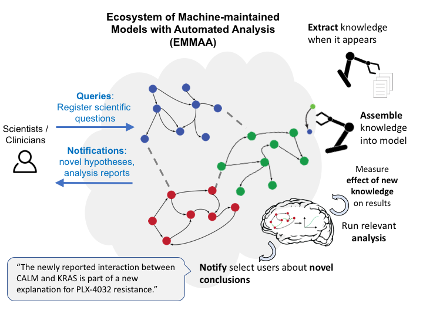
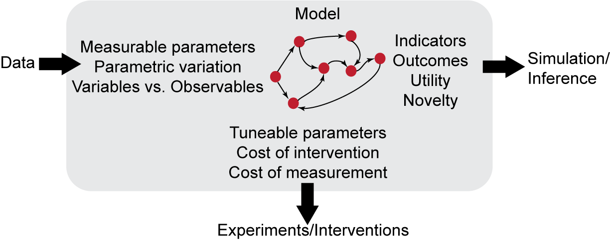
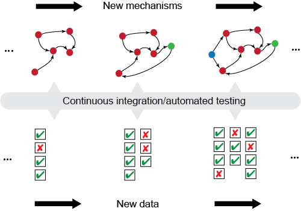
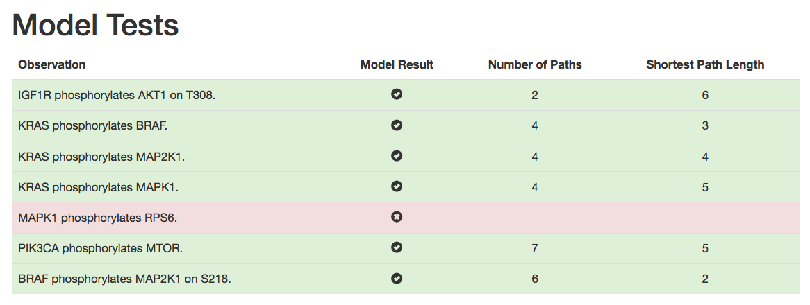
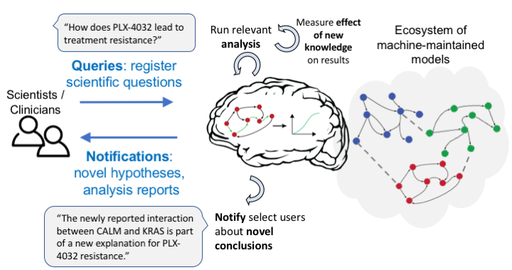

EMMAA Initial Architecture and Approach
=======================================

Cancer types of interest
------------------------
We start with six cancer types that are particularly relevant due to a
combination of frequency of occurrence and lack of adequate treatments.
The cancer types we have initially chosen are as follows. 

- Acute Myeloid Leukemia (aml)
- Breast Carcinoma (brca)
- Lung Adenocarcinoma (luad)
- Pancreatic Adenocarcinoma (paad)
- Prostate Adenocarcinoma (prad)
- Skin Cutaneous Melanoma (skcm)

Each type is 
followed by a "code" in parantheses indicating the subfolder in 
`emmaa/models <https://github.com/indralab/emmaa/tree/master/models>`_ 
in which the model files for the given cancer type are located.
For instance, the initial configuration files for Pancreatic Adenocarcinoma
can be found `here <https://github.com/indralab/emmaa/blob/master/models/paad/>`_.

Model availability
------------------
EMMAA models may be browsed through the Network Data Exchange (NDEx)
portal, available here:
http://ndexbio.org/#/group/be7cd689-f6a1-11e8-aaa6-0ac135e8bacf

Defining model scope
--------------------
Each model is initiated with a set of prior entities and mechanisms that take
entities as arguments. Search terms to extend each model are derived from the
set of entities.

Deriving relevant terms for a given type of cancer
--------------------------------------------------

Our goal is to identify a set of relevant entities (proteins/genes, families,
complexes, small molecules, biological processes and phenotypes) that can be
used to acquire information relevant to a given model. This requires three
components:

- A method to find entities that are specifically relevant to the given cancer
  type
- A background knowledge network of interactions between entities
- A method to identify relevant links and entities on the background knowledge
  network

These methods, as described in the subsections below, are implemented in
the `TcgaCancerPrior` (:py:mod:`emmaa.priors.cancer_prior.TcgaCancerPrior`)
class.

Finding disease genes
~~~~~~~~~~~~~~~~~~~~~
To identify genes that are relevant for a given type of cancer, we turn to
The Cancer Genome Atlas (TCGA), a cancer patient genomics data set available
via the `cBio Portal <http://www.cbioportal.org>`_.

We implemented a client to the cBio Portal which is documented `here
<https://indra.readthedocs.io/en/latest/modules/databases/index.html#module-indra.databases.cbio_client>`_.

Through this client, we first curate a list of patient studies for the given
cancer type. These patient studies are tabulated in
`emmaa/resources/cancer_studies.json <https://github.com/indralab/emmaa/blob/master/emmaa/resources/cancer_studies.json>`_.

Next, we query each study with a list of genes (the entire human genome, in
batches) to determine which patients have mutations in which genes. From this,
we calculate statistics of mutations per gene across the patient population.

Finding relevant entities in a knowledge network
~~~~~~~~~~~~~~~~~~~~~~~~~~~~~~~~~~~~~~~~~~~~~~~~
Finding relevant entities requires a prior network that can be supplied as a
parameter to `TcgaCancerPrior`. We use a network derived from processing and
assembling the content of the
`PathwayCommons <http://www.pathwaycommons.org/>`_,
`SIGNOR <https://signor.uniroma2.it/>`_,
and `BEL Large Corpus <https://github.com/OpenBEL/openbel-framework-resources/blob/latest/knowledge/large_corpus.xbel.gz>`_
databases, as well as machine reading *all* biomedical literature
(roughly 32% full text, 68% abstracts) with two machine reading systems:
`REACH <http://github.com/clulab/reach>`_ and
`Sparser <http://github.com/ddmcdonald/sparser>`_. This network has
2.5 million unique mechanisms (each corresponding to an edge).

Starting from the mutated genes described in the previous section, we use
a heat diffusion algorithm to find other relevant nodes in the knowledge network.
We first normalize the mutation counts by the length of each protein
(since larger proteins are statistically more likely to have random mutations
which can lack functional significance). We then apply the normalized mutation
count as a "heat" on the node in the network corresponding to the gene.
When calculating the diffusion of heat from nodes, we take into account the
amount of evidence for each edge in the network. The number of independent
evidences for the edge (i.e. the number of database entries or extractions
from sentences in publications by reading systems) and use a logistic
function with midpoint set to 20 by default (parameterizable) to set a weight
on the edge. We use a normalized Laplacian matrix-based heat diffusion algorithm
on an undirected version of the network, which can be calculated in a closed
form using `scipy.sparse.linalg.expm_multiply <https://docs.scipy.org/doc/scipy-0.16.1/reference/generated/scipy.sparse.linalg.expm_multiply.html>`_.

Having calculated the amount of heat on each node, we apply a percentile-based
cutoff to retain the nodes with the most heat.

Assembling a prior network
~~~~~~~~~~~~~~~~~~~~~~~~~~
Given a set of entities of interest, we turn to the INDRA DB and query
for all Statements about these entities. This set of Statements becomes
the starting point from which the model begins a process
of assembly. This involves the following steps:

- Filter out hypotheses
- Map grounding of entities
- Map sequences of entities
- Filter out non-human genes
- Run preassembly in which exact and partial redundancies are found and
  resolved

Updating the network
--------------------
Given the search terms associated with the model, we use a `client to the
PubMed web service <https://indra.readthedocs.io/en/latest/modules/literature/index.html#module-indra.literature.pubmed_client>`_ to search for new literature
content.

Machine-reading
---------------
Given a set of PMIDs, we use our Amazon Web Services (AWS) content acquisition
and high-throughput reading pipeline to collect and read publications using
the `REACH <https://github.com/clulab/reach>`_ and
`Sparser <https://github.com/ddmcdonald/sparser>`_ systems.
We then use INDRA's input processors to
extract INDRA Statements from the reader outputs. We also associate
metadata with each Statement: the date at which it was created and the
search terms which are associated with it.

These functionalities are implemented in the :py:mod:`emmaa.readers.aws_reader`
module.

Automated incremental assembly
------------------------------
The newly obtained Statements are evaluated against
Statements already existing in the model. A new Statement can relate to
the existing model in the following ways:

- Novel: there is no such mechanism yet in the model
- Redundant / Corroborating: the mechanism represented by the Statement
  is already in the model, providing new, corroborating evidence
  for that Statement
- Generalization: the mechanism is a more general form of one already in the
  model
- Subsumption: the mechanism is a more specific form of one already in the model
- Conflicting: the mechanism conflicts with one already in the model

The process of preassembly includes determining which case from the above list
applies and calculating belief scores. One can then
apply a cutoff to only "publish" Statements in the model that are above
the given belief threshold. The Statements below the threshold still remain
in the "raw" model knowledge and can later advance to be included in the
published model if they collect enough evidence to reach the belief threshold.

Model analysis
--------------

Analysis of scientific models is typically a manual process in which specific
simulation scenarios are formulated in code, executed, and the results
evaluated. In EMMAA, models will be semantically annotated with concepts
allowing scientific queries to be automatically formulated and executed.
The core component of this process will be a *meta-model* for associating
the necessary metadata with specific model elements.

EMMAA models automatically assembled via `INDRA <http://indra.bio>`_
will already have semantic annotations identifying the relevant entities
(e.g., specific genes or biological processes) and relations (e.g.,
post-translational modifications). As shown in the figure above,
the EMMAA meta-model will allow the annotation of:

- quantities in model-relevant data (e.g., measured values associated
  with specific model parameters)
- features of model parameters and observables relevant to subsequent
  experimental follow-up (e.g.,for example whether a parameter can be experimentally
  altered or whether measurement of a particular observable is cost-effective)
- higher-level scientific aspects associated with model variables and outcomes,
  such as the utility associated with particular model states (e.g.,
  decreased cell proliferation)

The meta-model will be implemented in JSON-LD and will allow model elements
encoded in different formalisms to be associated with the concepts necessary for
automated analysis in EMMAA. For example, a protein initial condition parameter
from an executable `PySB <http://pysb.org>`_ model could be linked to the EMMAA
concepts for a parameter that is *naturally varying,* *non-perturbable,* and
*experimentally measurable.* The use of JSON-LD (rather than RDF, for example)
will additionally allow these annotation documents to be human readable and
editable.

Model testing
-------------

A key benefit of using semantically annotated models is that it allows
models to be automatically validated in a common framework. In addition to
automatically extracting and assembling mechanistic models, EMMAA will run a
set of tests to determine each model's validity and explanatory scope.  Model
constraints for testing will consist of a combination of high-level qualitative
observations and, where available, structured datasets.

The testing methodology will involve multiple modes of simulation and analysis
including both static and dynamic testing. Static testing will be carried out
by the `Model Checker
<https://indra.readthedocs.io/en/latest/modules/explanation/index.html#module-indra.explanation.model_checker>`_
component of INDRA, which identifies causal paths linking a source or perturbed
variable (e.g., IGF1R) with an output or observed variable (e.g., AKT1
phosphorylated on T308).

A mockup showing a simple test report for a Ras signaling pathway
model is shown below, where each "Observation" is expressed in terms of an
expectation of model behavior (e.g., "IGF1R phosphorylates AKT1 on T308")
along with a determination of whether the constraint was satisfied
("Model Result"), the number of different paths found, and the length of the
shortest path.

In a manner analogous to continuous integration for software, model testing
will be triggered anytime the model or its associated constraints are updated.
This will be implemented by storing the current state of the model in
an Amazon S3 bucket and associating the bucket with a
`Cloudwatch Event <https://docs.aws.amazon.com/AmazonCloudWatch/latest/events/Create-CloudWatch-Events-Rule.html>`_. The Cloudwatch Event will trigger the
execution of a serverless Amazon Lambda function responsible for initiating
the model testing procedure.

Pre-registered queries and notifications
----------------------------------------
Each EMMAA model will also come with a set of pre-registered queries from
users. The queries will be in a machine-readable representation that utilizes
the meta-model semantics developed for automated model analysis. EMMAA will
initially support the following types of queries (here we show examples in
natural language but we initially imagine these queries to be submitted in
a formal, templated language):

- Structural properties with constraints:
  e.g., "What drugs bind PIK3CA but not PIK3CB?"
- Mechanistic path properties with constraints: e.g.,
  "How does treatment with PD-325901 lead to EGFR activation?"
- Simple intervention properties: e.g., "What intervention can reduce ERK
  activation by EGF?"
- Comparative intervention properties: e.g., "How is the effect of targeting
  MEK different from targeting PI3K on the activation of ERK by EGF?"

Each such property maps onto a specific model analysis task that can be run
on an EMMAA model, for instance, causal path finding with semantic constraints,
or dynamical simulations under differential initial conditions.

Further, the result of analysis for each property on a given version of the
model will be saved. This will then allow comparing any changes to
the result of analysis with previous states of the model. If a meaningful
change occurs, a notification will be generated to the user who registered
the query.

