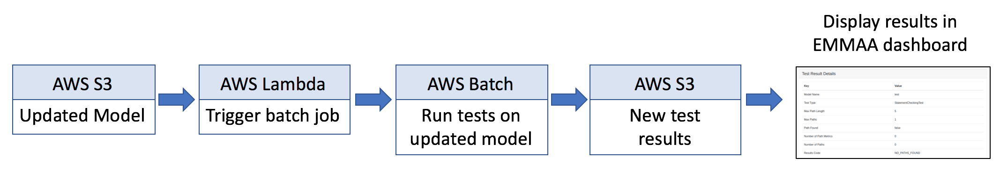

.. _model_analysis:

Model Testing and Analysis
==========================

A key benefit of using semantically annotated models is that it allows models
to be automatically validated in a common framework. In addition to
automatically extracting and assembling mechanistic models, EMMAA runs a
set of tests to determine each model's validity and explanatory scope.
We have implemented an approach to model testing that automates

- the collection of test conditions from a pre-existing observational
  knowledge base,
- deciding which test condition is applicable to which model,
- executing the applicable tests on each model, and
- reporting the summary results of the tests on each model.

.. image:: ../_static/images/model_testing_concept.png
   :scale: 80 %
   :align: right

The overall concept of automated model testing in EMMAA is shown in this
figure. Each time a model is updated with new findings, the model is tested
against a set of expected observations or properties. The tests themselves
can evolve over time as new observations are collected.

Model test cycle deployed on AWS
--------------------------------

Whenever there is a change to a model, a pipeline on Amazon Web Services (AWS)
is triggered to run a set of applicable model tests. When a model is updated
(i.e., with new findings extracted and assembled from novel research
publictions), a snapshot of it is deposited on the S3 storage service. A
Lambda process monitors changes on S3 and when a change occurs, triggers
a Batch job. The Batch job accesses the Dockerized EMMAA codebase and runs the
automated test suite on the model. The test results are then deposited on
S3. Finally, the new test results are propagated onto the EMMAA Dashboard
website. This process is summarized in the figure below.

The code implemented here is avilable in the following places:

- The EMMAA Dockerfile is available `here <https://github.com/indralab/emmaa/tree/master/Dockerfile>`_ .
- The Lambda implementation (:py:mod:`emmaa.aws_lambda`) is documented
  `here <https://emmaa.readthedocs.io/en/latest/modules/aws_lambda.html>`_.

Test conditions generated automatically
---------------------------------------

EMMAA implements a novel approach to collecting observations with respect to
which models can be tested. Given a set of INDRA Statements, which can be
obtained either from human-curated databases or literature extractions,
EMMAA selects ones that represent experimental observations (which relate a
perturbation to a potentially indirect downstream readout) from direct
physical interaction-like mechanisms. We treat these observational Statements
as constraints on mechanistic paths in a model. For instance, the observation
"treatment with Vemurafenib leads to decreased phosphorylation of MAPK1", could
be satisfied if the model contained a sequence of mechanisms connecting
Vemurafenib with the phosphorylation state of MAPK1 such that the aggregate
polarity of the path is positive.

As a proof of principle, we created a script which generates such a set of
test conditions from the BEL Small Corpus, a corpus of experimental
observations and molecular mechanisms extracted by human experts from the
scientific literature. Going forward, we will also rely on observations
collected directly from the literature for automated model testing.

The code to generate and run this corpus of test statements is available
`here <https://github.com/indralab/emmaa/blob/master/scripts/run_bel_tests.py>`_.

General EMMAA model testing framework
-------------------------------------
EMMMA contains a test framework in :py:mod:`emmaa.model_tests` with an abtract
class interface to connect models with applicable tests and then execute
each applicable test with respect to each applicable model. One strength of
this abstract class architecture is that it is agnostic to

- the specific content and implementation of each model and test,
- the criteria by which a test is determined to be applicable to a model,
- the procedure by which a test is determined to be satisfied by a model.

It therefore supports a variety of specific realizations of models and tests.
The classes providing this interface are the
`TestManager` (:py:mod:`emmaa.model_tests.TestManager`),
`TestConnector` (:py:mod:`emmaa.model_tests.TestConnector`)
and `EmmaaTest` (:py:mod:`emmaa.model_tests.EmmaaTest`).

Test conditions mapped to models automatically
~~~~~~~~~~~~~~~~~~~~~~~~~~~~~~~~~~~~~~~~~~~~~~

EMMAA currently implements a specific set of testing classes that
are adequate for our cancer models. This implementation uses the
`ScopeTestConnector` (:py:mod:`emmaa.model_tests.ScopeTestConnector`)
and `StatementCheckingTest` (:py:mod:`emmaa.model_tests.StatementCheckingTest`) classes in EMMAA.
The ScopeTestConnector class uses our meta-model annotations to
determine the identity of the concepts in the model as well as in the test, and
deems the test to be applicable to the model if all the concepts (i.e. the
perturbation and the readout) in the test are also contained in the model. 

Testing models using static analysis
~~~~~~~~~~~~~~~~~~~~~~~~~~~~~~~~~~~~
The StatementCheckingTest class takes a pair of a model and an applicable tests,
and determines whether the model satisfies the test as follows. The model is
first assembled into a rule-based PySB model object using INDRA's
PySB Assembler. The model is then exported into the Kappa framework, which
provides static analysis methods, including generating an influence map
(a signed, directed graph) over the set of rules in the model. EMMAA then
uses INDRA's `Model Checker
<https://indra.readthedocs.io/en/latest/modules/explanation/index.html#module-indra.explanation.model_checker>`_ to find paths in this influence map that match
the test condition (itself expressed as an INDRA Statement). If one or more
such paths are found, the test is assumed to be satisfied, and the results
are reported and stored. Otherwise, the model is assumed to to satisfy the
test.

An end-to-end model building and testing example is available `here <https://github.com/indralab/emmaa/blob/master/scripts/generate_simple_model_test.py>`_.

Going forward, the testing methodology will involve multiple modes of
simulation and analysis including also dynamic testing. 

Human-readable model test reports
~~~~~~~~~~~~~~~~~~~~~~~~~~~~~~~~~

A mockup showing a simple test report for a Ras signaling pathway model is
shown below, where each "Observation" is expressed in terms of an expectation
of model behavior (e.g., "IGF1R phosphorylates AKT1 on T308") along with a
determination of whether the constraint was satisfied ("Model Result"), the
number of different paths found, and the length of the shortest path.

.. image:: ../_static/images/testing_mockup.png
   :scale: 60 %

In a manner analogous to continuous integration for software, model testing
will be triggered anytime the model or its associated constraints are updated.

Pre-registered queries and notifications
----------------------------------------

Going forward, each EMMAA model will also come with a set of pre-registered
queries from users. The queries will be in a machine-readable representation
that utilizes the meta-model semantics developed for automated model analysis.
EMMAA will initially support the following types of queries (here we show
examples in natural language but we initially imagine these queries to be
submitted in a formal, templated language):

- Structural properties with constraints: e.g., "What drugs bind PIK3CA but not
  PIK3CB?"
- Mechanistic path properties with constraints: e.g., "How does treatment with
  PD-325901 lead to EGFR activation?"
- Simple intervention properties: e.g., "What is the effect of Selumatinib 
  on ERK activation by EGF?"
- Comparative intervention properties: e.g., "How is the effect of targeting
  MEK different from targeting PI3K on the activation of ERK by EGF?"

.. image:: ../_static/images/user_queries_concept.png
   :scale: 60 %
   :align: right

Each such property maps onto a specific model analysis task that can be run on
an EMMAA model, for instance, causal path finding with semantic constraints, or
dynamical simulations under differential initial conditions. We developed a
Model Analysis Query Language which specifies these types of properties,
see :ref:`maql`.

Further, the result of analysis for each property on a given version of the
model will be saved. This will then allow comparing any changes to the result
of analysis with previous states of the model. If a meaningful change occurs, a
notification will be generated to the user who registered the query.
