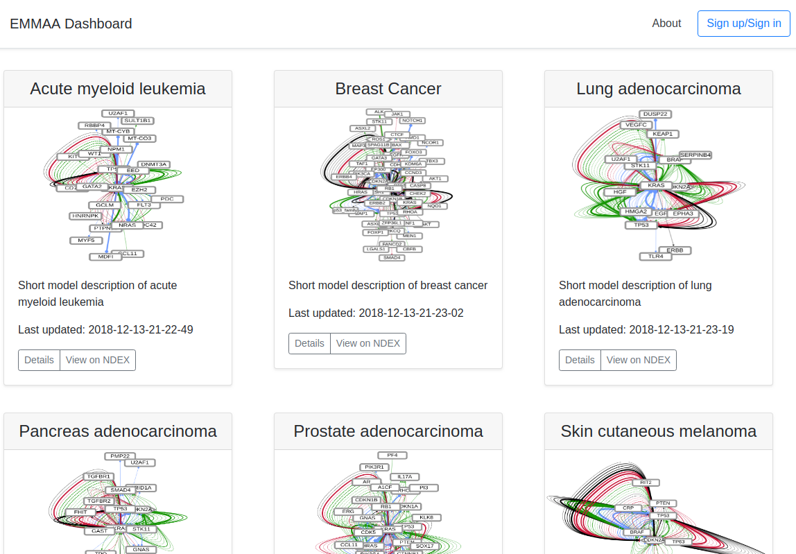

EMMAA Dashboard
===============
The EMMAA Dashboard will become the main entrypoint for users to interact
with models. Currently, users can browse and link out to interactive,
searchable network views of models of six cancer type.

Users can also set up an account and log in. Going forward, users will be able
to sign up for specific notifications about one or more automatically
built, tested and analyzed models.

The EMMAA Dashboard is accessible at
`http://emmaa-service-1943566322.us-east-1.elb.amazonaws.com/home <http://emmaa-service-1943566322.us-east-1.elb.amazonaws.com/home>`_.
