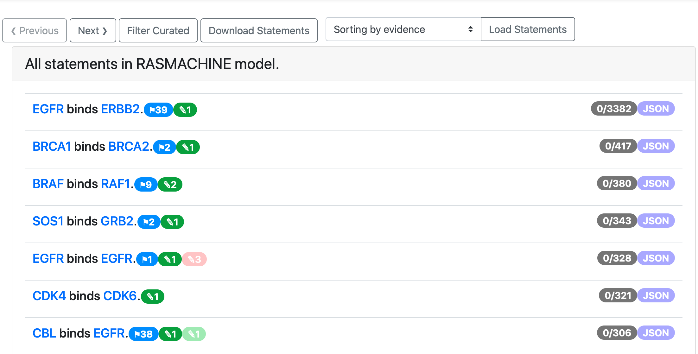

.. _all_statements:

EMMAA All Statements Page
=========================

All statements page allows to browse and curate statement evidences
similarly to statement evidence page but in this case all statements in the
model are listed. By clicking on any statement, a user can open it's evidences.
By default the statements are sorted by the number of supporting evidence they 
have, but it is possible to sort them by the number of paths they contribute to.
"Previous" and "Next" buttons allow to page through the full list of statements 
(only 1000 statements per page are loaded). "Filter Curated" button allow to
filter out the statements that have been already curated. It's also possible
to download all statements in JSON format by clicking on "Download Statements."
Each statement can have multiple badges that have the same meaning as in the
statement evidence page. Blue badge with a flag shows have many paths this
statement is a part of. Green or red badge with a pencil shows how many times
this statement was curated as correct or incorrect respectively. Grey badge
shows the number of loaded evidences and the total number of evidences 
supporting this statement. Clicking on JSON badge opens a new page containing
JSON representation of the statement.

  *All statements page view*