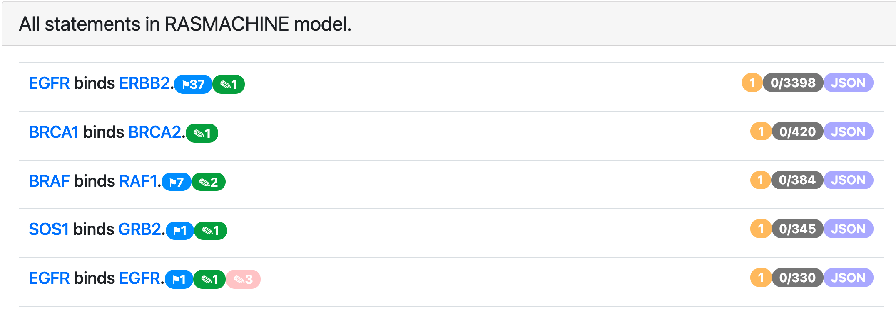

.. _all_statements:

EMMAA All Statements Page
=========================

The All statements page allows to browse and curate statement evidences
similar to the statement evidence page but in this case all statements in the
model are listed. By clicking on any statement, a user can open its evidences.
By default the statements are sorted by the number of supporting evidence they 
have, but it is possible to sort them by the number of paths they contribute to
or by their belief score - select the preferred sorting option from the dropdown.
The "Previous" and "Next" buttons allow to page through the full list of statements
(only 1000 statements per page are loaded). It's also possible
to download all statements in JSON format by clicking on "Download Statements."
There are several filters that can be applied to the statement list to display
only a subset of statements based on some criteria:

- Filter out the statements that have been already curated.
- Filter statements to one or more statement types.
- Filter statements to those that have belief within a given range.
- Filter statements to those that contain an agent of interest.

  *Request to filter all model statements to Inhibition statements about BRAF
  with belief score above 0.85 and sort them by belief*

Each statement can have multiple badges that have the same meaning as in the
statement evidence page. A blue badge with a flag shows how many paths this
statement is a part of. A green or red badge with a pencil shows how many times
this statement was curated as correct or incorrect respectively. An orange badge
shows statement's belief score. A grey badge
shows the number of loaded evidences and the total number of evidences 
supporting this statement. Clicking on the JSON badge opens a new page containing
the JSON representation of the statement.

  *All statements page view*