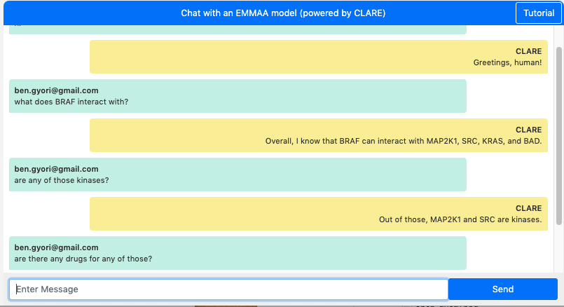

.. _chat_page:

Chat with the model
===================

Chatting with the model capability is powered by Clare, another project
developed by our team. To open this page a user needs to click on "Chat"
button either on home page or on the model page. The dialogue window will
open up and ask the user to provide their email address (that will be prefilled
if the user is logged in). After that the dialogue session will start and a
user can ask questions about the mechanisms in the model.

  *Example of a dialogue with a model*