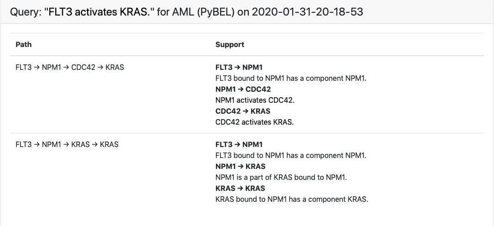
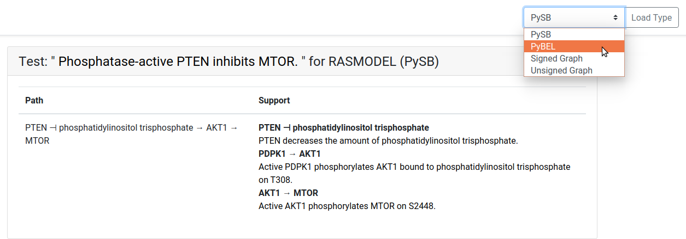
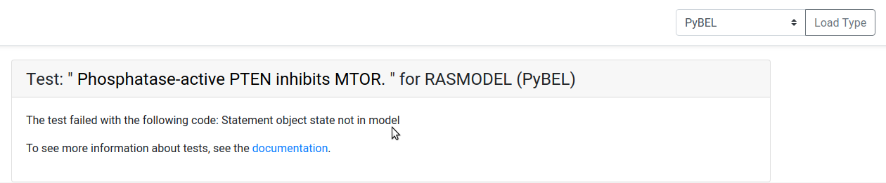

.. _detailed_tests_page:

EMMAA Detailed Test Results
===========================

The detailed test results page shows a test result at in high detail for a
specific model and model type. The left column describes the paths found that
satisfies the test. Note that the same test/query can be explained with
multiple different paths. The right column contains a detailed description of
each edge in the path with a list of english representation of the statements
supporting the edge. If a test did not pass, a message explaining why it did
not pass is shown.

  *The detailed test results for "FLT3 activates KRAS". The
  left column displays the two paths that satisfy the test for the model and
  model type. The right column gives detailed information for each of the
  edges, including its support, for each path.*

Results for Different Model Types
---------------------------------

The navigation bar contains a drop down menu where another model type can be
selected. After selecting the model type to switch to, click on "Load Type"
to load the same model test with the selected model type. *Note that only
model types available for the specific model are available in the menu.*

  *The drop down menu shows the other available model types for the test on
  the model.*

Non-passing Tests
-----------------

When a test fails, the detailed test page show a message that describes why
the test failed instead of results.

  *The test did not pass and a message is shown describing why.*
