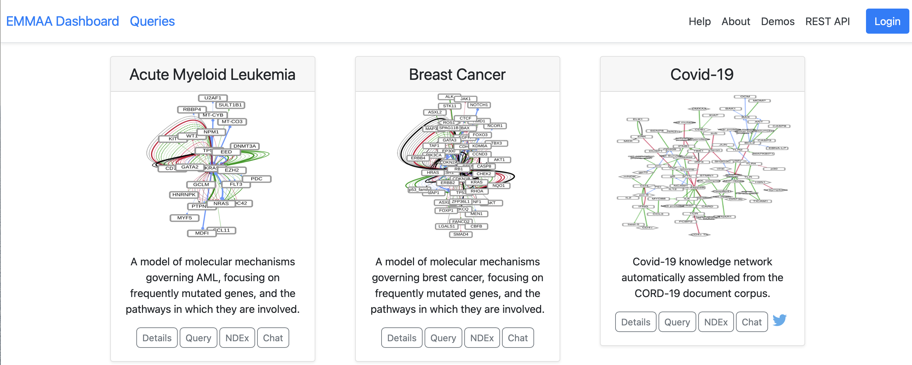

.. _dashboard:

EMMAA Dashboard
===============
The EMMAA Dashboard is accessible at
`http://emmaa.indra.bio <http://emmaa.indra.bio>`_.

The EMMAA Dashboard is the main entrypoint for users to interact
with models. Currently, users can browse and link out to interactive,
searchable network views of models of six cancer types, as well as details of
the latest tests applied to the models. The user can also navigate to a
queries page where queries about the models can be answered.
Going forward, users will be able
to sign up for specific notifications about one or more automatically
built, tested and analyzed models.

Please read the sections below to learn how the Models page and the Query page
works.

.. toctree::
   :maxdepth: 4

   models_page
   model_queries
   response_codes
   detailed_test_results
