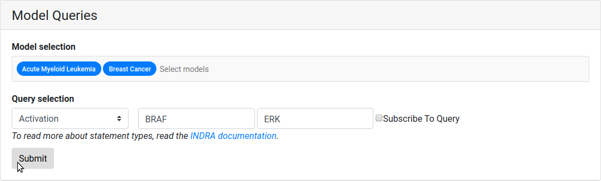
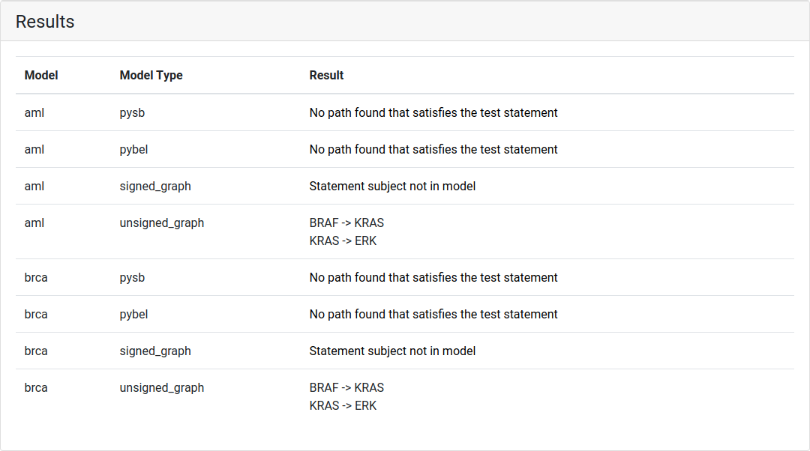
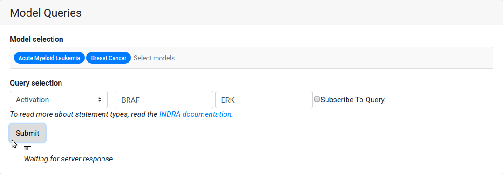
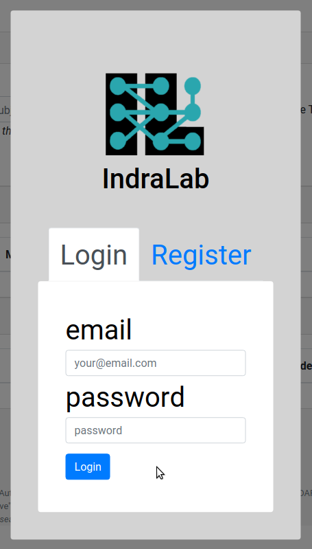
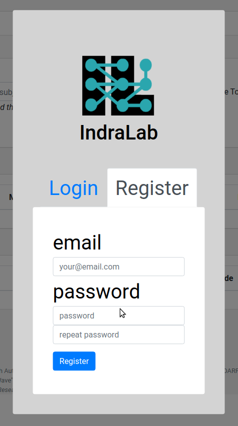
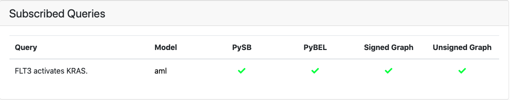

.. _dashboard_query:

EMMAA Model Queries
===================
The Queries page can be accessed by clicking the "Queries" link at the top
of the Dashboard website.

Submitting a Query
------------------

The model queries page can answer direct queries about one or more models.
A query consists of a statement type, a subject, and an object. Together with
the query, at least one model needs to be selected for the query submission
to be valid.

  *The query ready to be submitted that asks if BRAF activates ERK in the AML
  and BRCA cancer models.*

If the query is badly formatted or missing information, an error will be
shown stating the type of error.

The query will be received by the query service and return a response which is
displayed in the Results table below. The result for each model is either a
mechanistic path reported in English language which satisfies the query
condition, or an explanation of why the query could not be evaluated on the
model.

  *The above query resolved, showing the result per model and model type. If
  a path was found, the path is shown, otherwise the reason why a path was not
  found is is stated.*

The page displays "Waiting for server response" and a loader bar
while the query is being executed. The typical response time can be up to a
minute so please be patient when posting queries.

  *While the query resolves, a small animation is shown.*

Logging In and Registering a User
---------------------------------

A user can log in by clicking the "Login" button to the right on the
navigation bar. When clicking a the login button, an overlay shows up asking
for credentials. A user can also create an account by registering if they
don't already have an account.

  *The login tab of the login overlay.*

  *The registration tab of the login overlay.*

Subscribing to a Query
----------------------

When logged in, a user can register a query for subscription. To register a
subscribe to a query, the tick box for "Subscribe To Query" has to be ticked
when the query is submitted. After submission, the query is associated with
the logged in user. When returning to the page, the queries associated with
the user will be loaded together with the latest result of those queries.

  *The table for subscribed queries, here for the query Activation(FLT3, KRAS)
  of the AML cancer model.*
