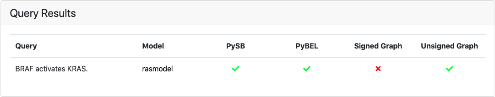
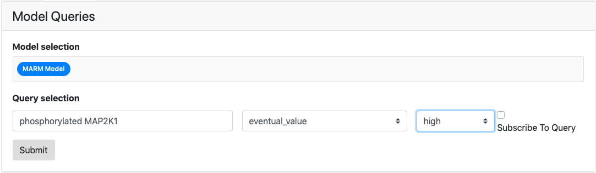
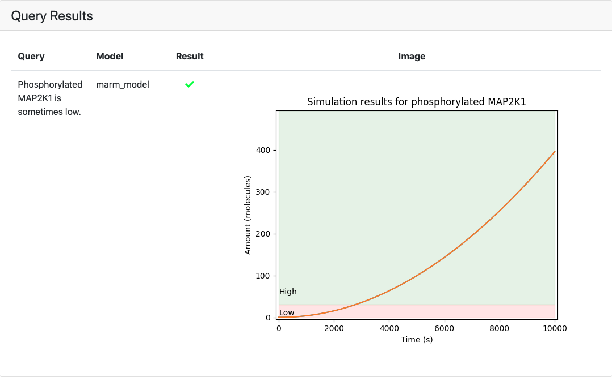
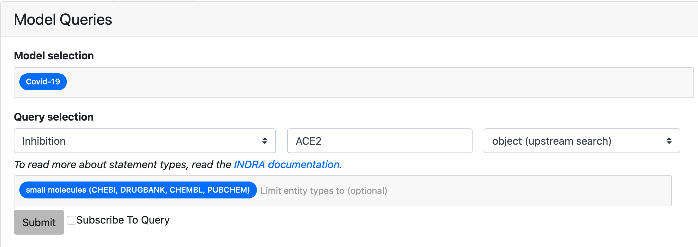
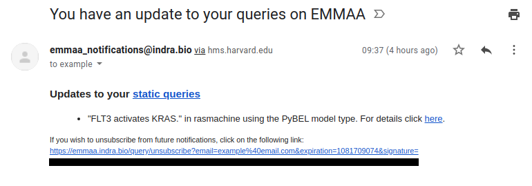
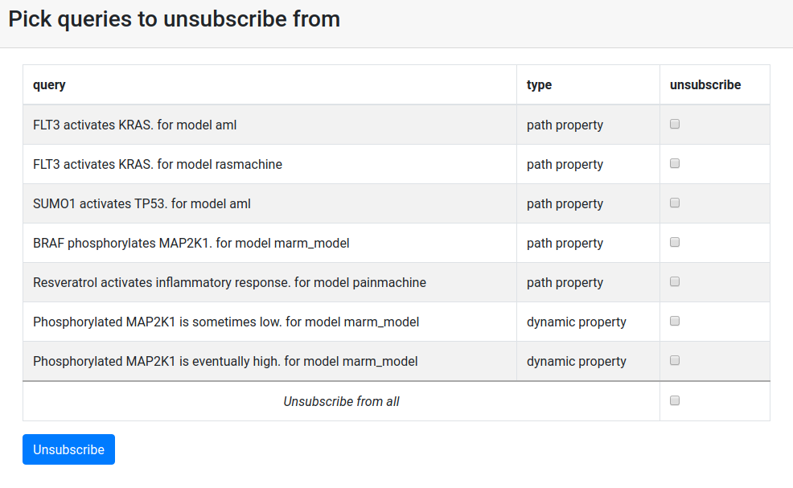

.. _dashboard_query:

EMMAA Model Queries
===================
The Queries page can be accessed by clicking the "Queries" link at the top
of the Dashboard website. The page contains the forms to submit queries and
results of queries in three tabs *Static*, *Dynamic*, and *Open Search* 
corresponding to three currently supported query types.

Static Queries
--------------

This tab allows to submit queries and view the results for static queries that
involve finding mechanistic paths to explain causal relation. Queries are run
against four model types: PySB, PyBEL, signed graph, and unsigned graph.

Submitting a Query
~~~~~~~~~~~~~~~~~~

The model queries page can answer direct queries about one or more models.
A static query consists of a statement type, a subject, and an object.
Together with the query, at least one model needs to be selected for the query
submission to be valid.

.. figure:: ../_static/images/query_filled.png
  :align: center
  :figwidth: 100 %

  *The query ready to be submitted that asks if BRAF activates ERK in the AML
  and BRCA cancer models.*

If the query is badly formatted or missing information, an error will be
shown stating the type of error.

Viewing the results
~~~~~~~~~~~~~~~~~~~

The query will be received by the query service and return a response which is
displayed in the Results table below. Similarly to the results of tests on the
model page, query results are presented as a grid of green, red and grey marks.
A green check mark is shown for queries that passed and a red cross is shown
for the queries that did not. Grey cirlce will be shown for queries not
applicable for selected model. The marks can be clicked on and link to a
detailed query results page where the detailed path(s) or a reason for the
model not having passed the test will be shown.

  *The above query resolved, showing the result per model and model type.
  Detailed results can be viewed by clicking on a green/red mark.*

.. _dashboard_dyn_query:

Dynamical Queries
-----------------

This tab allows to submit and view the results for queries about dynamical
model properties. To answer these queries simulations are run on a
PySB-assembled EMMAA model.

Submitting a Query
~~~~~~~~~~~~~~~~~~

Dynamical query requires the user to specify the model, the entity to run
simulations for, a temporal pattern and, for some patterns, whether the entity
amount should be high or low. An observable entity can be described using
natural language, e.g. "phosphorylated MAP2K1".

  *The query ready to be submitted that asks whether phosphorylated MAP2K1 is
  eventually high in the MARM model.*

Viewing the results
~~~~~~~~~~~~~~~~~~~

Results of the dynamical queries include a green/red mark showing whether the
required condition was satisfied in more than a half of simulations and a plot
of the observable's time cours during the simulation.

  *The above query resolved, showing the result per model.*

.. _dashboard_open_query:

Open Search Queries
-------------------

This tab allows submitting and viewing the results of open search queries
that involve finding mechanistic paths upstream or downstream of an entity of
interest. Similar to static queries, open search queries are run against
four model types: PySB, PyBEL, signed graph, and unsigned graph.

Submitting a Query
~~~~~~~~~~~~~~~~~~

The model queries page can answer direct queries about one or more models.
An open search query consists of a statement type, an agent (entity), and 
an agent's role (subject for downstream search and object for upstream search).
Optionally, a user can also limit the search results to only include paths to
or from genes/proteins, small molecules, or biological processes.
Together with the query, at least one model needs to be selected for the query
submission to be valid.

  *The query ready to be submitted that asks what small molecules inhibit
  ACE2 in Covid-19 model*

If the query is badly formatted or is missing information, an error will be
shown stating the type of error.

Viewing the results
~~~~~~~~~~~~~~~~~~~

The query is received by the query service which returns a response in a
format similar to the result of static queries.

.. figure:: ../_static/images/open_query_result.png
  :align: center
  :figwidth: 100 %

  *The above query resolved, showing the result per model and model type.
  Detailed results can be viewed by clicking on a green/red mark. Grey circles
  mean that these model types are not available for a selected model.*

Waiting for results
-------------------

For either of the query types the page displays "Waiting for server response"
and a loader bar while the query is being executed. The typical response time
can be up to a minute so please be patient when posting queries.

.. figure:: ../_static/images/waiting_for_response.png
  :align: center
  :figwidth: 100 %

  *While the query resolves, a small animation is shown.*

Logging In and Registering a User
---------------------------------

A user can log in by clicking the "Login" button to the right on the
navigation bar. When clicking the login button, an overlay shows up asking
for credentials. A user can also create an account by clicking "Register" if
they don't already have an account.

.. rst-class:: center

   |p1| |p2|

.. |p1| image:: ../_static/images/login_window.png
   :width: 30 %

.. |p2| image:: ../_static/images/registration_window.png
   :width: 30 %

*The login and registration tabs of the login overlay.*

Subscribing to a Query
----------------------

When logged in, a user can register a query for subscription. To register a
subscription to a query, the tick box for "Subscribe To Query" has to be
ticked when the query is submitted. Both static and dynamic queries can be
subscribed to. After submission, the query is associated with the logged in
user. When returning to the page, the subscribed queries will be loaded
together with their latest results.

.. figure:: ../_static/images/subscribed_queries.png
  :align: center
  :figwidth: 100 %

  *The table for subscribed queries, here for the query Activation(FLT3, KRAS)
  of the AML cancer model.*

Email Notifications of Subscribed Queries
-----------------------------------------

If a user subscribes to a query, they are also signed up for daily email
updates that will be sent out if there is an update to any of the subscribed
queries. An update to a query is defined as there being a change in the
associated model that answers the query. The email lists the updates by
query type, query, model and model type. If are no updates for one of the
query types, only the query type that has any updates will be shown. For
static queries, a direct link to the detailed query results is provided.

  *An example of an email notification for a query. Here, an update to the
  query Activation(FLT3, KRAS) of the Ras Machine model of the PyBEL model
  type is shown under "static queries". The unsubscribe link at the bottom
  links out to the unsubscribe page (see below).*

Unsubscribing From Query Notifications
~~~~~~~~~~~~~~~~~~~~~~~~~~~~~~~~~~~~~~

In every email notification there is an unsubscribe link in the footer of
the email. To unsubscribe from queries, follow the link to the unsubscribe
page. On the unsubscribe page, all active subscriptions for the associated
email are shown with tick boxes for each subscription and one tick box for
unsubscribing from all subscribe queries. After ticking the appropriate
boxes and submitting the unsubscribe request, a message will be shown
describing the status of the request once it resolves.

  *An example of how the unsubscribe page looks like. All subscribed queries
  for a given user is shown. Each query can be individually marked for
  unsubscription. All queries can be unsubscribed simultaneously by ticking
  the box for "unsubscribe from all"*
