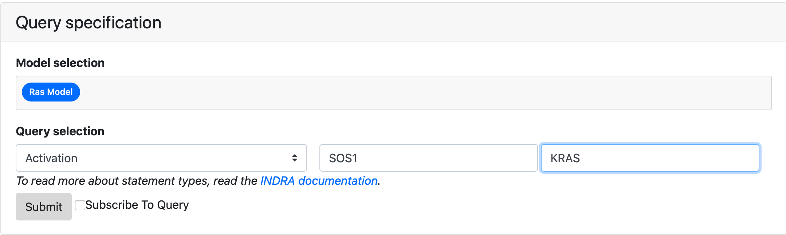
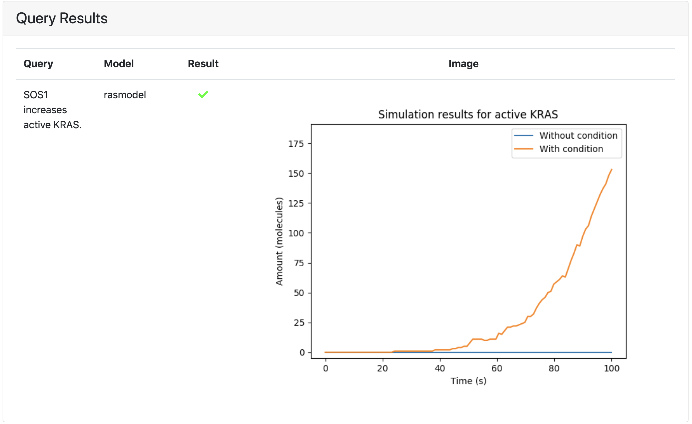

.. _dashboard_query:

EMMAA Model Queries
===================
The Queries page can be accessed by clicking the "Queries" link at the top
of the Dashboard website. The page contains the forms to submit queries and
results of queries in four tabs *Source-target paths*, *Source-target dynamics*,
*Temporal properties*, and *Up/down-stream paths*
corresponding to three currently supported query types.

Each tab has the following boxes:

- **Description** - a brief description of selected query mode, what questions
  can it answer and how to specify it properly.

- **Query specification** - a form to select which models the query should be run
  on and to specify query parameters.

- **Query results** - here the immediate results for the recently run query will
  be displayed.

- **Subscribed queries** - if a user is logged in and has previously subscribed to
  any queries of a given type, these queries are rerun every time the models are
  updated and the latest results will be displayed in this box.

Which query type do I need?
---------------------------

- If you want to explain an effect between two entities, read more about
  :ref:`source_target_paths`

- If you want to observe the effect of intervention in dynamical simulation,
  read more about :ref:`source_target_dynamics`

- If you want to observe the baseline dynamics of an entity in the model in
  dynamical simulation, read more about :ref:`dashboard_dyn_query`

- If you want to find the downstream targets or upstream regulators of an
  entity, read more about :ref:`dashboard_open_query`

.. _source_target_paths:

Source-target paths queries
---------------------------

This query mode uses causal path finding to explain an effect between a source
and a target. It allows to answer questions like *“How does EGF lead
to the phosphorylation of MAPK1”?* Depending on
which EMMAA model is selected, multiple modeling formalisms
(unsigned graph, signed graph, PyBEL model, PySB model) are used to find paths,
each with different causal constraint assumptions, potentially resulting
in different results.

Submitting a Query
~~~~~~~~~~~~~~~~~~

Specifying the query involves providing names for a source and a target and
selecting a statement type (e.g., Phosphorylation, Inhibition, IncreaseAmount).
It is possible to run the queries against one or more EMMAA models to see the
results in different contexts. At least one model needs to be selected for the
query submission to be valid.

.. figure:: ../_static/images/query_filled.png
  :align: center
  :figwidth: 100 %

  *The query ready to be submitted that asks if BRAF activates ERK in the AML
  and BRCA cancer models.*

If the query is badly formatted or missing information, an error will be
shown stating the type of error.

Viewing the results
~~~~~~~~~~~~~~~~~~~

The query service will receive the query and return a response which is
displayed in the Query Results table below. Query results are presented as a
grid of green, red and grey marks. A green check mark is shown for queries
that passed and a red cross is shown for the queries that did not. Grey cirlce
will be shown for queries not applicable for selected model.
The marks can be clicked on and link to a :ref:`detailed_tests_page` page
where the detailed path(s) or a reason for the model not having passed
the query will be shown.

.. figure:: ../_static/images/path_query_result.png
  :align: center
  :figwidth: 100 %

  *The above query resolved, showing the result per model and model type.
  Detailed results can be viewed by clicking on a green/red mark.*

.. _source_target_dynamics:

Source-target dynamics queries
------------------------------

This query mode uses dynamical simulation to describe the effect of an
intervention from a given source on a given target. An example question that
can be answered using this query type is *“If the initial amount of BRAF is
increased, does the phosphorylation of MAP2K1 increase?”*.
The results provide a yes/no answer to the query as well as the time course
results of simulations of the target readout (phosphorylated MAP2K1 in the
above example) to compare the effect of two different initial amounts of the source.

Submitting a Query
~~~~~~~~~~~~~~~~~~

Source-target dynamics query requires the user to specify the model, a source
and a target by name, and select a statement type(e.g., Phosphorylation,
Inhibition, IncreaseAmount) which represents the effect of the
intervention on the target. It is possible to run the queries
against one or more EMMAA models to see the results in different contexts.
At least one model needs to be selected for the query submission to be valid.

  *The query ready to be submitted that asks whether SOS1 leads to the
  activation of KRAS in simulation of RAS model.*

If the query is badly formatted or missing information, an error will be
shown stating the type of error.

Viewing the results
~~~~~~~~~~~~~~~~~~~

Results include a green/red mark showing whether the expected intervention
effect was oserved in the simulation and a plot of the observable's time course
during the simulation with and without the intervention.

  *The above query resolved, showing that active KRAS is substantially higher
  when SOS1 is present at a high level*

.. _dashboard_dyn_query:

Temporal properties queries
---------------------------

This query mode uses dynamical simulation to verify if the baseline dynamics
(i.e., no intervention) of the model meets a given qualitative pattern.
To answer these queries simulations are run on a PySB-assembled EMMAA model.
Temporal properties query allows answering questions like
*“Is the amount of phosphorylated BRAF at any point in time high?”*.
The result provides a yes/no answer to the query as well as the time course
results of simulations of the given agent state.

Submitting a Query
~~~~~~~~~~~~~~~~~~

Temporal properties query requires the user to specify the model, provide an
agent state description (e.g., “active KRAS”, “phosphorylated BRAF”,
“DUSP6 bound to MAPK1”), a pattern type (e.g., sometime_value) and in some
pattern types, a value (e.g., low/high). It is possible to run the queries
against one or more EMMAA models to see the results in different contexts.
At least one model needs to be selected for the query submission to be valid.

.. figure:: ../_static/images/dynamic_query.png
  :align: center
  :figwidth: 100 %

  *The query ready to be submitted that asks whether phosphorylated MAP2K1 is
  eventually high in the MARM model.*

If the query is badly formatted or missing information, an error will be
shown stating the type of error.

Viewing the results
~~~~~~~~~~~~~~~~~~~

Results of the dynamical queries include a green/red mark showing whether the
required condition was satisfied in more than a half of simulations and a plot
of the observable's time course during the simulation.

.. figure:: ../_static/images/dynamic_result.png
  :align: center
  :figwidth: 100 %

  *The above query resolved, showing how the amount of phosphorylated MAP2K1
  changes during the simulation*

.. _dashboard_open_query:

Up/down-stream paths queries
----------------------------

This query mode allows finding causal paths to or from a given agent to
identify its upstream regulators and its downstream targets. A user can
optionally limit the up/downstream entities to genes/proteins, small molecules
or biological processes. It allows expressing questions such as
*“What small molecules inhibit the phosphorylation of JAK2?”*
or *“What biological process does TNF activate?”*.
The result returns not only the entities but also the specific causal paths
that are consistent with the query specification. Depending on which EMMAA
model is selected, multiple modeling formalisms (unsigned graph, signed graph,
PyBEL model, PySB model) are used to find paths, each with different causal
constraint assumptions, potentially resulting in different results.

Submitting a Query
~~~~~~~~~~~~~~~~~~

The query specification involves specifying the agent by name and role
(subject or object corresponding to finding its downstream targets or upstream
regulators, respectively), a statement type representing the effect of the
regulations (e.g., Phosphorylation, Inhibition), and optional constraints on
the types of up/downstream entities that are of interest.
Together with the query, at least one model needs to be selected for the query
submission to be valid.

.. figure:: ../_static/images/open_query.png
  :align: center
  :figwidth: 100 %

  *The query ready to be submitted that asks what small molecules inhibit
  ACE2 in Covid-19 model*

If the query is badly formatted or is missing information, an error will be
shown stating the type of error.

Viewing the results
~~~~~~~~~~~~~~~~~~~

The query service will receive the query and return a response which is
displayed in the Query Results table below. Query results are presented as a
grid of green, red and grey marks. A green check mark is shown for queries
that passed and a red cross is shown for the queries that did not. Grey cirlce
will be shown for queries not applicable for selected model.
The marks can be clicked on and link to a :ref:`detailed_tests_page` page
where the detailed path(s) or a reason for the model not having passed
the query will be shown.

.. figure:: ../_static/images/open_query_result.png
  :align: center
  :figwidth: 100 %

  *The above query resolved, showing the result per model and model type.
  Detailed results can be viewed by clicking on a green/red mark. Grey circles
  mean that these model types are not available for a selected model.*

Waiting for results
-------------------

For either of the query types the page displays "Waiting for server response"
and a loader bar while the query is being executed. The typical response time
can be up to a minute so please be patient when posting queries.

.. figure:: ../_static/images/waiting_for_response.png
  :align: center
  :figwidth: 100 %

  *While the query resolves, a small animation is shown.*

Logging In and Registering a User
---------------------------------

A user can log in by clicking the "Login" button to the right on the
navigation bar. When clicking the login button, an overlay shows up asking
for credentials. A user can also create an account by clicking "Register" if
they don't already have an account.

.. rst-class:: center

   |p1| |p2|

.. |p1| image:: ../_static/images/login_window.png
   :width: 30 %

.. |p2| image:: ../_static/images/registration_window.png
   :width: 30 %

*The login and registration tabs of the login overlay.*

Subscribing to a Query
----------------------

When logged in, a user can register a query for subscription. To register a
subscription to a query, the tick box for "Subscribe To Query" has to be
ticked when the query is submitted. Both static and dynamic queries can be
subscribed to. After submission, the query is associated with the logged in
user. When returning to the page, the subscribed queries will be loaded
together with their latest results.

.. figure:: ../_static/images/subscribed_queries.png
  :align: center
  :figwidth: 100 %

  *The table for subscribed queries, here for the query Activation(FLT3, KRAS)
  of the AML cancer model.*

Email Notifications of Subscribed Queries
-----------------------------------------

If a user subscribes to a query, they are also signed up for daily email
updates that will be sent out if there is an update to any of the subscribed
queries. An update to a query is defined as there being a change in the
associated model that answers the query. The email lists the updates by
query type, query, model and model type. If are no updates for one of the
query types, only the query type that has any updates will be shown. For
static queries, a direct link to the detailed query results is provided.

.. figure:: ../_static/images/email_notification.png
  :align: center
  :figwidth: 100 %

  *An example of an email notification for a query. Here, an update to the
  query Activation(FLT3, KRAS) of the Ras Machine model of the PyBEL model
  type is shown under "static queries". The unsubscribe link at the bottom
  links out to the unsubscribe page (see below).*

Unsubscribing From Query Notifications
~~~~~~~~~~~~~~~~~~~~~~~~~~~~~~~~~~~~~~

In every email notification there is an unsubscribe link in the footer of
the email. To unsubscribe from queries, follow the link to the unsubscribe
page. On the unsubscribe page, all active subscriptions for the associated
email are shown with tick boxes for each subscription and one tick box for
unsubscribing from all subscribe queries. After ticking the appropriate
boxes and submitting the unsubscribe request, a message will be shown
describing the status of the request once it resolves.

.. figure:: ../_static/images/unsubscribe_page.png
  :align: center
  :figwidth: 100 %

  *An example of how the unsubscribe page looks like. All subscribed queries
  for a given user is shown. Each query can be individually marked for
  unsubscription. All queries can be unsubscribed simultaneously by ticking
  the box for "unsubscribe from all"*
