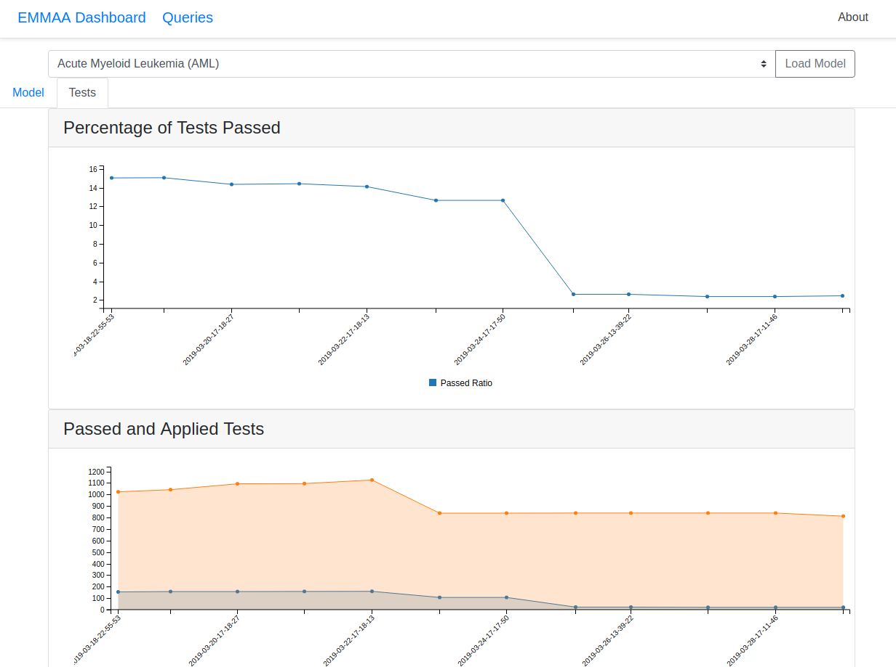
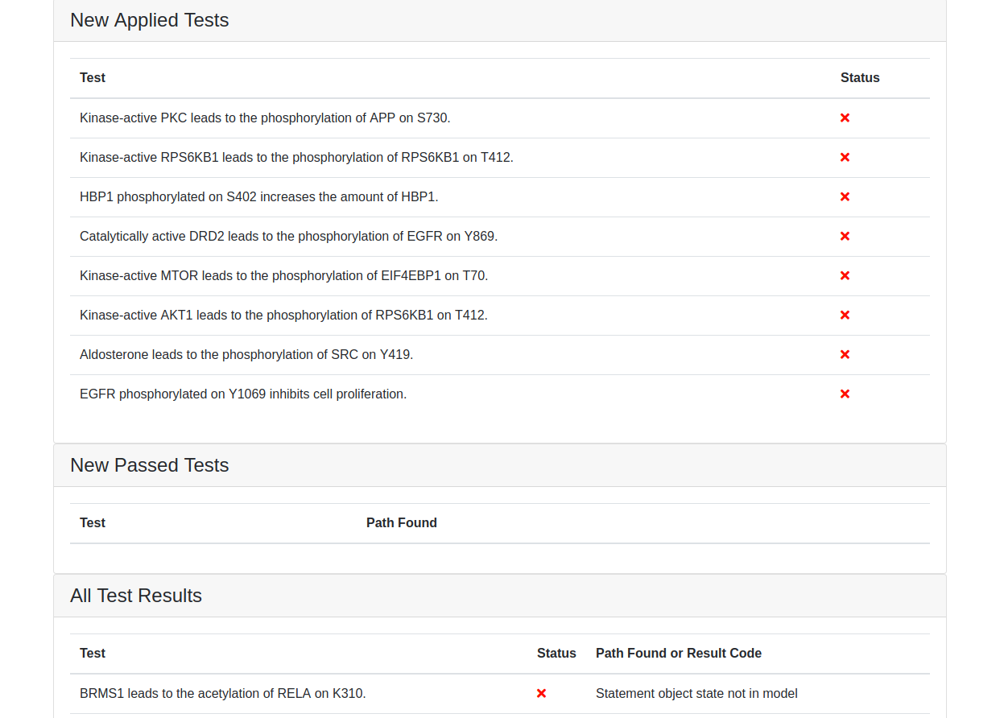
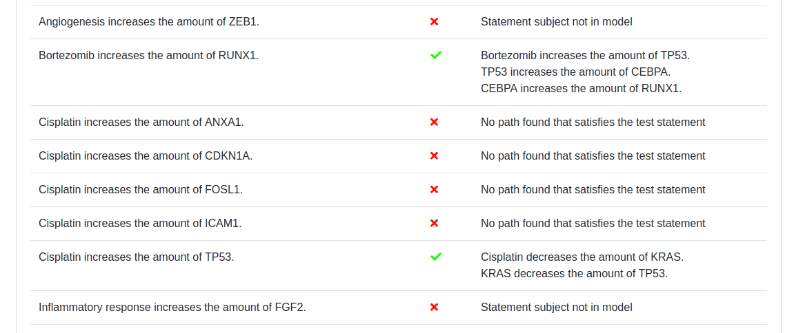

EMMAA Models Page
=================

The models page contains detailed information about the selected model in two
tabs: *Model* and *Tests*. At the top of the page the selected model is
shown in a drop-down menu. Another model can also be selected and loaded from
the menu.

Link to sources
---------------

To see further details regarding a mechanism, links to content databases are
generated for all statements where possible.

.. figure:: ../_static/images/linkout.png
  :align: center
  :figwidth: 75 %

  *Link to content database*

Model Tab
---------

The model tab contains model info with the date the model was last updated and
links to the NDEx website where a network view of the model can be examined.
The page also displays properties of the current state of the model, namely,
the distribution of statement types, the top 10 agents in the model, and the
statements with the most evidential support from various knowledge sources.
Further, the page shows how the number of statements in the model has evolved
over time, and which statements were added to the model during the most recent
update.

.. figure:: ../_static/images/aml_model_tab.png
  :align: center
  :figwidth: 75 %

  *The top of the model tab*

Tests Tab
---------

The tests tab contains two related plots: one showing the evolution over time
of the  percentage of applicable tests that passed, and another showing the
absolute number of tests that were applied to the model and the number of tests
that passed. 

  *The top of the tests tab showing the percentage of tests passed and applied
  and passed tests*

If any new tests were applied in the latest test run of the model
they are shown under *New Applied Tests*, while the new tests that passed are
shown under *New Passed Tests*.

  *If new tests were applied, they will be shown together with a breakdown of
  which tests passed*

Further down, all tests applied to the model are shown. A green check mark is
shown for tests that passed, along with an English language summary of how,
specifically, the model satisfies the test condition. For tests that didn't
pass, a red cross is shown, along with the reason for the model not having
passed the test (e.g., "Statement subject not in model").

  *Part of the list showing all applied tests with a status indicator for
  passed/failed*
