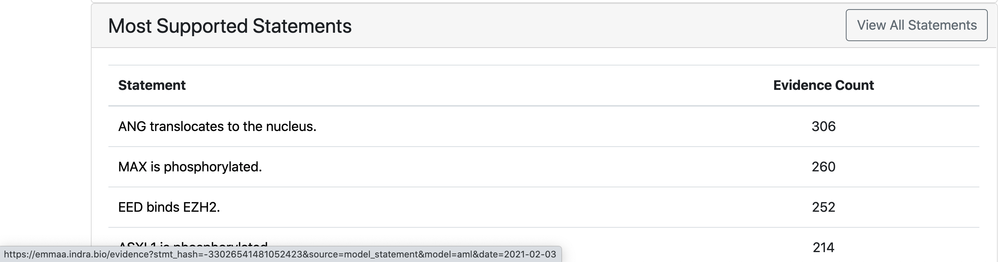
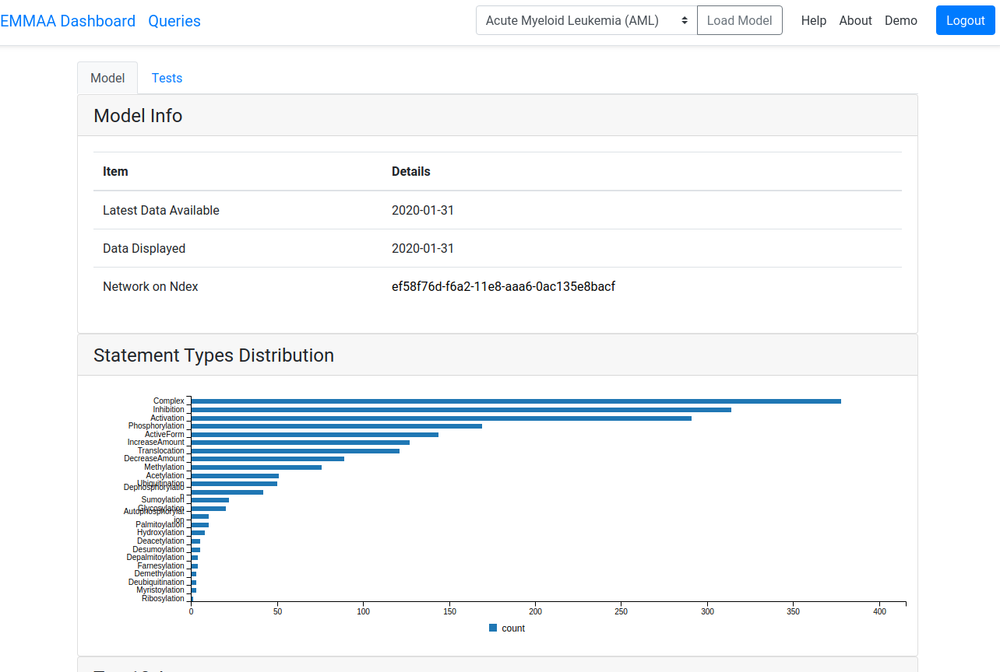
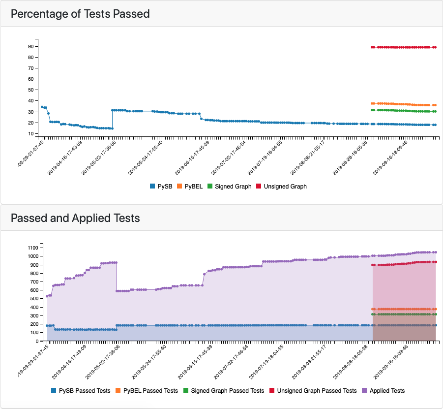
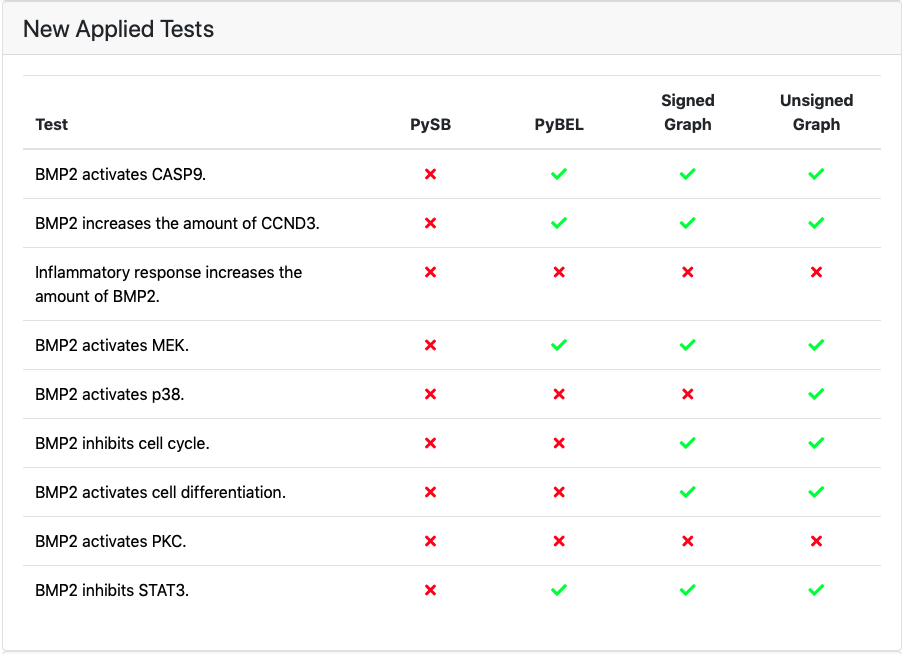

EMMAA Models Page
=================

The models page contains detailed information about the selected model in two
tabs: *Model* and *Tests*. At the top of the page the selected model is
shown in a drop-down menu. Another model can also be selected and loaded from
the menu.

Link to sources
---------------

To see further details regarding a mechanism, links to content databases are
generated for all statements where possible.

  *Link to content database*

Model Tab
---------

The model tab contains model info with the date the model was last updated and
links to the NDEx website where a network view of the model can be examined.
The page also displays properties of the current state of the model, namely,
the distribution of statement types, the top 10 agents in the model, and the
statements with the most evidential support from various knowledge sources.
Further, the page shows how the number of statements in the model has evolved
over time, and which statements were added to the model during the most recent
update.

  *The top of the model tab*

Tests Tab
---------

The tests tab contains two related plots: one showing the evolution over time
of the  percentage of applicable tests that passed, and another showing the
absolute number of tests that were applied to the model and the number of tests
that passed in each of supported model types. For the first few months of the
project, the tests were run on a PySB model assembled from EMMAA model 
statements. Later three other model types were added, namely, PyBEL graph, 
signed directed graph and unsigned directed graph.

  *The top of the tests tab showing the percentage of tests passed and applied
  and passed tests in different model types* A green check mark is
  shown for tests that passed and a red cross is shown for the tests that did
  not. The marks can be clicked on and link to a detailed test page where the
  detailed path(s) or a reson for the model not having passed the test will be
  shown.

If any new tests were applied in the latest test run of the model
they are shown under *New Applied Tests*

  
  *If new tests were applied, they will be shown together with a breakdown of
  a test status per each model type*

New tests that passed for any of the model types are shown under 
*New Passed Tests* along with the top path found. To see the statements
supporting the path, one can click on a path and be redirected to a detailed
test page.

  
  *If new tests were passed, they will be shown together with a top path*

Further down, all tests applied to the model are shown. Similarly to new
applied tests, this table also contains green and red marks indicating the test
status and linking to detailed test page.

.. figure:: ../_static/images/all_test_results.png
  :align: center
  :figwidth: 100 %

  *Part of the list showing all applied tests with a status indicator for
  passed/failed*
