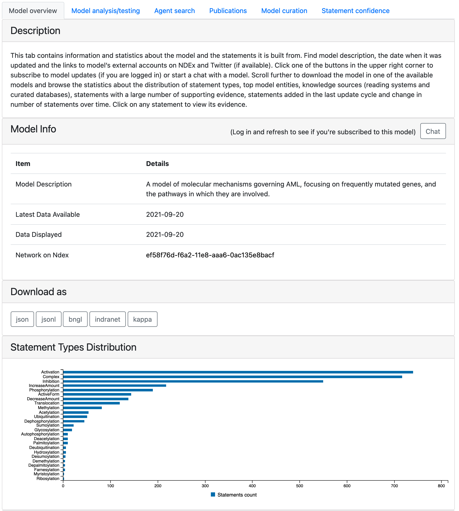

EMMAA Models Page
=================

The models page contains detailed information about the selected model in the
following tabs:

- :ref:`dashboard_model_overview_tab`
- :ref:`dashboard_models_tests_tab`
- :ref:`dashboard_agent_search_tab`
- :ref:`dashboard_models_papers_tab`
- :ref:`dashboard_models_curation_tab`
- :ref:`dashboard_belief_tab`

Each tab has a section describing its content. At the top of the page the
selected model is shown in a drop-down menu. Another model can also be selected
and loaded from the menu.

  *Avaliable tabs*

Link to statement details
-------------------------

Multiple tabs display the model statements descibing relevant biological
mechanisms. To see further details regarding a mechanism, browse its
evidence from literature and databases and submit curations, links to a separate page are
generated for all statements where possible. To read more about that page, see:
:ref:`statement_evidence`.

.. figure:: ../_static/images/linkout.png
  :align: center
  :figwidth: 75 %

  *Link to statement evidence page*

.. _dashboard_model_overview_tab:

Model Overview Tab
------------------

This tab contains information and statistics about the model and the statements
it is built from. At the top of the tab a user can find model description,
the date when it was last updated and the date when the displayed state of the model was 
generated. By default the latest available state of the model is displayed but 
the user has an option to explore earlier states by clicking on an earlier time
point on any of the time plots across the tabs
(for more details see: :ref:`dashboard_models_load_previous`).
Links to the NDEx website where a network view of the
model can be examined and to the Twitter account if available are provided.
There are also two buttons in the top right corner of the first table:
- "Subscribe" (might need to log in to see) that lets users subscribe to
receive email notifications when the model has any updates.
- "Chat" that opens up a dialogue window where users can chat with the model
in natural language. Read more about this here: :ref:`chat_page`

It is possible to download the models in various formats and the corresponding
buttons are placed next.

The page also displays properties of the current state of the model, namely,
the distribution of statement types, the top 10 agents in the model, the 
distribution of knowledge sources (reading systems and databases) of model
statements and the statements with the most support from various knowledge bases.
The table with most supported statements also has a button "All statements"
clicking on which a user can be redirected to a page showing all statements in
the model: :ref:`all_statements`. It is also possible to get redirected to
all statements page by clicking on any statement type in "Statement Types
Distribution" plot (the statements will be filtered to this type in this case).
Further, the page shows how the number of statements in the model has evolved
over time, and which statements were added to the model during the most recent
update.

  *The top of the model tab*

.. _dashboard_models_tests_tab:

Model Analysis/Testing Tab
--------------------------

The model analysis/testing tab contains information about the results of using
the model on a selected “test” corpus. Test corpora consist of Statements
representing observations. These can either be considered properties that the
model is expected to satisfy (model validation or testing) or unexplained data
that model analysis is used to explain (model analysis). At the top of the
model analysis/testing tab, a drop down menu displays which test corpus was
used for the currently displayed test results. Clicking on the drop down menu
will display all available test corpora for the current model. Clicking
"Load Test Results" will load the test results for the selected test corpus.

  *The results from different test corpora can be loaded. Here "Rasmodel Tests",
  "Skcm tests", "Rasmachine Tests", and "Large Corpus Tests" are available.*

The analysis/testing tab contains two related plots: one showing the evolution over time
of the percentage of applicable tests that passed, and another showing the
absolute number of tests that were applied to the model and the number of tests
that passed in each of supported model types. For the first few months of the
project, the tests were only run on a PySB model assembled from EMMAA model
statements. Later three additional model types were added, namely, PyBEL
graph, signed directed graph and unsigned directed graph.

.. figure:: ../_static/images/rasmachine_tests_tab_top.png
  :align: center
  :figwidth: 100 %

  *The top of the tests tab showing the percentage of tests passed together
  with applied and passed tests in different model types*

If any new tests were applied in the latest test run of the model
they are shown under *New Applied Tests*. A green check mark is shown for
tests that passed and a red cross is shown for the tests that did not. The
marks can be clicked on and link to a detailed test results page where the
detailed path(s) or a reason for the model not having passed the test will be
shown. To read more about the detailed test results page, see:
:ref:`detailed_tests_page`.

.. figure:: ../_static/images/new_applied_tests.png
  :align: center
  :figwidth: 100 %
  
  *If new tests were applied, they will be shown together with a breakdown of
  a test status per each model type*

New tests that passed for any of the model types are shown under 
*New Passed Tests* along with the top path found. The statements supporting
the path are can be seen by clicking on a path which links out to the detailed
test results page for the test.

.. figure:: ../_static/images/new_passed_tests.png
  :align: center
  :figwidth: 100 %
  
  *If new tests were passed, they will be shown together with a top path*

Further down, all tests applied to the model are shown. Similarly to new
applied tests, this table also contains green and red marks indicating the test
status, linking to detailed test results page.

.. figure:: ../_static/images/all_test_results.png
  :align: center
  :figwidth: 100 %

  *Part of the list showing all applied tests with a status indicator for
  passed/failed*

.. _dashboard_agent_search_tab:

Agent Search Tab
----------------
The Agent Search tab allows users to view the statistics about any individual
agent (for instance, a protein, small molecule, or phenotype) in the model.
To initiate the search, a user needs to type the name of the entity of interest
(or select one from suggested options) and click "Generate agent stats" button.
The page will be reloaded with the statistics about this agent.

  *Suggestions for the partially typed agent name*

The newly generated page contains the agent description and links to external
ontologies as well as the relevant sections of other tabs with the focus on
selected agent. Similarly to model overview tab, it displays the distribution
of statement types, knowledge sources and most supported statements but only
statements containing the selected agent are used to generate this statistics.
The tab also shows top interactors of the entity in the model and publications
from which the statements containing it were extracted.

.. figure:: ../_static/images/agent_stats.png
  :align: center
  :figwidth: 75 %

  *Part of the page generated for BRAF*

Similarly to model analysis tab it contains the results of testing the model
against a given test corpus. It is possible to select a different corpus to
reload the results. There are two different aspects displayed here:
1) the observations ("tests") that contain the agent of interest and their
explanations
2) explanations (paths) containing the agent of interest.

  *Tests and paths containing BRAF*

.. _dashboard_models_papers_tab:

Publications Tab
----------------

The Publications tab shows statistics for both processed papers and papers that support
assembled model statements. At the top of the Publications tab the time series plot
shows the changes in the counts of both paper groups over time.

.. figure:: ../_static/images/papers_over_time.png
  :align: center
  :figwidth: 100 %

  *Number of processed papers and papers with assembled model statements over time*

Further down, papers with the largest number of assembled statements are shown.
The statements extracted for each paper can be viewed by clicking on a paper
title (see: :ref:`paper_page`).

Finally, a list of papers processed after the previos update is displayed. The
table is sorted first by the number of assembled statements and then by the 
number of raw statements extracted from the paper. One or both of these numbers
can be zero. Zero assembled statements with a positive number of raw statements
means that the raw statements were filtered from the model during the assembly
process. Two zeros mean that the paper was processed but no statements were
extracted from it. The second column in this table provides a link to the
original publication as an external resource.

.. figure:: ../_static/images/new_papers.png
  :align: center
  :figwidth: 100 %

  *Example of new processed papers table*

.. _dashboard_models_curation_tab:

Model Curation Tab
------------------

The Model Curation tab summarizes statistics related to curations for statements
that are part of the model. At the top of the tab two barplots
show the counts of evidences and assembled statements curated by individual
curators.  

.. figure:: ../_static/images/curators.png
  :align: center
  :figwidth: 100 %
  
  *Counts of evidences and statements curated by individual curators*

The next plot shows the number of curations grouped by type.

.. figure:: ../_static/images/curation_types.png
  :align: center
  :figwidth: 100 %

  *Curations grouped by type*

Finally, the number of curated statements and evidences over time is shown.

.. figure:: ../_static/images/curation_over_time.png
  :align: center
  :figwidth: 100 %

  *Curations over time*

.. _dashboard_belief_tab:

Statement Confidence Tab
------------------------

Each statement in the model has an associated belief which represents the
confidence level that the statement is correct. This tab shows the distribution
of beliefs among statements in the model and allows users to select a belief
range to view the statements within it.

  *Statement Confidence tab*

.. _dashboard_models_load_previous:

Load Previous State of Model
----------------------------

To view the state of the selected model together with the test results for a
particualar date, click on any data point for the desired date in any of the
time series shown on either the Model tab, the Tests tab or the Papers tab.

.. figure:: ../_static/images/time_machine_selection_cropped.png
  :align: center
  :figwidth: 100 %

  *Clicking on a data point in any time series will link to the state of the
  model and the test results for the associated date.*

Clicking the data point will link back to the same models page with data
loaded for the selected date. The model info section displays the selected
date as well as the date for the most recent data. Any time series show data
up to the selected date. Any section showing new updates, such as "New
Passed Tests", shows what was new on the selected date while "All Test
Results" shows the state of the results were in. Clicking on "Go To Latest"
on the top panel will link back to the most recent state of the model.

.. figure:: ../_static/images/previous_date_cropped.png
  :align: center
  :figwidth: 100 %

  *When the state of the model for a previous date is shown, the date is
  diplayed in "Data Displayed". Clicking on "Go To Latest" on the top panel
  will link back to the most recent state of the model*
