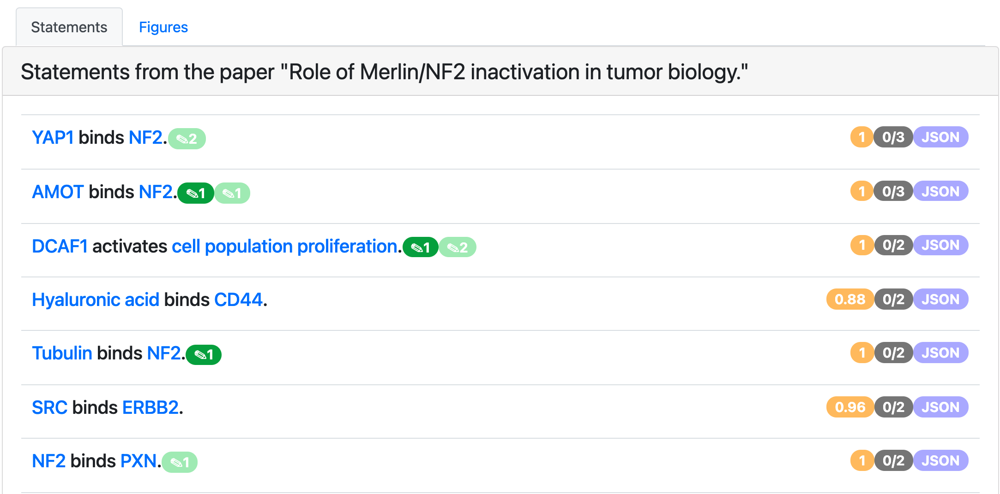

.. _paper_page:

EMMAA Individual Paper Page
===========================

By clicking on paper title on papers tab on model page, a user is redirected to
an individual paper page that contains model statements from this paper. The
view here is similar to statement evidence or all statements page with the 
exception that the statements and evidences are filtered to only those that
are extracted from a given paper. To browse and curate the evidence, a user
needs to click on a statement. Each statement can have multiple badges that
have the same meaning as in the statement evidence page. Blue badge with a flag
shows have many paths this statement is a part of. Green or red badge with a 
pencil shows how many times this statement was curated as correct or incorrect 
respectively. Grey badge shows the number of loaded evidences and the total 
number of evidences supporting this statement. Clicking on JSON badge opens a 
new page containing JSON representation of the statement.

  *Individual paper page view*