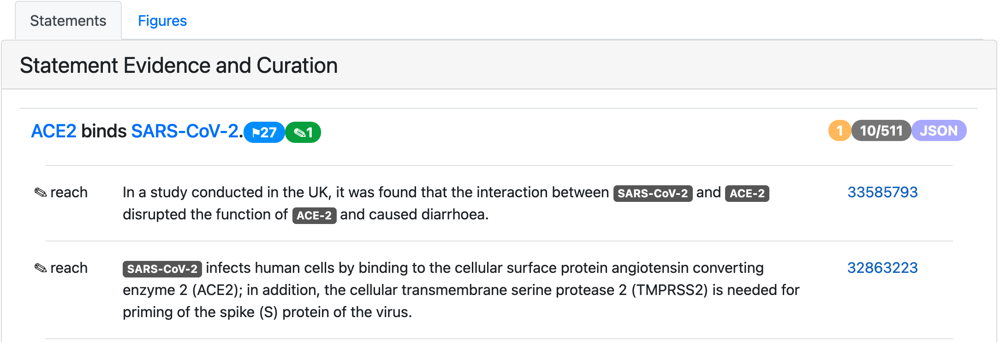
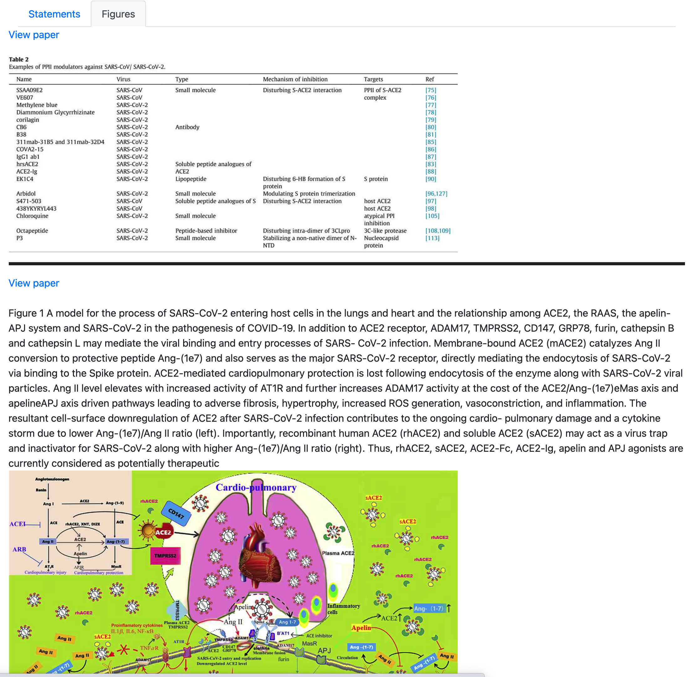

.. _statement_evidence:

EMMAA Statement Evidence Page
=============================

Any statement displayed on any of the other pages (model page, detailed test or
query results) is linked to a statement evidence page where evidences from
different sources can be browsed and curated. Statement evidence page has two
tabs: statement and figures.

  *Textual statement evidence*

The statement tab displays text evidence for the statement.
At the top of the table, the statement itself is presented followed by a list
of sentences supporting this statement. There are several badges that represent
additional information about the statement. The blue badge with a flag in the example
above shows have many paths this statement is a part of. A green or a red badge with
a pencil shows how many times this statement was curated as correct or incorrect
respectively.  An orange badge shows statement's belief score.
The grey badge shows the number of loaded evidence and the total
number of evidences supporting this statement. Clicking on the JSON badge opens a
new page containing the JSON representation of the statement. For each evidence the
knowledge source and external link to the publication is given.
Clicking on the pencil badge to the left of the evidence, a user can curate
this evidence.

Figure tab shows non-textual evidence for the given mechanism. It displays
figures and tables from various papers mentioning the same entities as the
statement. It also provides short descriptions of figures (as described in
original publications) and links to the papers.

  *Non-textual statement evidence*