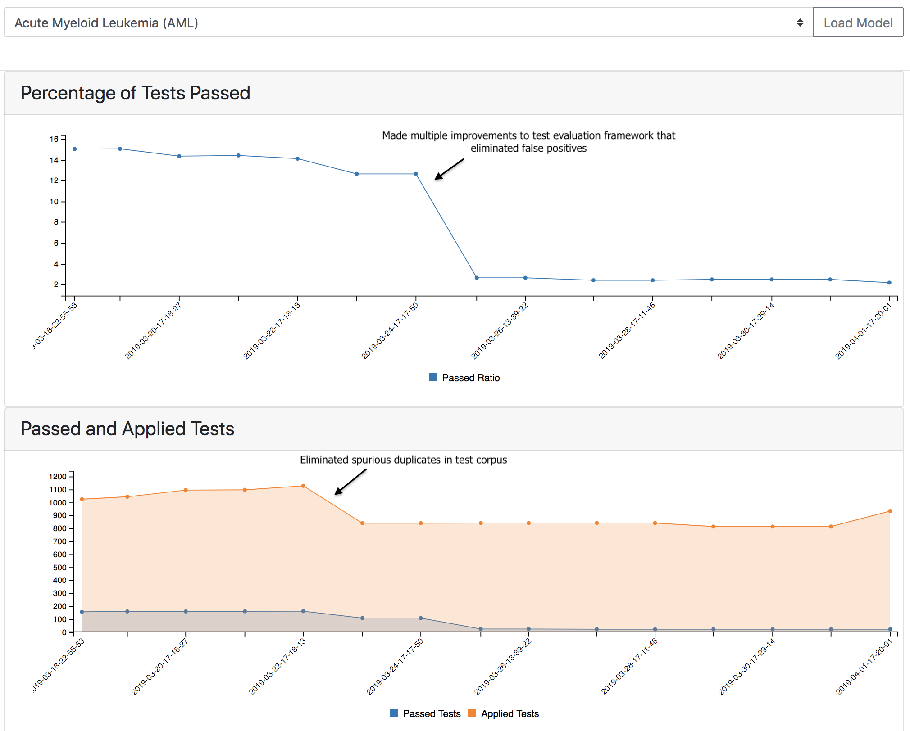
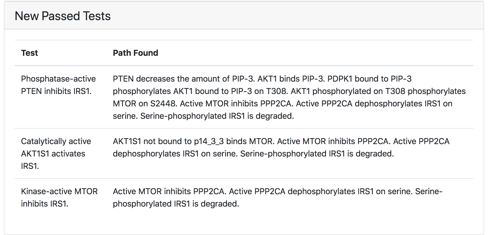
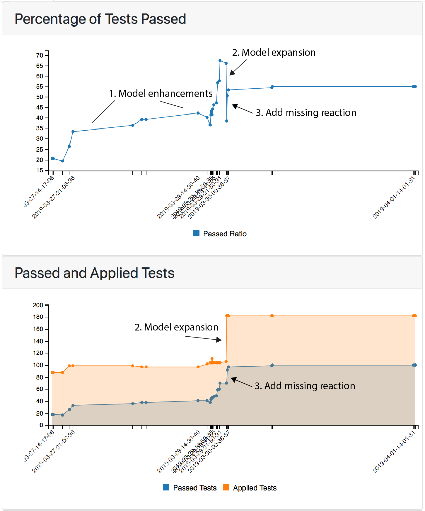

ASKE Month 5 Milestone Report: Lessons Learned
==============================================

Here we summarize some of the high-level lessons we learned about large-scale
machine-assisted model assembly and analysis over the course of developing
EMMAA. Overall, we strongly believe that through an attempt to automate
scientific modeling, we can gain substantial insight into the way human
experts work with models of complex systems.

Automated model assembly: the challenge of defining scope and context
---------------------------------------------------------------------

The initial development of EMMAA focused on deploying an automated model
assembly pipeline to generate models specific to the various cancer types
catalogued in the cancer genome atlas (TCGA). Collectively these models would
constitute an "Ecosystem" of self-updating, context-specific models that could
be used to answer mechanistic queries relevant to specific diseases. Context
specificity was necessary because the answer to queries (e.g. "What is the
effect of EGFR inhibition on cell growth?") differ depending on the specific
gene expression pattern and mutation profile of a particular cancer type.

Our initial approach to enforce the context-specificity of automatically
assembled models is described *here* and is centered on the genetics of specific
cancer types. Frequently mutated genes in specific cancers were used as search
terms to query Pubmed for publications which were then processed with
machine reading tools and assembled into models along with information from
curated databases.

Subsequent model testing highlighted a key shortcoming of this approach: tests
of well-known biochemical pathways would fail in nearly all models because the
limitations imposed on model scope (in the interest of context specificity)
resulted in many key genes being omitted.

In an effort to expand models to incorporate key "backbone" genes while still
retaining context specifity we then implemented two alternative approaches.

1. Run heat diffusion over our biological knowledge network to identify genes
   that were highly connected to the cancer-specific genes;
2. Query Reactome, a high quality database of biological pathways, for
   pathways containing the disease genes, and incorporate all genes
   from these pathways into the model.

We found that the latter approach involving Reactome was more effective at
eliminating mechanistic gaps than heat diffusion, which tended to highlight
irrelevant genes based peculiarities of the knowledge network structure.
However, even with the automated Reactome-based approach we found that models
had a very low ratio of passing tests, and glaring mechanistic gaps: for
example, the melanoma model passed `only 4% of tests
<http://emmaa.indra.bio/dashboard/skcm>`_ from the BEL Large Corpus, and
omitted MAP2K1, a protein immediately downstream of (the frequently mutated
gene) BRAF and a validated target in melanoma.

We therefore explored an alternative approach, in which models would be made
specific to biochemical pathways rather than cancer types, a la the original
Ras Machine. We found that the first iteration of this model had a much
higher pass ratio of 34%, suggesting that models built and limited in scope
in this way were more likely to have the internal integrity required for
answering mechanistic queries.

Despite this improvement, the central problem of capturing model context
remains: even if an automatically assembled model contains the genes relevant
to a specific disease does not imply that it can answer a mechanistic query in
a context specific way. For example, the Ras pathway is involved in many cancer
types, not least in lung cancer and melanoma, yet the effects of intervening in
the pathways differ between the two diseases. A key remaining challenge is to
develop a system that can pull in the relevant data (e.g., gene expression,
mutations) to contextualize structurally identical models, and make use of this
data during analysis to reach context-specific conclusions.

Automated model analysis: benefits of automated model validation
----------------------------------------------------------------

With respect to model analysis, the first key lesson learned is how valuable
the process of automated testing is for developing model assembly systems
such as INDRA and EMMAA. By coupling large-scale automated reading and assembly
with automated testing and analysis, the strengths and weaknesses of the
reading/assembly machinery itself are clearly exposed. Over the course
of monitoring daily updates to the disease models and browsing test results,
we were able to identify bugs and other opportunities for improvement in a
highly efficient and targeted way. The image below illustrates the effect
of some of these improvements as they affected the number of applied and passed
tests:

Test-driven modeling
--------------------

A key observation that we have made during the development of EMMAA is of the
value of automated model testing not only as a means of post-hoc model validation,
but also to support *test-driven modeling.* That is, the *construction* (in
part manual) of scientific models based on a corpus of qualitative experimental
constraints. This is by analogy with `test-driven development
<https://en.wikipedia.org/wiki/Test-driven_development>`_ in software
engineering in which the tests are written first, and program features are only
added to satisfy the tests.

During this reporting period, we have explored test-driven modeling by manually
building a model of a core subset of the `Ras signaling pathway
<https://www.cancer.gov/research/key-initiatives/ras/ras-central/blog/2015/ras-pathway-v2>`_.
The model is built using natural language via INDRA and TRIPS as described
`here <http://msb.embopress.org/content/13/11/954.long>`_; the automated
assembly of the natural language sentences yields a model with semantic
annotations enabling subsequent testing and analysis. The model is exposed in
the EMMAA dashboard as the `"Ras Model"
<http://emmaa.indra.bio/dashboard/rasmodel>`_. The initial model consisted of a
set of roughly 60 natural language sentences and was roughly doubled in size
through an iterative process of expansion and refinement that was driven by
model testing.

We have found that the test-driven modeling approach has a number of advantages
for the construction of scientific models. First, the approach to scientific
modeling in many fields is to use a formal model to encode a specific
hypothesis about a particular phenomenon. These "fit-to-purpose" models are
useful tools for answering specific scientific questions but they are rarely
reusable and are biased toward a particular explanation. With test-driven
modeling, the growth of the model is empirically driven by the observations
that match the scope of the model, independent of any specific problem.  In
extending the Ras model to satisfy tests from the BEL Large Corpus, we
repeatedly found it necessary to add in underappreciated or noncanonical
mechanisms. For example, it is well known that EGFR activation leads to the
phosphorylation and activation of SRC; but it is also the case that SRC
phosphorylates and potentiates the activation of EGFR. Similarly, AKT1 both
phosphorylates and is phosphorylated by MTOR. In typical practice, a modeler
would not incorporate all of these influences unless it was their specific
intention to investigate crosstalk, feedback, or other aspects of the
overall mechanism that deviate from a simple linear pathway. The process of
test-driven modeling brought to the forefront how common these processes are.

Second, just as in software development, test-driven modeling helps the modeler
avoid decorating a model with details that are not essential to improving
overall performance. This helps to avoid modeling quagmires in which a
modeler attempts to encode everything known about a process in maximum detail.
The existence of a set of tests, and the iterative development process that
EMMAA enables (serving here as a tool for continuous integration of models),
dramatically improves the efficiency of building high quality, reusable models.

Third, test-driven modeling helps build insight into how a model works, as well
as highlighting serendipitous and potentially unexpected implications of
particular mechanisms.  During the test-driven development of the Ras Model,
there were several instances where adding a small extension to the model to
address an issue that appeared to be local to the two proteins resulted in
several additional tests passing, that involved long-range causal influences.
For example, fixing a reaction involving MTOR and PPP2CA resulted in three
tests passing, each highlighting the negative feedback from MTOR back to
upstream IGF1R signaling via IRS-1.

The screenshot of the EMMAA dashboard test results page for the curated Ras
Model, shown below, highlights the iterative process of test-driven
model refinement and expansion.

The bottom plot shows the total number of applied tests over time, along with
the number of passing tests; the top plot tracks changes in the percentage of
passing tests. The initial process of model refinement is shown by (1), in
which the initial model was subject to testing and then progressively refined
over time. During this process the pass ratio grew from roughly 20% to 67%. At
this point, the model was expanded to include the well studied signaling
proteins EGF and EGFR. This nearly doubled the number of applied tests (2,
bottom plot), but since relatively few of these new tests passed, the pass
ratio dropped to ~35%. Importantly, these new tests were applied
*automatically* by EMMAA as a consequence of the expansion in model scope.
Inspection of the model highlighted the fact that EGFR was disconnected from
many of its downstream effectors; addition of only a single statement
(connecting EGFR to SOS1, which was already in the model for its role
downstream of IGF1R) led to a large number of the new tests passing, boosting
the pass ratio back to over 50% (3, both plots).

Exploiting the bidirectional relationship between models and tests
------------------------------------------------------------------

During the development of EMMAA we have come to appreciate the benefits of
treating the information flow between models and tests as symmetric
and bidirectional.

For example, manually curated tests can be used to validate automatically
assembled models, or the other way around: curated models validating
automatically extracted observations. In our initial work, we focused on the
application of curated experimental observations (from the BEL large corpus) to
automatically assembled mechanistic models. We described above how applying
these tests to the Ras Machine model helped us to identify issues in our
automatic model assembly pipeline that had been latent for years. We now also
see the value in automatically collecting tests and using high-quality curated
models to evaluate the plausibility of the test observations themselves. For
example, in the development of the Ras Model, we found that a surprising
proportion (over 15%) of the tests in the BEL Large Corpus were incorrectly
curated. These *test errors* were inadvertently highlighted when the *model*
failed to pass them. We imagine that observations derived from a noisy source
(such as machine reading) could be subjected to checking by one or more
high-quality models, with the model establishing the likelihood that a finding
resulted from a machine reading error. It is also possible to imagine that in
fields where models are mature, new scientific findings could be
automatically subjected to model-driven evaluation, highlighting the ways in
which they either support or contradict established models.
