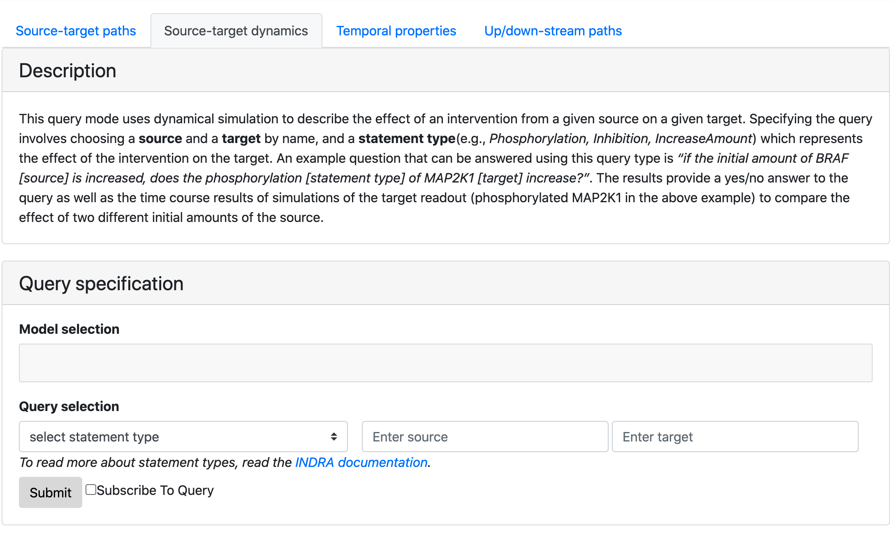
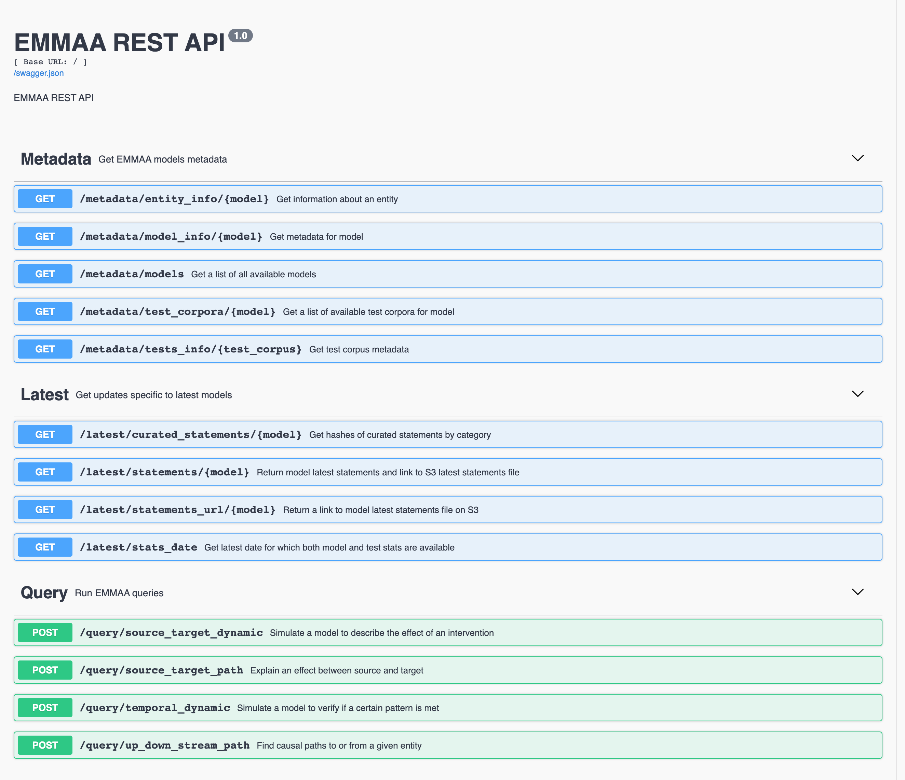
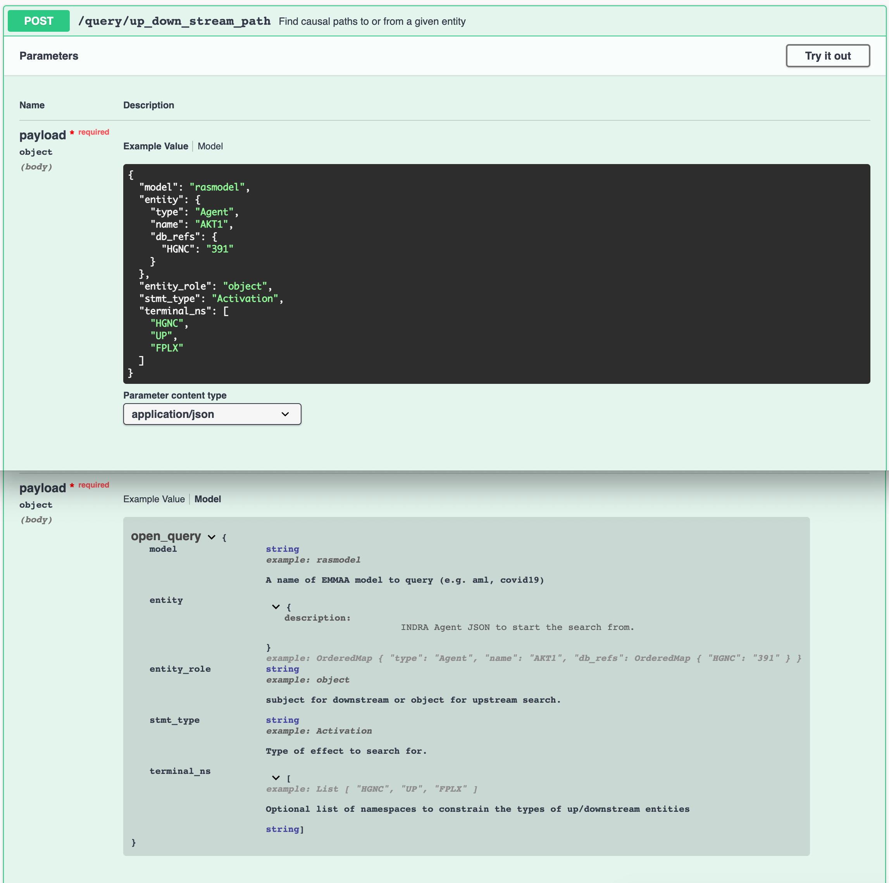
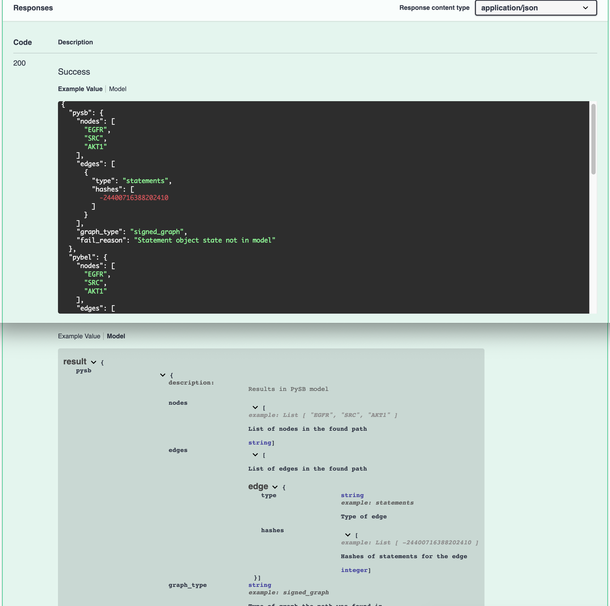

ASKE-E Month 10 Milestone Report
================================

Dynamical model analysis
------------------------

We made several developments that significantly extend the ways in which
EMMAA models can be analyzed using simulation.

Extended automated assembly for model simulation
~~~~~~~~~~~~~~~~~~~~~~~~~~~~~~~~~~~~~~~~~~~~~~~~

As described previously, EMMAA contains models built using several different
approaches ranging from small human-defined models written in simple English to
large fully automatically assembled models from up to hundreds of thousands
of publications. There is a special set of challenges associated with models
build automatically from source knowledge as follows:
- Several EMMAA models are very large, making simulation impractical.
- EMMAA models that are automatically assembled from literature and
  pathway databases can by default include "bypass edges", i.e., relationships
  that are reported in some source which are not direct physical interactions
  but indirect effects.
- There are complicated redundancies at the level of individual mechanisms,
  for instance a model can simultaneously contain "A activates B", and
  "A phosphorylates B", without an explicit relationship between the two.
  This can create inconsistent "parallel" pathways over different states
  of B.
- Models that include text mining output are naturally subject to some amoun
  of incorrect information due to various random and systematic errors.
- Any mechanisms not explicitly stated in text (or in pathway databases) are
  not represented. One common set of mechanisms are "reverse effects". For
  instance, there may be several known mechanisms for the positive regulation
  of the amount of a given protein, but no explicit mention of proteins
  naturally degrading.

To address these challenges, we have developed a number of assembly procedures
and implemented support for running an additional assembly pipeline consisting
of these steps for EMMAA models, specifically to support dynamical simulation.
Similar to the generic knowledge assembly pipeline that is applied to
each EMMAA model, these assembly steps are still applied at the
knowledge/statement level before generating a rule-base dynamical model
from the statements using the PySB model assembler.

To demonstrate this, we chose The Ras Machine model and configured
an extended assembly pipeline with the following steps:
- Filter out complex formation statements, since they can lead to unconstrained
  polymerization unless additional conditions are supplied.
- Filter to statements that are known to be direct, either based on annotations
  from pathway databases or determined from linguistic cues during text mining.
- Filter to high-confidence statement that have belief score > 0.95.
- Filter to the most specific version of statements in case a statement appears
  at multiple refinement levels.
- Filter strictly to genes in the Ras pathway (which are also the prior search
  terms around which The Ras Machine is built).
- Apply a set of semantic filters: filter phosphorylations to ones where the
  subject is a kinase, filter to amount regulation statements where the
  subject is a transcription factor, etc.
- Run the "Mechanism Linker" which applies logic over sets of statements
  to fill in missing information and remove certain redundancies as follows:
  - Find the most specific activity type known for each protein and "reduce"
    all active forms to that activity type. For example, if a protein is
    known to have generic "activity", but also "kinase" activity, and "kinase"
    activity is the only known specific activity type, then all the generic
    "activity" states will be reduced to "kinase" activity.
  - Find the most specific modifications known for each protein and "reduce"
    all modifications to that form.
  - Remove any activation statements that are redundant with respect to
    a modification and an active form statement. (For instance, if we know
    that A activates B, and also that A phosphorylates B, and Phosphorylated
    B is active, then we can remove the redundant A activates B statement.
  - Rewrite all agents that appear in an active position in a statement (
    e.g., A in the statement A activates B) to be in one of their known
    active forms. For example, if we have the statement A activates B,
    and we know that A is active when it's bound to C, then the statement
    is rewritten to A bound to C activates B.
  - Filter out inconsequential modifications and activations, in other words,
    remove any statements that modify the state of an agent in a way that
    doesn't have any further downstream effect and is therefore
    inconsequential.

Having performed these steps, we were able to simulate the model using
network-free stochastic simulation.

Supporting network-free simulation
~~~~~~~~~~~~~~~~~~~~~~~~~~~~~~~~~~
Until recently, EMMAA only supported deterministic ODE-based simulation for
models. The main limitation is that ODE-based simulation requires fully
defining the set of variables and equations representing system behavior up
front. This implies that a reaction network (from which ODEs can be derived)
needs to be generated, where the reaction network describes all biochemical
reactions that change the amount or state of entities (typically proteins and
small molecules). However, reaction networks can be very large (and potentially
infinitely large) due to the combinatorial complexity of entities interacting
with each other. (Consider for instance the trivial polymerization reaction
where some entity X has two binding sites each of which can bind X, resulting
in chains of X of unlimited length).

Network-free, agent-based simulation overcomes this challenge since
it doesn't require enumerating all states up front, rather, one can
provide an initial mixture from which the state of the system evolves
as reaction events happen over time. To support this simulation mode,
we integrated the Kappa simulator with EMMAA via the kappy Python package.
We implemented the API to the Kappa simulator such that it is consistent with
the previous ODE-based simulator.

One specific example of a model which - due to combinatorial complexity -
cannot be generated into a reaction network but can be simulated using this
network-free approach.

Adaptive sample-size dynamical property checking
~~~~~~~~~~~~~~~~~~~~~~~~~~~~~~~~~~~~~~~~~~~~~~~~
One property of stochastic network-free simulation is that each simulation
trace is different, and given any qualitative property, whether a trace
satisfies that property or not can differ due to this stochasticity. So the
question arises: how many simulations should one do to conclude - assuming
pre-specified statistical error bounds - that a given property holds with
at least a given probability. We integrated a sequential hypothesis testing
algorithm with the property checking surrounding network-free simulation
which can decide (after each simulation) whether to stop or to perform
another simulation to decide about the satisfaction of the property. This way,
sample sizes are chosen adaptively and automatically in a principled way.

In the future, we will work on integrating parametric uncertainty in EMMAA
model analysis. In that case, even deterministic ODE-based simulations will
be subject to uncertainty, and the same sequential hypothesis testing
approach will be applicable in that simulation mode too.

Intervention-based dynamical queries
~~~~~~~~~~~~~~~~~~~~~~~~~~~~~~~~~~~~

Integration with the Kappa dynamical modeling and analysis UI
~~~~~~~~~~~~~~~~~~~~~~~~~~~~~~~~~~~~~~~~~~~~~~~~~~~~~~~~~~~~~

Improved EMMAA query UI and REST API
------------------------------------
This month we made various changes to the EMMAA service to improve user
experience for both users querying models via the interactive web interface and
through the REST API programmatically.

Having added intervention-based dynamical queries as described in the previous
section, we now support four types of queries. We updated the names of the
query types to be more descriptive and added instructions on how to submit and
interpret the results for each of the query types using the EMMAA interactive
query tool.

*Query page showing four types of queries, description and the form*

Over the last several months we reported adding various endpoints to the EMMAA REST
API to facilitate integration with the Uncharted UI. During this reporting period
we extended and improved the REST API and added an automatically rendered Swagger documentation that
describes the methods, input requirements, and expected responses for each
endpoint. We grouped the endpoints into three categories corresponding to the
goals for which they can be used (retrieving EMMAA models' metadata, getting
latest models' updates, and running EMMAA queries). The previous `/run_query`
endpoint that allowed running any type of query was replaced with four
separate endpoints for each of the query types for convinience and better
validation of user input.

*EMMAA REST API endpoints*

The documentation contains the descriptions and example values for each
parameter that a given endpoint can accept. The interactive Swagger
documentation also allows manually modifying the example input and trying out the
endpoints.

*Example input and parameters description for Up/down-stream query endpoint*

In addition, we provide examples and descriptions for responses to
validate the output and facilitate the interpretation of results.

*Example response and interpretation*

Network representation learning for EMMAA models
------------------------------------------------
Sets of INDRA statements such as those associated with each EMMAA model can be assembled into
graph-like data structures of decreasing granularity: directed graphs with typed edges,
directed graphs without typed edges, and ultimately, undirected graphs. Different network
representation learning methods can be used for each data structure to assign dense vectors
to nodes (and edges, if applicable). These are useful for downstream machine learning tasks
(e.g., clustering, classification, regression), link prediction, and entity disambiguation.
Our goal is to use the representations to investigate the similarities between nodes' representations
between the full INDRA database and each EMMAA model to identify context-specific nodes as well
as to make recommendations for including or removing nodes from each EMMAA model.

Building a preliminary NRL pipeline
~~~~~~~~~~~~~~~~~~~~~~~~~~~~~~~~~~~
There are both practical and theoretical considerations for using the highest granular directed
graphs with typed edges (i.e., knowledge graphs). Most of the associated methods, called
knowledge graph embedding models (KGEMs), suffer from issues in scalability. Because most useful
biological networks are larger than the size supported, there is still minimal theoretical insight
into how the methods perform on biological networks, which have very different topology to the
`semantic web` datasets to which they are typically applied and evaluated.

Instead, we built a reproducible pipeline for assembling the full INDRA database and each EMMAA model
into directed graphs without typed edges at varying belief levels for application of the `node2vec`
random walk embedding model to generate 64-dimensional vectors in Euclidean space for each node.

Later, we will automate this pipeline to run automatically upon each update to the full INDRA
Database and each EMMAA model such that the latest information can be incorporated. Further, the
results could be included in EMMAA API endpoint that returns model-specific metadata for each node.

Comparing EMMAA models with background knowledge
~~~~~~~~~~~~~~~~~~~~~~~~~~~~~~~~~~~~~~~~~~~~~~~~
We first investigated where nodes from each EMMAA model appear in the embedding space generated from the full INDRA
database with a belief greater than 60%. We used principal component analysis to project into 2-dimensional space
for visualization. Because of the formulation of the `node2vec` method, each features' contributions to the overall
variance are more homogenous than typical feature sets. The first two principle components only explained ~35% of
the variance. Background nodes are shown with low opacity in blue while EMMAA nodes are shown with high opacity in
orange.

.. image:: ../_static/images/nrl_comparison.png
   :align: center

Interestingly, there are some regions that are not covered by any EMMAA model. While this could be because of a
bias in the contexts covered by current EMMAA models, it might also lead to insight in underrepresented biology.

Identification of context-specific nodes
~~~~~~~~~~~~~~~~~~~~~~~~~~~~~~~~~~~~~~~~
Next, we wanted to identify nodes with the most similar and most dissimilar topologies in the INDRA database
and a given EMMAA model. We hypothesize that the most similar nodes represent the most generic biology and
the most dissimilar nodes represent context-specific biology. We investigated the overlap between the k-nearest
neighbors in embedding space for each node in the INDRA Database with the k-nearest neighbors in the embedding
space for each EMMAA model. To account for the size differences in the INDRA database and much smaller EMMAA
models, we used a fractional k=0.05 and the set overlap coefficient, which is more appropriate for sets of different
sizes. We performed the same task on the embeddings generated based on several belief cutoffs.

The following chart shows that when the belief cutoff is increased, the shape of the overlap coefficient rank
distribution typically shifts towards higher overlap coefficients. Darker lines correspond to higher belief.
Notably, this pattern does not hold for the literature derived models (e.g., Pain Model). The RAS Model results
should also be disregarded since the statements there should have an axiomatic belief of 1.0, but are tagged via
TRIPS so have a lower belief.

.. image:: ../_static/images/nrl_belief_plot.png
   :align: center

The nodes in the long tail of these distributions hold the most potential for novelty but also the most liability
for irrelevance. Our next step is to build a minimal browser for looking into these nodes as having a human in the
loop for the investigation of these nodes at the boundaries of EMMAA models could be useful.

Towards an automated recommendation engine
~~~~~~~~~~~~~~~~~~~~~~~~~~~~~~~~~~~~~~~~~~
Our ongoing work towards an automated recommendation looks at the neighbors of nodes in the EMMAA models within
the embedding space from the full INDRA Database to identify potential additions. We are investigate several clustering
algorithms and their classification counterparts as potential methods for scoring nodes for inclusion. Similarly, we
are investigating anomaly detection methods at can be used in reverse towards the same goal.

Later, we will return to the k-nearest neighbors analysis to identify nodes that could potentially be removed from
a given EMMAA model.

Improvements to :mod:`pykeen`
~~~~~~~~~~~~~~~~~~~~~~~~~~~~~
While `node2vec` performs well on biological networks due to the symmetry in the model formulation and the important
property of local community structure common to biological networks, we would still like to use more powerful methods
for network representation learning. We are making improvements to the :mod:`pykeen` package for knowledge graph
embeddings in order to make it more scalable and applicable for the directed graph with typed edges assembly of
INDRA statements. So far, we have made several improvements to its memory management on large graphs and begun work
integrating the :mod:`accelerate` for scaling across multiple GPUs.
