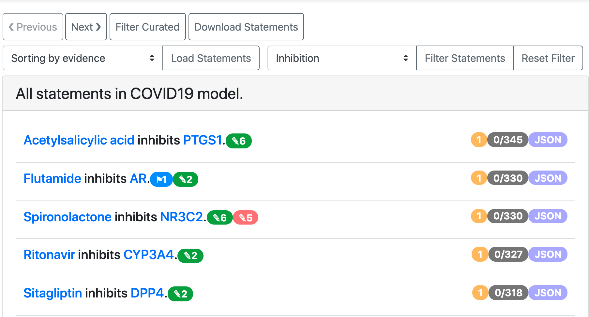
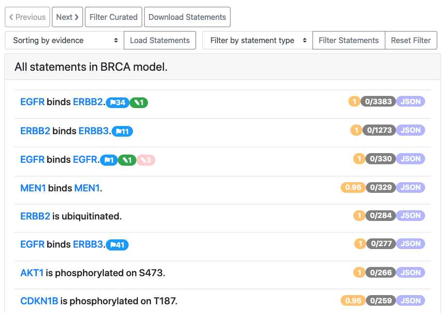
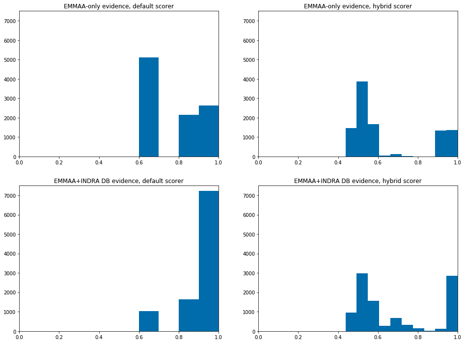

ASKE-E Month 11 Milestone Report
================================

Integration with ASKE modeling frameworks
-----------------------------------------

We collaborated with other teams to decide on a unified modeling framework to
simulate and visualize different models built in ASKE the same way.
As a result we designed a process to convert PySB reaction networks of EMMAA
models into PetriNet Classic GroMEt format developed by University of Arizona
team. The GroMEt structure includes State and Rate junctions connected by
wires. In the context of EMMAA models, State and Rate junctions are
represented by model species and reaction rates respectively. Wires include
the connections from reactants to the rates and from rates to products.
After discussions with University of Arizona and Uncharted teams on what
metadata is necessary for meaningful visualizations, we added custom metadata
to GroMEts generated from EMMAA models that includes mappings from State
junctions to INDRA Agents and from Rate junctions to INDRA Statements and
PySB rules. 

Generation of GroMEts is now deployed as a part of automated update pipeline and
their daily updated JSON exports are available for download on S3 and on EMMAA
dashboard. We also uploaded two examples of GroMEt exports to the shared GitHub
repo maintained by Galois team for the upcoming ASKE-E final demo.

BioCreative participation
-------------------------
The BioCreative challenge is a longstanding community effort to evaluate text
mining systems applied to biology. This year, BioCreative includes a special
track for COVID-19 text mining tool interactive demos which focuses on text
mining-based tools specifically developed to support COVID-19 research efforts.
We registered for this track with a proposal on the EMMAA COVID-19 model titled
"A self-updating causal model of COVID-19 mechanisms built from the scientific
literature", and our proposal was accepted for participation. We also received
some useful feedback on how to improve the EMMAA model query interface and the
statement browser interface which we subsequently implemented (as described in
this report). Going forward, we will continue to improve the EMMAA COVID-19
model and surrounding features, and aim to highlight ways in which EMMAA goes
significantly beyond just text mining and knowledge assembly, encompassing also
automated modeling and data analysis based on text mining results.

Improving the EMMAA model query interface
-----------------------------------------

In the previous report we shared the updates on addition of new query types and
improvements in the interactive query interface. This month we extended the
tutorial on using the query UI. We added sections about navigating different
parts of query page and selecting the correct query type based on the
scientific question and updated the descriptions and examples for all supported
types of queries.

.. figure:: ../_static/images/query_tutorial.png
   :align: center
   :scale: 30%

   *Part of updated query tutorial*

We exposed the links to both written tutorials and video
demonstations of the tool on the query page.

.. figure:: ../_static/images/query_links.png
   :align: center

   *Links to demos and tutorials from query page*

Improving the EMMAA statement browser
-------------------------------------

We extended the set of features for browsing all statements in a given EMMAA
model. It can be often useful to focus on one type of interactions when
browsing or curating statements. To enable this, we added a filter by statement
type that is shown on the image below.

   *COVID-19 model statements filtered to Inhibition*

In addition to filtering statements by type from the all statements view, user
can also click on any of the horizontal bars on statement types distribution
plot on the EMMAA model dashboard to be redirected to a page displaying
statements filtered down to that type. 

.. figure:: ../_static/images/stmt_types_chart.png
   :align: center

   *Statement types distribution chart before clicking to open statements view*

Previously we supported sorting the statements by the number of unique
evidence they have and by the number of paths they support. Recently we added
an option to sort statements by their belief score.

Using custom belief scorers for EMMAA models
--------------------------------------------

During this period we have developed an approach to deploying custom
probability models to estimate the reliability ("belief") of statements in
EMMAA models. As part of our ongoing efforts to validate and improve the
accuracy of these belief estimates, we have developed and validated several
machine learning models (e.g. logistic regression, random forest) to
empirically estimate belief based on a dataset of roughly 5,000 statements that
we have manually curated. A valuable feature of these models is that they can
capture the role of features other than reader evidence counts in estimating
belief; for example, we have found that statement type and number of unique
supporting PMIDs are also informative. We have also extended this approach to
include "hybrid" models that incorporate machine learning for estimating
reliability from text mining sources and a set of priors for curated databases.

We created a framework for deploying versioned, alternative belief models to S3
after training and subsequently making use of them during the assembly of EMMAA
models. The EMMAA model configuration now takes a user-configurable parameter
specifying which belief model to load and use. Statement belief estimates are
now also displayed in the front-end and can be used to sort statements in the
All Statements view (see screenshot below).

   *All statements view for the BRCA model, showing the orange belief badges on
   the right*

We are working to draw on additional statement evidences that are in the INDRA
Database (but outside the scope of the EMMAA model) to enhance estimates of
belief. This way, a statement that may appear rarely in text for a specific
disease context can be corroborated by information appearing outside that
context, such as in a pathway database or in papers not incorporated by the
EMMAA model. This will separate the technical estimate of a statement's
reliability from its canonicalness in a specific context, allowing users to
identify high-confidence extractions that may be novel in the context of a
particular disease.

To demonstrate these new developments, we computed belief estimates for the
neurofibromatosis model in four different configurations: with the default
belief model vs. a new, partly machine-learned "hybrid" model, and with
EMMAA-only evidences vs. evidences from both EMMAA and the INDRA DB. As shown
in the figure below, the inclusion of additional evidence from the INDRA DB
shifts belief estimates to the right due to the addition of extra evidence,
while the hybrid model provides a more continuous stratification of belief than the default belief model. In the upcoming period we will evaluate the use of
this approach in other models and determine whether the new belief estimates are well-calibrated.

   *Belief scores of statements in the EMMAA model, using the default belief
   model (left plots) or random-forest-based hybrid model (right plots); and
   using only EMMAA evidence (top plots) or including evidences from the
   INDRA DB (bottom plots).*

Developments in relation extraction from text
---------------------------------------------

We have previously reported on completing our goals to enable named entity
recognition and grounding in the Reach reading system for (1) viral proteins
(2) human and non-human (including viral) protein chains and fragments, and
have developed new algorithms in INDRA for organism disambiguation for proteins
in the context of a given publication.

This month, we continued our work on creating a training data set for
recognizing causal precedence in text. The goal is to find a set of positive
and negative examples where a paper describes an A-B interaction and also
a B-C interaction, and an A->B->C causal chain is implied (in the positive
case) or not implied (in the negative case). This labeled data can then be
used to train a classifier that can be run on elementary relation extractions
to reconstruct causal precedence relations. We have previously reported on
our approach to automatically finding positive examples. Since then, we have
worked on an alternative approach to finding negative examples. First, we
searched for papers in which both the A-B and the B-C relationship could be
found within a specified distance of each other. To improve the
quality/reliability of each example, we also implemented a filter to
retain only A-B, B-C pairs where each is supported by additional background
evidence beyond the given paper (this helps eliminate text mining errors).
We then reviewed the results to curate positive vs negative examples.
We found that the vast majority of examples remaining were positive
for causal precedence. This imples that proximity in text may often be
sufficient to infer causal precedence across A-B, B-C relations. We are
investigating this further while continuing to develop an improved method
for finding negative examples.
