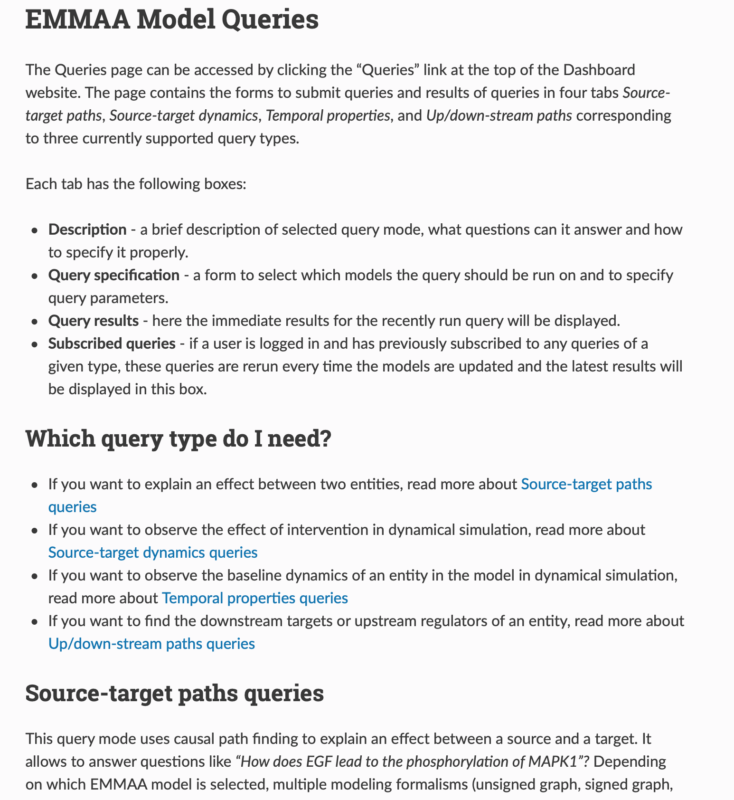
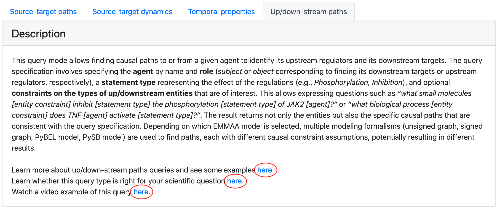
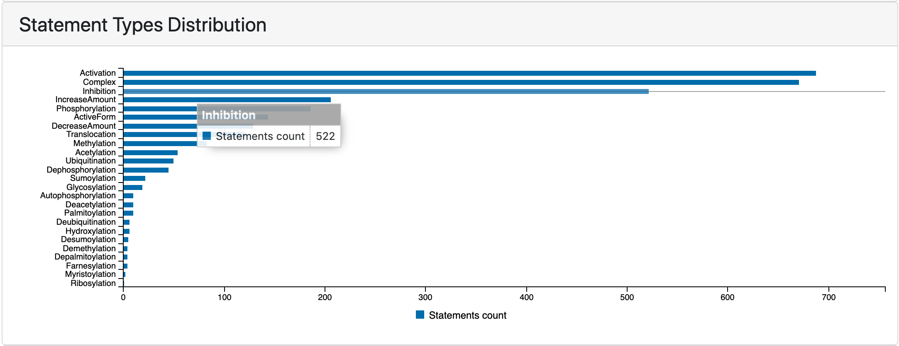

ASKE-E Month 11 Milestone Report
================================

Integration with ASKE modeling frameworks
-----------------------------------------

We collaborated with other teams to decide on a unified modeling framework to
simulate and visualize different models built in ASKE the same way.
As a result we designed a process to convert PySB reaction networks of EMMAA
models into PetriNet Classic GroMEt format developed by University of Arizona
team. The GroMEt structure includes State and Rate junctions connected by
wires. In the context of EMMAA models, State and Rate junctions are
represented by model species and reaction rates respectively. Wires include
the connections from reactants to the rates and from rates to products.
After discussions with University of Arizona and Uncharted teams on what
metadata is necessary for meaningful visualizations, we added custom metadata
to GroMEts generated from EMMAA models that includes mappings from State
junctions to INDRA Agents and from Rate junctions to INDRA Statements and
PySB rules. 

Generation of GroMEts is now deployed as a part of automated update pipeline and
their daily updated JSON exports are available for download on S3 and on EMMAA
dashboard. We also uploaded two examples of GroMEt exports to the shared GitHub
repo maintained by Galois team for the upcoming ASKE-E final demo.

BioCreative participation
-------------------------

Improving the EMMAA model query interface
-----------------------------------------

In the previous report we shared the updates on addition of new query types and
improvements in the interactive query interface. This month we extended the
tutorial on using the query UI. We added sections about navigating different
parts of query page and selecting the correct query type based on the
scientific question and updated the descriptions and examples for all supported
types of queries.

   *Part of updated query tutorial*

We exposed the links to both written tutorials and video
demonstations of the tool on the query page.

   *Links to demos and tutorials from query page*

Improving the EMMAA statement browser
-------------------------------------

We extended the set of features for browsing all statements in a given EMMAA
model. It can be often useful to focus on one type of interactions when
browsing or curating statements. To enable this, we added a filter by statement
type that is shown on the image below.

   *COVID-19 model statements filtered to Inhibition*

In addition to filtering statements by type from the all statements view, user
can also click on any of the horizontal bars on statement types distribution
plot on the EMMAA model dashboard to be redirected to a page displaying
statements filtered down to that type. 

   *Statement types distribution chart before clicking to open statements view*

Previously we supported sorting the statements by the number of unique
evidence they have and by the number of paths they support. Recently we added
an option to sort statements by their belief score.

Using custom belief scorers for EMMAA models
--------------------------------------------

Developments in relation extraction from text
---------------------------------------------

