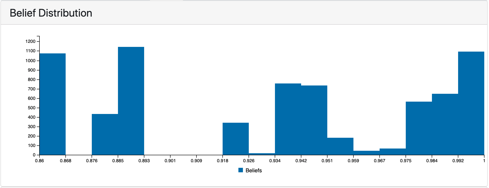
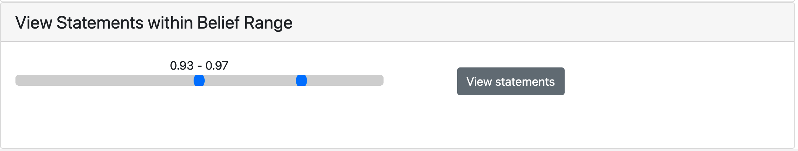
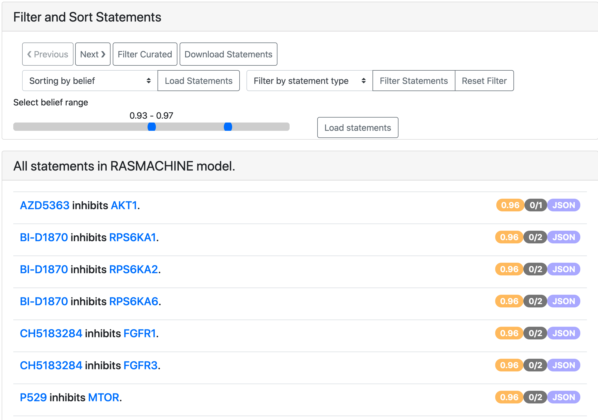

ASKE-E Month 12 Milestone Report
================================

Current state of EMMAA
----------------------

Applying EMMAA model to COVID-19 therapeutics
---------------------------------------------
The COVID-19 EMMAA model has continued monitoring and processing the literature
being published - currently at a pace of around 315 papers per day -
surrounding COVID-19. Since the beginning of 2021 the model has increased by
56% in terms of the number of papers processed. During this period, it also
identified over 30,000 new unique causal statements, an increase of around 8%.
Interestingly, while new relationships are still being frequently mentioned,
the rate of new, unique, causal knowledge being published appears to be
decreasing.

In terms of the model's explanatory capability, the number of drug effects on
coronaviruses it is able to explain (with the signed graph model) has grown
from 1,814 to 2,132 this year, in other words, it has explained over 300 new
drug effects based on new knowledge collected and assembled so far this year.

Review article on automated modeling
------------------------------------
This month we submitted and revised a review article "From knowledge to models:
automated modeling in systems and synthetic biology" which was accepted for
publication. It introduces a conceptual framework for discussing levels of
modeling automation with each level implying different roles for the human and
the machine in the modeling process. The review discusses existing tools and
approaches at each level of automation and provides. It also outlines the
strengths and weaknesses of current modeling approaches at the different levels
and discuss the prospect of fully automated fit-to-purpose modeling of
biological systems.

Progress on inter-sentence causal connective extraction from text
-----------------------------------------------------------------

Integrating belief information in the EMMAA dashboard
-----------------------------------------------------

We recently added a new tab on model dashboard to display belief statistics and
browse statements based on their belief scores.

The following plot shows the distribution of belief scores in the COVID-19
EMMAA model. Having it visualized is useful for understanding the effect of
using different belief scorers described in the previous report and of applying
belief filters in the model assembly.

   *Belief scores distribution in RasMachine EMMAA model.*

The next section in the belief tab shows the slider displaying the range of
belief scores in a given model. A user can select a belief range and load the
statements with the belief scores in that range. This gives a new way to
prioritize the statements for the curation.

   *Belief scores range slider.*

It is also possible to filter the statements to a given belief score range
from the all statements page.

   *EMMAA model statements filtered to a given belief range.*

Extending the ontology to epidemiology
--------------------------------------
To allow the Uncharted UI to use a single ontology covering both biology and
epidemiology models, we aimed to extend the INDRA ontology with terms relevant
for epi models. We found that the Infectious Disease Ontology (IDO) was an
appropriate ontology to integrate since it contains terms such as "susceptible
population" which correspond to commonly modeled nodes in epi models. However,
in order to integrate IDO, we needed to implement a new module in INDRA to
ingest ontologies in OWL format and expose their structure through an
appropriate interface. Using this new OWL-ingestion module, we added nodes and
relations from IDO to the INDRA Ontology graph and created a new export for use
in the Uncharted UI.

STonKGs paper
-------------

PyKEEN updates
--------------

BioCreative participation
-------------------------
We continued working on the BioCreative challenge on interactive COVID-19 text
mining tools. Our proposal "A self-updating causal model of COVID-19 mechanisms
built from the scientific literature" was accepted for participation. This
month, we prepared a system description document, recruited test users, and
created a new tutorial for using EMMAA's COVID-19 model.  TODO: link to
tutorial