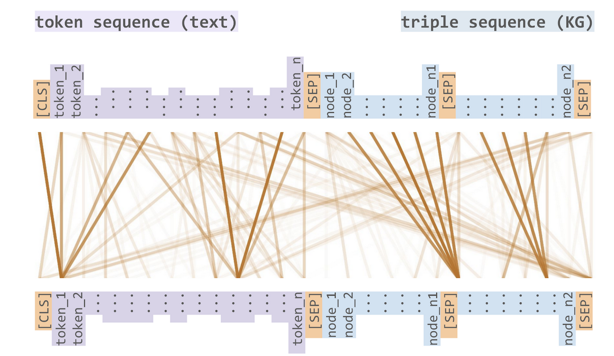

ASKE-E Month 12 Milestone Report
================================

Current state of EMMAA
----------------------

Applying EMMAA model to COVID-19 therapeutics
---------------------------------------------
The COVID-19 EMMAA model has continued monitoring and processing the literature
being published - currently at a pace of around 315 papers per day -
surrounding COVID-19. Since the beginning of 2021 the model has increased by
56% in terms of the number of papers processed. During this period, it also
identified over 30,000 new unique causal statements, an increase of around 8%.
Interestingly, while new relationships are still being frequently mentioned,
the rate of new, unique, causal knowledge being published appears to be
decreasing.

In terms of the model's explanatory capability, the number of drug effects on
coronaviruses it is able to explain (with the signed graph model) has grown
from 1,814 to 2,132 this year, in other words, it has explained over 300 new
drug effects based on new knowledge collected and assembled so far this year.

Review article on automated modeling
------------------------------------
This month we submitted and revised a review article "From knowledge to models:
automated modeling in systems and synthetic biology" which was accepted for
publication. It introduces a conceptual framework for discussing levels of
modeling automation with each level implying different roles for the human and
the machine in the modeling process. The review discusses existing tools and
approaches at each level of automation and provides. It also outlines the
strengths and weaknesses of current modeling approaches at the different levels
and discuss the prospect of fully automated fit-to-purpose modeling of
biological systems.

Progress on inter-sentence causal connective extraction from text
-----------------------------------------------------------------

Integrating belief information in the EMMAA dashboard
-----------------------------------------------------

We recently added a new tab on model dashboard to display belief statistics and
browse statements based on their belief scores.

The following plot shows the distribution of belief scores in the COVID-19
EMMAA model. Having it visualized is useful for understanding the effect of
using different belief scorers described in the previous report and of applying
belief filters in the model assembly.

.. figure:: ../_static/images/belief_distr.png
   :align: center

   *Belief scores distribution in RasMachine EMMAA model.*

The next section in the belief tab shows the slider displaying the range of
belief scores in a given model. A user can select a belief range and load the
statements with the belief scores in that range. This gives a new way to
prioritize the statements for the curation.

.. figure:: ../_static/images/belief_range.png
   :align: center

   *Belief scores range slider.*

It is also possible to filter the statements to a given belief score range
from the all statements page.

.. figure:: ../_static/images/belief_filter.png
   :align: center

   *EMMAA model statements filtered to a given belief range.*

Extending the ontology to epidemiology
--------------------------------------
To allow the Uncharted UI to use a single ontology covering both biology and
epidemiology models, we aimed to extend the INDRA ontology with terms relevant
for epi models. We found that the Infectious Disease Ontology (IDO) was an
appropriate ontology to integrate since it contains terms such as "susceptible
population" which correspond to commonly modeled nodes in epi models. However,
in order to integrate IDO, we needed to implement a new module in INDRA to
ingest ontologies in OWL format and expose their structure through an
appropriate interface. Using this new OWL-ingestion module, we added nodes and
relations from IDO to the INDRA Ontology graph and created a new export for use
in the Uncharted UI.

STonKGs paper
-------------
The transformers and attention architectures have reinvigorated large scale language models through
`BERT <https://arxiv.org/abs/1810.04805>`_ and its derivatives. Our collaborators at Fraunhofer are
developing Sophisticated Transformer trained on biomedical text and knowledge graphs (STonKGs), a
joint knowledge graph and language model that relies on the following cross-modal attention
mechanism:

   *The cross-modal attention mechanism in the STonKGs model enables joint learning over INDRA statements and their associated textual evidences*

This model is able to take an INDRA statement and its associated text then generate a dense
Euclidean vector representation that can be used for downstream machine learning tasks.
We have prepared a dump of the INDRA database in order to pre-train this model and suggested
several downstream "fine-tuning" binary/multi-class classification tasks on which STonKGs could be
evaluated:

================  ===================================================================================  ==============================================================================================================================================================================================
Task              Description                                                                          Example
================  ===================================================================================  ==============================================================================================================================================================================================
Polarity          Directionality effect of the source node on the target node                          “HSP70 [...] increases ENPP1 transcript and protein levels” (PMID:19083193)
Interaction Type  Whether it is known to be a physical interaction between the source and target node  “SHP repressed [...] transcription of PEPCK through direct interaction with C/EBPalpha protein” (PMID:17094771)
Cell Line         Cell line in which the given relation has been described                             “We show that upon stimulation of HeLa cells by CXCL12, CXCR4 becomes tyrosine phosphorylated” (PMID:15819887)
Disease           Disease context in which the particular relation occurs                              “ [...] nicotine [...] activates the MAPK signaling pathway in lung cancer” (PMID:14729617)
Location          Cellular location in which the particular relation occurs                            “The activated MSK1 translocates to the nucleus and activates CREB [...].” (PMID:9687510)
Species           Species in which the particular relation has been described                          “Mutation of putative GRK phosphorylation sites in the cannabinoid receptor 1 (CB1R) confers resistance to cannabinoid tolerance and hypersensitivity to cannabinoids in mice” (PMID:24719095)
================  ===================================================================================  ==============================================================================================================================================================================================

Ultimately, the model showed ability to learn and predict within the training/testing split
across all tasks better than only using purely network-based prediction methods or purely
text-based prediction methods.

Further investigation is necessary to assess its overfitting to the underlying text mining
systems, such as REACH, by generating additional curated corpora for each task that had not
already been read by REACH.

PyKEEN Updates
--------------
Improvements to Link Prediction Evaluation Metrics
~~~~~~~~~~~~~~~~~~~~~~~~~~~~~~~~~~~~~~~~~~~~~~~~~~
The common evaluation metrics used in the link prediction task for knowledge graph embeddings
(e.g., mean rank (MR), mean reciprocal rank (MRR), and hits at *k*) are not comparable for
knowledge graphs of varying number of entities, relations, and triples. This poses a problem
a as we move to apply knowledge graph embedding models to biomedical knowledge graphs because
we are interested in comparing different formulations (e.g., using just knowledge from
databases vs. INDRA's entire knowledge graph).

`Berrendorf et al. (2020) <https://arxiv.org/abs/2002.06914>`_ proposed the adjusted mean rank,
which normalized the value based on the expected value. We have derived closed form expectations
for the mean reciprocal rank and hits at *k* and implemented their corresponding adjustments in PyKEEN.

Further we developed an alternative metric to the hits at *k* that uses a smooth logistic sigmoid
instead of a discrete step function in order to mitigate some of its biases, including its applicability
to graphs of varying sizes.

Improvements to Loss Functions
~~~~~~~~~~~~~~~~~~~~~~~~~~~~~~
The binary cross entropy loss, softplus loss, margin ranking loss, and non-self adversarial negative sampling
loss have proven to be the most popular in knowledge graph embedding models. However, there are deep theoretical
relationships between them, such as the alleged equivalence between the softplus loss and binary cross
entropy loss with sigmoids, that have been relatively unexplored. We improved the programmatic design to
generalize and identify some of these concepts, as well as provide implementations of the double margin loss and
focal loss which we believe might be more valuable for applications to biological networks.

The double loss is given as:

.. math::

    h(\bar{\lambda} + \bar{k}) + h(\lambda - k)

The focal loss is given as

.. math ::

    FL(p_t) = -(1 - p_t)^\gamma \log (p_t)

with :math:`p_t = y \cdot p + (1 - y) \cdot (1 - p)`, where :math:`p` refers to the predicted probability, and `y`
to the ground truth label in :math:`{0, 1}`.

Non-Parametric Baseline Models
~~~~~~~~~~~~~~~~~~~~~~~~~~~~~~
Many supervised machine learning methods use y-scrambling or similar methods for generating null models
against which the true model can be compared. Because knowledge graph embedding models are so time-consuming
to train, comparison to a null model is often omitted in both theoretical and practical work. We have developed
two non-parametric baseline models based solely on entity and relation co-occurrence that require no training.

For the marginal distribution model, to predict scores for the tails, we make the following simplification of
:math:`P(t | h, r)`:

.. math ::

    P(t | h, r) \sim P(t | h) * P(t | r)

Surprisingly these perform very well, and ultimately provide a minimum threshold that any more knowledge
graph embedding model must surpass. The results are available
`here <https://pykeen.github.io/nonparametric-baseline-benchmark/>`_.

BioCreative participation
-------------------------
We continued working on the BioCreative challenge on interactive COVID-19 text
mining tools. Our proposal "A self-updating causal model of COVID-19 mechanisms
built from the scientific literature" was accepted for participation. This
month, we prepared a system description document, recruited test users, and
created a new tutorial for using EMMAA's COVID-19 model.  TODO: link to
tutorial