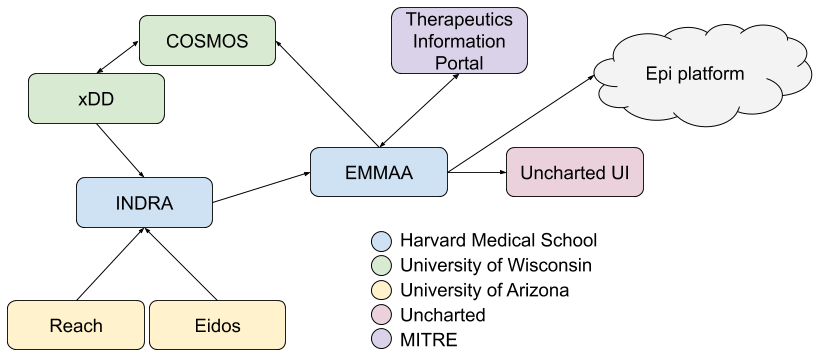

ASKE-E Month 1 Milestone Report
===============================

Overall goals and use cases for the Bio Platform
------------------------------------------------

The goal of the Bio Platform is to provide an automated modeling and
model analysis platform (with appropriate interfaces for user-in-the-loop
interaction) around the molecular basis of diseases and their therapies.
The initial disease focus for the platform is COVID-19. In this context,
the use cases we aim to work towards are as follows:

- Explain drug mechanisms based on existing experimental observations

  - Example: through what mechanism does E64-D decrease SARS-CoV-2 replication?

- Propose new drugs that haven't yet been tested

  - Example: Leupeptin should be investigated since through protease
    inhibition, it is expected to decrease SARS-CoV-2 entry.

- Causally/mechanistically explain high-level/clinical associations
  that are unexplained

  - Example: What is the mechanistic basis for men being susceptible to more
    severe COVID-19 compared to women?

- Construct reports on the implication of therapeutics on clinical outcomes,
  optimize course of therapy

  - Example: Find the optimal course of interferon treatment using modeling
    and simulation.

Integration plan for the Bio Platform
-------------------------------------

The following diagram shows the integration architecture for the Bio
Platform:

The main components of this integration are as follows. The HMS team's INDRA
system integrates multiple knowledge sources, including the Reach and Eidos
machine-reading systems developed by the UA team. INDRA is also integrated with
UW's xDD system where it is run on a subset of published papers and preprints
to produce statements that INDRA doesn't otherwise have access to. xDD will
also provide provenance information for relevant figures and tables coupled
to statement evidences.

INDRA produces statements daily that are picked up by EMMAA (each EMMAA model
gets only statements that are specifically relevant to its use case as
controlled by a definition of model scope). Each EMMAA model then assembles
its statements in a use-case-specific way to produce an assembled knowledge
base. This is then the basis of generating multiple executable / analyzable
model types (unsigned graph, signed graph, PyBEL, PySB) and applying these
models to automatically explain a set of observations (note that this process
can also be thought of as "testing" or "validation" of the model).

EMMAA integrates with the MITRE Therapeutics Information Portal by pulling
in observations about drug-virus relationships that it then explains.
The resulting explanations (typically mechanistic paths) will be linked
back to the MITRE portal. The portal will also link to INDRA-assembled
information on specific drugs and their targets.

EMMAA models will also link back to UW's COSMOS system to provide additional
annotations for documents they index.

Finally, EMMAA will integrate with the Uncharted UI both at the level of
the knowledge base that each model constitutes, and the explanations
produced by each model.

Progress during the ASKE-E Hackathon
------------------------------------

Our teams made progress on multiple fronts during the first ASKE-E
Hackathon.

First, with the UA team, we identified relevant resources for the
lexicalization of protein fragments. The initial goal was to identify and
extract relevant terms from the Protein Ontology (https://proconsortium.org/).
Due to the diversity of features by which protein fragments are annotated
in this ontology, identifying the right subset of terms has turned out to
be challenging, but we produced an initial set of terms that are now in
the process of being added to the Reach system's bioresources.

From the MITRE team, we received an updated export of drug-virus relations
from the Therapeutics Information Protal which we ingested as a set
of observations against the COVID-19 EMMAA model
(see https://emmaa.indra.bio/dashboard/covid19?tab=tests&test_corpus=covid19_mitre_tests).
The set of applied tests (i.e., observations) went up from 1,839 to 2,641, and
the number of explanatory paths found by EMMAA went up from 1,643 to 2,398.
In other words, we not produce explanations for an additional 755 drug-virus
relationships.

With the UW team, we made technical specifications for how INDRA/EMMAA
can provide annotations back to COSMOS that it can use for enhanced
document indexing and retrieval. The two options (each with different
advantages) are to (1) integrate additional INDRA processing steps with the
reading infrastructure running on xDD and allow COSMOS to ingest these outputs
directly or (2) use assembled EMMAA knowledge and map these back (via document
identifiers) to COSMOS as annotations. We also discussed approaches to
access relevant figures and tables connected to statement evidence. UW will
implement an API which takes a set of keywords, and optionally, a set of
DOIs and returns a ranked list of figures and tables.

As for the integration with Uncharted, we implemented a new JSON-L format for
exporting and sharing EMMAA models and made this available. We also
provided ongoing help with accessing and interpreting the content
of EMMAA models as well as the results of EMMAA explanations. In support
of the latter, we developed a new JSON-L based representation format for
tests that provide a list of node names, a list of Statement hashes
representing edges, and other metadata necessary to identify the test for
which the explanatory path was produced. We also provided an export of
all assembled knowledge potentially relevant to any of the EMMAA models, as
well as access to a query API for the same knowledge.

Open Search model queries and notifications
-------------------------------------------

