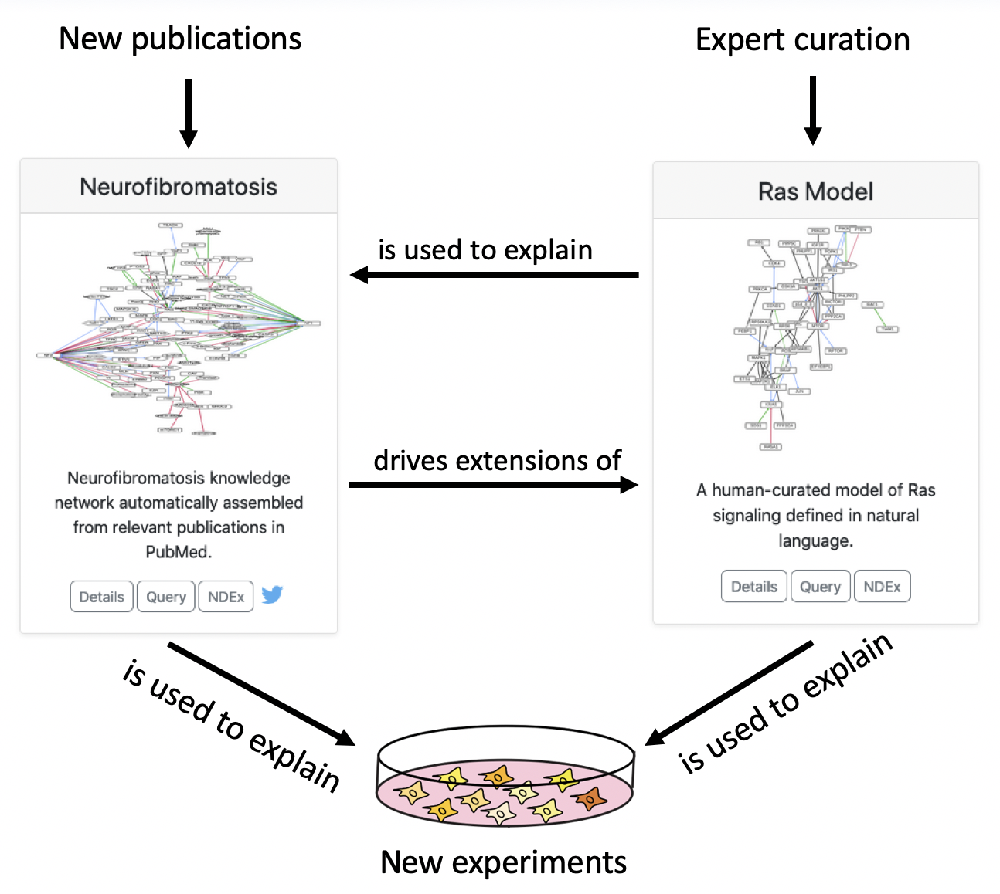

ASKE-E Month 4 Milestone Report
===============================

EMMAA Neurofibromatosis Models and NF Hackathon Prize
-----------------------------------------------------

During this reporting period we won one of the top prizes in the "Hack for NF",
a six-week event sponsored by the Children's Tumor Foundation to develop novel
software relevant to neurofibromatosis (NF), a set of cancer syndromes
that affect children.

Our submission consisted of two causal models of NF deployed in EMMAA.
The first model was built directly from text mining the 18,000 PubMed articles
about NF; it contains approximately 9,000 statements about the functions and
interactions of NF1, NF2, and other entities mentioned in those articles.
Unlike the other cancer-related models in EMMAA, the NF model does not specify
an explicit list of disease-relevant proteins: the scope of the model is defined
strictly by neurofibromatosis keyword search terms. This keeps the content of
the model as disease-specific as possible, with the model serving as a
comprehensive representation of what is known about NF.

For the second part of our submission, we substantially expanded our curated
Ras signaling model to include mechanisms relevant to NF1 and NF2 signaling.
The model is transparent even for non-modelers because it is built from ~200
declarative English sentences and automaticalaly assembled by INDRA. In an
iterative, test-driven process, we used the reported causal relationships from
the literature-based NF model that were unexplainable by the curated model to
both 1) identify errors in the literature derived model and 2) discover
necessary extensions to the curated model.

As an example, the literature-based model contains the observation that NF2
inhibits PAK1. The extended curated model shows that this this finding can be
explained by a mechanistic path whereby NF2 competes Angiomotin (AMOT) away
from inhibiting ARHGAP17, allowing ARHGAP17 to inhibit CDC42, which would
otherwise activate PAK1.

As a further demonstration of the scientific value of automated model analysis,
we converted drug screening data from NF1 and NF2 cell lines into EMMAA tests
and checked the literature-derived model against them.  Interestingly, we found
that while the causal paths identified by the models were typically short,
involving paths with a single intermediate node (i.e., drug->protein->cell
proliferation) the explanatory nodes were highly context-specific, in some
cases having been previously identified in the literature as therapeutic
vulnerabilities for NF cell lines.

We see the two types of models (curated and literature-derived) as working
synergistically to explain experimental results and accumulate actionable
knowledge, as shown in the diagram below.

For this hackathon entry, we won one of three top prizes. The press
release from the Children's Tumor Foundation can be found
`here, <https://www.ctf.org/news/hack-for-nf-2020-winning-projects>`_
and a video presentation describing our project can be found
`here. <https://www.youtube.com/watch?v=WI-NnFEXY_Y>`_

Rapid initialization of EMMAA models from literature for two new diseases
-------------------------------------------------------------------------
The new `Literature Prior module <https://emmaa.readthedocs.io/en/latest/modules/priors.html#literature-prior-emmaa-priors-literature-prior>`_ module makes
the instantion of EMMAA models based on a subset of the scientific
literature straightforward. As input, the class takes a list of PubMed
search terms and optionally a list of Medical Subject Headings. It then
automatically identifies relevant publications, and collects all statements
from text mining that were extracted from these papers. The model is then
uploaded to AWS and is available for daily updates and access via the
dashboard. We used this method to start two new EMMAA models, for
`vitiligo <https://emmaa.indra.bio/dashboard/vitiligo?tab=model>`_ and
`multiple sclerosis <https://emmaa.indra.bio/dashboard/ms?tab=model>`_.

Downloading EMMAA models in alternative formats
-----------------------------------------------
The knowledge assembly approach in EMMAA allows exporting each model
in multiple different modeling formalisms. In fact, EMMAA internally uses
four different modeling formalisms (PySB, PyBEL, signed graph and
unsigned graph) for querying and analysis. However, these formats, and
other community standards have not been made available to users through the
EMMAA dashboard.

We added multiple exports for each model that are generated during each
model update (typically daily) and are available through the EMMAA dashboard.
Each model has the following export formats available:

- `json.gz`: A gzipped INDRA Statement JSON dump.
- `jsonl`: An uncompressed dump of INDRA Statement JSONs with one statement
  per line.
- `indranet`: A tabular (tsv) file where each row represents a single
  binary interaction between two entities. This format is ideal for building
  networks from an EMMAA model.

Models that support PyBEL analysis provide a `pybel` export. In addition,
models that support analysis at the rule-based executable
level are exported into the following formats:

- `bngl`: BioNetGen model representation (http://bionetgen.org/)
- `kappa`: Kappa model representation (https://kappalanguage.org/)

Finally, models that support reaction-network based analysis are exported
into these formats:

- `sbml`: Systems Biology Markup Language (http://sbml.org/)
- `sbgn`: Systems Biology Graphical Notation (https://sbgn.github.io/)

