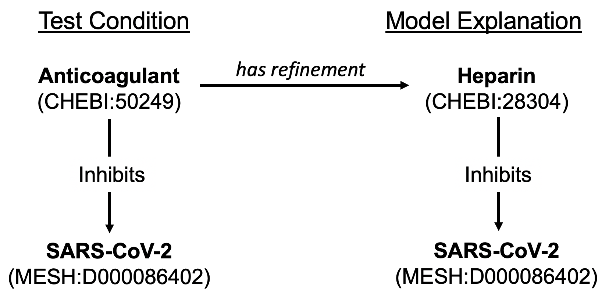

ASKE-E Month 5 Milestone Report
===============================

Semantic filters to improve model analysis
------------------------------------------
Examining the explanations produced by the COVID-19 EMMAA model for
in-vitro drug screening experiments, we found that some of the explanations
included causal mechanisms that were not consistent with the nature of
the experimental context being studied. For instance, in an experiment
where a single drug is added in a controlled manner, a mechanism that involves
another drug (for instance via a drug-drug interaction) is not appropriate.
Similarly, for an in-vitro experiment, higher-level societal factors are
semantically not appropriate as intermediate concepts on a causal path.

Motivated by this, we implemented an approach to applying semantic filters
to mechanistic paths that allow encoding constraints on what is and isn't
allowed on paths when explaining a given observation. These
constraints derive from what is known about the experimental context in which
that observation was made. For the observations used as test conditions
for the COVID-19 model, we created constraints to exclude small molecules
other than the drug that is used in the given experiment and higher level
concepts including phenotypes, organisms and diseases. We found that the
quality of explanations found improved substantially and is now more
appropriate semantically with respect to the experimental context.

Model analysis exploiting ontological relationships
---------------------------------------------------

During this reporting period we extended the way EMMAA models are tested
against experimental observations. Previously, we applied tests to models based
on a strict match between the entities in the test and the set of entities in
the model. However we noticed that in many cases models tended to consist of
highly specific entities (e.g., individual proteins like KRAS, HRAS, and NRAS),
whereas literature mining often picked up tests involving higher-level
ontological concepts (e.g., the RAS protein family). The limitation of this
approach was that we could only return a path based on exact matches between
test and model entities, even when the model contained a path among more
specific entities that would serve as a test explanation.

In the new approach we allow relations among more specific concepts to serve as
explanations for relations among more general concepts (but not the reverse).
Specificity is determined not only by hierarchical levels in the ontology (e.g.
a member of a protein family is more specific than the family entity), but also
by the amount of contextual information supplied for an entity (e.g., a protein
with a phosphorylation is a more specific version of the same entity without a
phosphorylation). This information is used to determine which tests can be
applied to the model and also to find explanatory paths. To make this
relationship explicit in our explanations, when a path found starts or ends
with a more specific version of a test entity, we add a special "is a
refinement of" or "has a refinement" edge to the path.

We applied this new testing approach to the EMMAA COVID-19 model. For the tests
from the MITRE Therapeutic Information Browser Corpus ("MITRE Tests"), 174 new
tests were determined to be relevant to the model when taking refinements into
account. For these tests, which generally take the form "drug X inhibits virus
Y", we found relevant, more specific agents both for drugs (e.g.,
"rifampicin" is a type of "RNA polymerase inhibitor") and viruses (e.g.,
"infectious bronchitis virus" is a type of "gammacoronavirus"). Of these new
tests, 95 passed in the signed graph network.

An example new passing test is shown in the figure below for the test condition
"anticoagulant inhibits SARS-CoV-2", which was previously determined to not be
relevant to the model due to the fact that the model did not contain the
specific entity for "anticoagulant" (CHEBI:50249). The model contains
the information that heparin (CHEBI:28304), a type of anticoagulant, inhibits
SARS-CoV-2, and the system now returns the explanation that "anticoagulant has
refinement heparin; heparin inhibits SARS-CoV-2."

Improved reading and assembly of protein chains and fragments
-------------------------------------------------------------
Protein chains and fragments are important both for human and
viral biology. In ASKE-E month 2, we reported having extended the Reach reading
system with lexicalizations of these entities from UniProt and the Protein
Ontology (PR). This month, we made a number of extensions to our software
stack to propagate these extensions in a useful way.

First, UniProt and PR have a large number of overlapping entries but neither
source provides mappings to the other at the level of protein chains (only full
protein entries). We developed a semi-automated approach to find and curate
these mappings. We used `Gilda <https://github.com/indralab/gilda>`_ to find
lexical overlaps between the two ontologies and put these as predictions into
the `Biomappings repository and curation tool
<https://github.com/biomappings/biomappings>`_. We then curated these mappings
to confirm correct ones and remove incorrect ones. These mappings were then
propagated into the INDRA Ontology graph to be used for standardization.

Second, we found that the names of protein chains (similar to the names
of full proteins) are ambiguous across organisms. This is especially
problematic with the large number of viral species and strains that contain
protein chains with identical or similar names. Current machine reading systems
including Reach typically cannot disambiguate across these choices and produce
highly ambiguous groundings for these viral proteins. Therefore, contextual
information needs to be brought in externally to decide which organism
to prioritize when selecting a grounding produced by Reach. To this end,
we implemented an organism prioritization scheme whereby the user (or some
external automated process) can supply a ranked list of organism identifiers
to represent priority. This list is then used to guide how to the
grounding of proteins and protein chains is selected. For example, if a paper
is known to describe SARS-CoV-2 and human biology, one can supply an organism
priority list including the identifiers of these two organisms to exclude or
de-prioritize any spurious groundings from e.g., other viral strains that are
irrelevant in the given context. Further, the organisms which a paper describes
can be obtained from annotations that are either provided directly with the
paper in PubMed or can be obtained using dedicated NLP systems set up for this
task e.g, the MTI system.

Going forward, we will re-process the COVID-19 papers with these features
in place and expect that the quality of reading, extraction and assembly for
virus-host interactions will improve significantly.

Bio ontology optimized for visualization
----------------------------------------
We implemented a custom export of the INDRA BioOntology graph that is optimized
for organizing nodes in a UI. The idea is to create top-level groups of
entities that correspond to an intuitive category (e.g., human genes/proteins,
non-human genes/proteins, small molecules, diseases, etc.). EMMAA models
don't contain this information about their entities directly, rather, they
are inferred from identifiers assigned to each entity in a given set of
name spaces. However, some name spaces contain multiple types of entities
(e.g., MESH contains small molecules as well as diseases) and some entity
types are distributed across multiple name spaces (e.g., human genes/proteins
can be grounded to HGNC, UniProt, FamPlex, etc.). In this custom export,
we split some name spaces and merged others to create a more ideal resolution
and shared this export with the Uncharted team.
