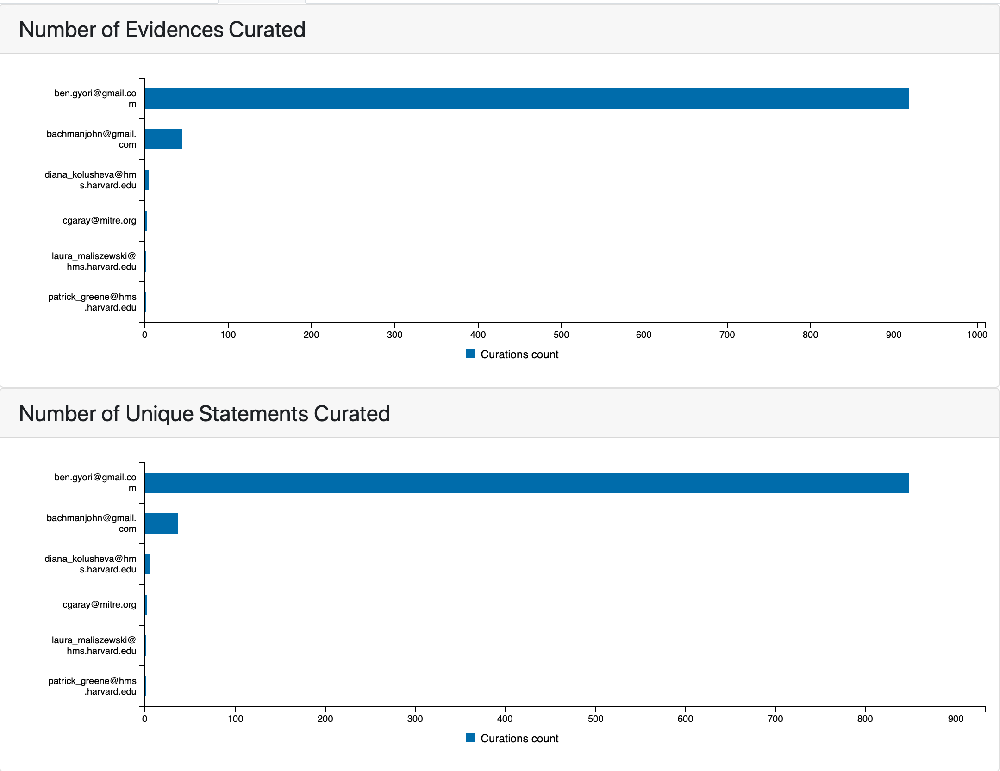
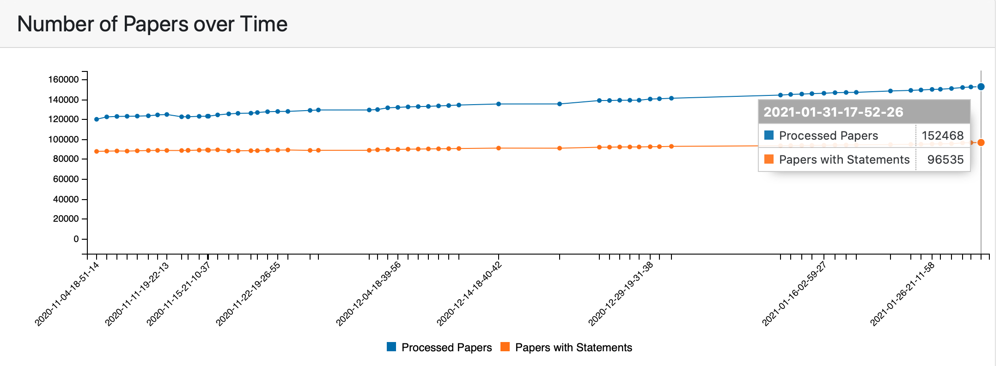
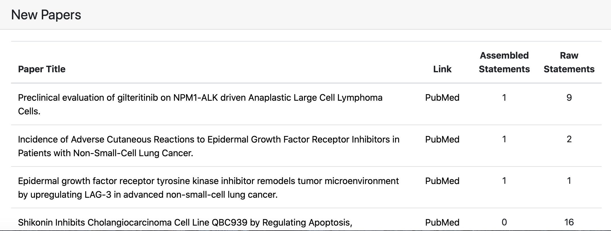
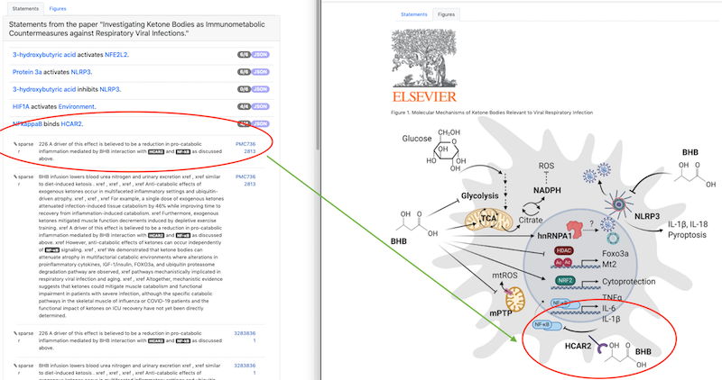

ASKE-E Month 6 Milestone Report
===============================

Reading and assembly with context-aware organism prioritization
---------------------------------------------------------------

A key challenge in monitoring the COVID-19 literature and modeling the effect
of new discoveries is that descriptions of mechanisms span multiple organisms.
First, we need to be able to recognize both viral proteins and human (or other
mammalian) proteins in text and find possible database identifiers for them.
Second, we need to deal with substantial ambiguity in protein naming between
viral species.

By default, the Reach reading system's named entity recognition module is
configured to tag only human proteins in text. This month, our team developed
a script which cross-references UniProt protein synonyms with the NCBI
Taxonomy to allow generating customized named entity resources which include
protein synonyms for custom sub-trees of the Taxonomy. We used this script
to generate named entity resources that include all human proteins as well
as protein synonyms for all different viral species. We then compiled a custom
version of Reach including these resources.

Next, we implemented a new feature in INDRA which allows processing Reach
output with context-dependent organism prioritization. For a given paper with
a PubMed ID, we can draw on Medical Subject Headings (MeSH) annotations to find
out about organisms that are being discussed. For instance, papers about
Ebola are (typically) tagged with the MeSH heading D029043
(https://meshb.nlm.nih.gov/record/ui?ui=D029043), and papers about SARS-CoV-2
with MeSH heading D000086402 
(https://meshb.nlm.nih.gov/record/ui?ui=D000086402). Once we have a
pre-defined or paper-specific list of relevant organisms, we can process Reach
output with this order in place to choose the highest priority UniProt entry
for each ambiguous entry having been matched.

While our focus here is on coronaviruses (and in particular on SARS-CoV-2),
these new capabilities can be applied to studying other types of existing
viruses, or monitoring the literature on future emerging viral outbreaks.
We have tested the above grounding approach locally but haven't yet
re-processed the entire body of literature (~100k papers) underlying the
EMMAA COVID-19 model. We plan to do this in the next reporting period.

Preparing for the stakeholder meeting
-------------------------------------

The EMMAA COVID-19 model is considerably large since it is configured to
monitor all of the COVID-19 literature without any further restrictions on
model scope. Consequently, for more focused (e.g., pathway-specific) studies,
it makes sense to start with subsets of this overall knowledge, and
demonstrating this type of more focused model-driven analysis is one of the
goals at the upcoming stakeholder meeting. To prepare for this, we defined six
distinct ways in which our models and REST services can be used to obtain
subsets of knowledge on COVID-19 mechanisms, and to extend them using expert
knowledge.

First, the EMMAA
COVID-19 model can be queried in at least two ways: using a paper-oriented or
an entity-oriented approach. In the paper-oriented case, one searches for
elements ot the EMMAA COVID-19 model that have support from one or more
specific publications. In the entity-oriented case, one defines a list
of entities of interest, and queries for all model statements that involve
one or more of those entities. The advantage of the paper-oriented approach
is that one does not need to curate a specific entity list up front, but due
to potential recall issues with automated reading, there is no guarantee that
a mechanism of interest will have been extracted from any specific paper.
In contrast, the entity-oriented approach provides more reliable coverage for
the given set of entities while potentially, inadvertently ignoring other
relevant mechanisms.

Second, the general INDRA DB can be used to query for information. The REST API
supports both entity-oriented and paper-oriented queries here as well. The
main difference compared to querying the EMMAA model is that the INDRA DB
results are unfiltered (they can statements that have been marked as incorrect,
ungrounded entities, statements out of scope, etc.) and may require
post-processing to get good quality results for a focused modeling study.

Finally, we provide features for experts to build models from scratch or
extend automatically initialized models. For instance, the INDRA API provides an
endpoint to run a machine-reading system on a given span of text (e.g.,
one describing mechanisms for a given pathway in simple English sentences)
and process these into INDRA Statements.

We provided pointers to the Uncharted team for invoking all of these service
endpoints.

Reporting curation statistics
-----------------------------

While update and assembly of EMMAA models are automated, we manually curate
model statements to improve model the quality of knowledge extraction and
provide better mechanistic explanations. Previously, EMMAA dashboard allowed to
submit and browse individual curations, but we did not have a way to view and 
analyze curations at the model level. To address this we added a new "Curation"
tab on EMMAA model dashboard. In this tab we show the number of curations
submitted by individual curators for statements that are part of a given model.
We look at the counts for individual evidences and unique assembled statements.
This differentiation is important because each assembled statement may be supported
by multiple evidences. In addition, curation information affects the assembly
process - all statements that have been curated as incorrect and do not any
evidences curated as correct are filtered out from the model.

  *Curators of COVID19 EMMAA model*

We also report the number of curations grouped by their type. This shows what
errors are the most frequent and helps prioritize the further work.

.. figure:: ../_static/images/curation_types.png
  :align: center

  *Curations grouped by type*

Another aspect of curations we report is how the number of curated statements
and evidence changed over time. The figure below shows the time series plot of 
number of curations in COVID19 model. The first few points here predate the
pandemics and the model creation. This is due to the fact the COVID19 model was 
initially built with a set of all relevant papers that were already a part of
INDRA database and some of them were curated earlier.

.. figure:: ../_static/images/curation_types.png
  :align: center

  *Curations over time*

Reporting paper level statistics
--------------------------------

INDRA processes thousands of publications daily. The previous EMMAA interface
allowed browsing the evidences of assembled statements and linked out to
original papers but had the following limitations:
1) It was only possible to see evidences/links to publications for statements
that were included in the model after assembly.
2) The evidences/links to publications were grouped by an interaction and not
by paper.
3) It was not possible to view the papers that either produced statements
that were filtered during assembly or did not produce statements at all.

In this reporting period we added a new "Papers" tab on EMMAA model dashboard
and a new page "statements from paper". 

On a "Papers" tab we show the changes in number of processed papers and number 
of papers we get assembled statements from over time.

  *Number of processed papers and papers with assembled model statements over time*

We also show the list of papers with the largest number of statements and the
list of newly processed papers. 

  *Example of new processed papers table*

Each paper title here is linking out to a new page that shows the model statements
extracted from a given paper. This provides a way to explore different statements
from the same paper. The second column in this table has an external link to
the original publication. 

Integrating non-textual evidence with EMMAA models
--------------------------------------------------

An important goal in extending EMMAA is to tie the causal mechanisms models are
built of to evidence not only in text but also figures and tables. The xDD
platform developed at UW provides multiple entry points for querying figures
and tables. One approach is to search by entities (e.g., "ACE2, TMPRSS2") to
find relevant figures from multiple papers relevant for these entities.
Another approach is to search for any figures and tables available for a given
paper.

As a proof of principle or integration, we created a client for the second
query approach (i.e., find figures and tables by paper identifier) in EMMAA.
When displaying the set of statements in an EMMAA model from a given paper,
the "Statements" tab allows examining the individual EMMAA statements with
their supporting (textual) evidence. A new "Figures" tab contains relevant
figures fetched from xDD that can provide additional context and evidence
for the model statements.

The figure above shows an initial proof of principle for the paper
"Investigating Ketone Bodies as Immunometabolic Countermeasures against
Respiratory Viral Infections". On the left, the Statements tab highlights
the statement "NFkappaB binds HCAR2" and an evidence sentence describing
"...BHB interaction with HCAR2 and Nf-kB...". On the right, the Figures
tab shows a directly relevant figure of the interaction between NF-kappaB,
HCAR2, and BHB. The visual nature of the figure clearly complements the
textual evidence here and may provide users with a richer overall
understanding of mechanisms of interest.

This feature is not yet deployed on the main EMMAA dashboard. We are continuing
to work on the modes in which figure/table information is integrated with EMMAA
and are exploring the possibility of making use of entity-oriented queries to
connect figures/tables to EMMAA models.
