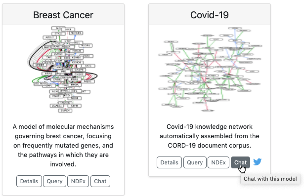
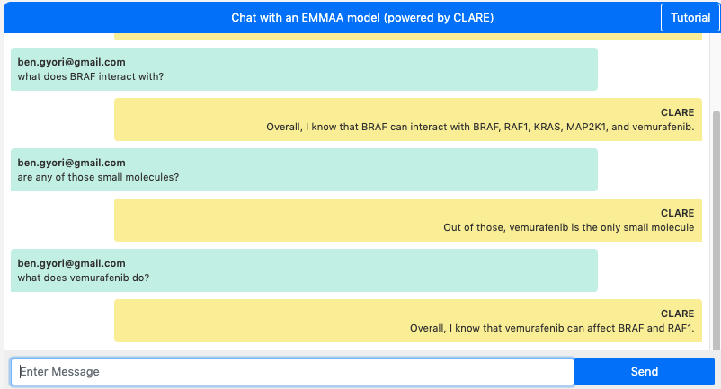

ASKE-E Month 7 Milestone Report
===============================

Natural language dialogue interaction with EMMAA models
-------------------------------------------------------
This month we developed a new feature that allows users to directly "chat" with
an EMMAA model. The main idea is to make use of the CLARE dialogue system we
have previously developed, and create custom instances of it, on demand, that
load a given EMMAA model and conduct dialogue with respect to that model. An
instance of the CLARE system is running on a remote server and can handle
multiple independent user sessions simultaneously. Chat sessions are
orchestrated through the Pusher framework (https://pusher.com/) which handles
the real-time aspects of the chat interaction (initialize new user session,
asynchronously listen to messages, deliver messages to connected clients,
etc.). In EMMAA, we implemented a Pusher chat client which integrates into the
main EMMAA dashboard. When clicking on the "Chat" button on the card
representing a model on the EMMAA dashboard, a new page opens up where the user
can put in their email (this is automatically populated if the user is logged
in) and start the chat session. They can then talk about a variety of topics,
including mechanisms represented in the given EMMAA model.

The image below shows the new "Chat" buttons on the EMMAA dashboard:

The screenshots below show dialogues with two different EMMAA models: the
MARM model above and the RAS model below. The first question "what does
BRAF interact with?" highlights the fact that in the two sessions, these
questions are answered with respect to two different model contexts. In the
MARM model, we find that "BRAF can interact with BRAF, RAF1, KRAS, MAPK1,
and vemurafenib", whereas in the RAS model, we find that "BRAF can interact
with MAP2K1, SRC, KRAS, and BAD".

Chat with the MARM model:

Chat with the RAS model:

.. image:: ../_static/images/emmaa_chat_ras_model.png
   :align: center
   :scale: 80%

A key feature of human-machine dialogue as implemented by CLARE is that it
maintains dialogue context and can interpret and answer follow-up questions
using co-references that refer to previous questions or answers. This allows
exploring complex mechanisms, such as ones represented by EMMAA models,
sequentially. This kind of sequential exploration with intuitive co-reference
resolution would be difficult to implement using traditional form-based web
interfaces.

The two dialogues above also demonstrate this context-aware co-reference
resolution feature. For instance, the questions "are any of those small
molecules?", "are any of those kinases?" or "are there any drugs for any of
those?" are all questions making use of this feature.

We plan to improve the rendering of some answers (bulleted lists, HTML
formatting, etc.) in the coming weeks. We will also improve session management
on the back-end to allow terminating sessions explicitly thereby freeing up
resources. Finally, we plan to make more tutorials and demos available for this
dialogue integration to help users make best use of it.

Automatically generated text annotations in context
---------------------------------------------------
We implemented a new integration with the hypothes.is that allows taking
statements extracted from a given paper, and annotating the website
for that paper (a PubMed or PubMed Central landing page, or
publisher-specific page) with these statements. First, we implemented
an approach to deriving annotation objects from statements. Each hypothes.is
annotation consists of a URI (i.e., the address of the page to be annotated),
annotation text (i.e., the actual content of the annotation), and a target (a
specific text span on the web page that the annotation applies to). The
annotation text represets a human-readable English sentence derived from the
statement with the names of entities rendered as links to outside ontologies
representing them. The target of the annotation is the evidence sentence
from which the statement was originally extracted. We can then use the
hypothes.is API, for which we implemented a new and extended client, to
upload these annotations on demand for a given paper.

We then integrated with new feature with EMMAA. As an extension of the
paper-centered view of model statements reported last month, we added a new
"hypothes.is button" which allows annotating a given paper on demand and
then looking at the annotations in the context of the actual paper. The figure
below illustrates the relevant part of the updated "Paper" tab on the EMMAA
dashboard.

.. image:: ../_static/images/hypothesis_badge.png
   :align: center
   :scale: 30%

For each paper from which statements were extracted, a small hypothesis ("h.")
badge is now displayed. Clicking on this badge starts the process of uploading
the annotations for statements extracted from this paper. After all annotations
are added, an external page with this paper opens up in a new tab. In addition,
a link to this page is displayed on the EMMAA website.

.. image:: ../_static/images/annotations_added.png
   :align: center
   :scale: 30%

Viewing the uploaded annotations requires the user to install the hypothes.is
extension in their browser. The figure below shows how annotations can be
viewed and edited on the newly opened page. In this example, a paper on PubMed
Central was automatically annotated. The sentences supporting each of the
extracted statements are highlighted in the paper and the statements can be
viewed in the annotations panel on the right. For instance, this image shows
the highlighted sentence mentioning "FGF1–heparin complex" and the extracted
"heparin binds FGF1" INDRA statement.

.. image:: ../_static/images/annotations_displayed.png
   :align: center
   :scale: 30%

Currently, these annotations are only visible by members of a closed group
on hypothes.is, however, we have requested that hypothes.is make annotations
in the group publicly visible, and hope that this will be done soon.

Demonstrations at the stakeholder meeting
-----------------------------------------
The February 2021 stakeholder meeting focused on system integration: we
demonstrated how EMMAA models can be displayed and interacted with in the HMI
developed by Uncharted. First, we showed how a keyword search for an entity of
interest can lead a user to "discover" a relevant paper and then an EMMAA model
which contains mechanisms surrounding the given entity. The user can then
interact with a network view of the model, highlighting interactions derived
from the paper of interst in the context of all concepts organized by their
ontological categories (for instance, a search for IL6 connects the node
representing it in the "Human proteins" category with the node representing
SARS in the "Infections" category). The HMI is also able to visualize the
subnetwork corresponding to the specific paper on a separate tab. The user can
then click on a node to see additional incoming or outgoing interactions and
click ont them to add them to this view. The figure below shows interactions
highlighted in the context of ontology-based categories on the left, and the
separate view of interactions derived from a given paper on the right.

.. image:: ../_static/images/askee_hmi_1.png
   :align: center
   :scale: 50%

We also showed how the results of model queries can be displayed in the HMI.
Here we focused on small molecules that can inhibit the replication of
SARS-CoV-2 through an intermediary of interest: the Nrf-2 (NFE2L2) protein.
Based on the ontology-guided grouping, the HMI provides an intuitive overview
of what types of entties are on each mechanistic path from a drug to
SARS-CoV-2. For instance, sildenafil, which is grouped under "vasodilator
agents" is shown to regulate the activity of NFE2L2 which in turn can regulate
SARS-CoV-2 replication. We also showed examples of drugs inhibiting SARS-CoV-2
via cathepsins. The figure below shows mechanisms by which drugs regulate
SARS-CoV-2 via NFE2L2. More detail can be seen by zooming and panning in the
HMI.

.. image:: ../_static/images/askee_hmi_2.png
   :align: center
   :scale: 50%

Developing the EMMAA REST API for flexible integration
------------------------------------------------------
We continued working on extending the EMMAA REST API to support integration
with other teams. One of the key goals was to allow dynamic retrieval of EMMAA
models and tests metadata. To enable this, we implemented four new endpoints in
the EMMAA REST API that support the retrieval of the following data:

    - A list of all available EMMAA models;
    - Model metadata (short name, human readable name, description, links to
      the NDEx landing page and to the model's Twitter account) for a given
      model;
    - A list of test corpora that a given model is tested against;
    - Test corpus metadata (name and description) for a given test corpus.

Another important extension of the EMMAA API we implemented is the support for
running queries programmatically. Previously it was only possible to submit
queries through a web form on the Query page of the EMMAA dashboard and then
browse the displayed results. The new approach allows sending programmatic
requests to the API and receive the results in JSON format. Similar to the
interactive interface on the dashboard, the programmatic endpoint supports
three types of queries: static (find directed paths between two entities), open
search (find upstream regulators or downstream targets of an entity), and
dynamic (confirm dynamical model properties by simulating the model) queries.