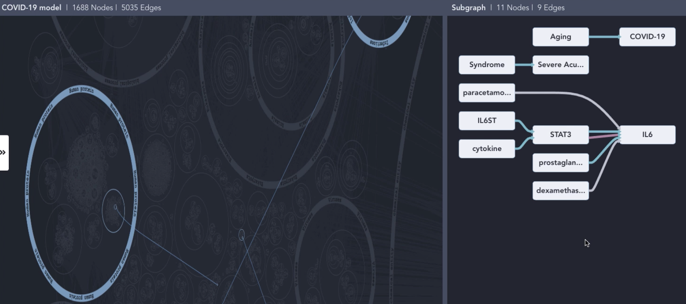
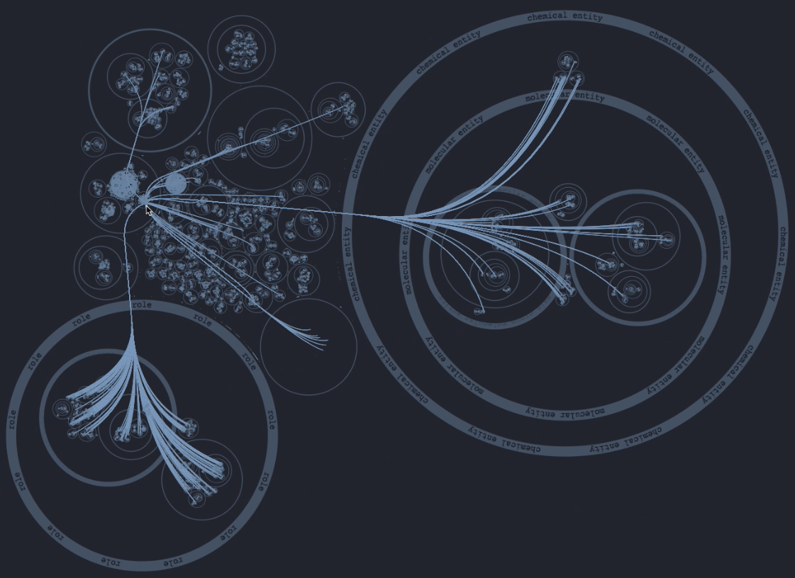

ASKE-E Month 7 Milestone Report
===============================

Demonstrations at the stakeholder meeting
-----------------------------------------
The February 2021 stakeholder meeting focused on system integration: we
demonstrated how EMMAA models can be displayed and interacted with in the HMI
developed by Uncharted. First, we showed how a keyword search for an entity of
interest can lead a user to "discover" a relevant paper and then an EMMAA model
which contains mechanisms surrounding the given entity.  The user can then
interact with a network view of the model, highlighting interactions derived
from the paper of interst in the context of all concepts organized by their
ontological categories (for instance, a search for IL6 connects the node
representing it in the "Human proteins" category with the node representing
SARS in the "Infections" category. The HMI is also able to visualize the
subnetwork corresponding to the specific paper on a separate tab. The user can
then click on a node to see additional incoming or outgoing interactions and
click ont them to add them to this view. The figure below shows interactions
highlighted in the context of ontology-based categories on the left, and the
separate view of interactions derived from a given paper on the right.

We also showed how the results of model queries can be displayed in the HMI.
Here we focused on small molecules that can inhibit the replication of
SARS-CoV-2 through an intermediary of interest: the Nrf-2 (NFE2L2) protein.
Based on the ontology-guided grouping, the HMI provides an intuitive overview
of what types of entties are on each mechanistic path from a drug to
SARS-CoV-2. For instance, sildenafil, which is grouped under "vasodilator
agents" is shown to regulate the activity of NFE2L2 which in turn can regulate
SARS-CoV-2 replication.  We also showed examples of drugs inhibiting SARS-CoV-2
via cathepsins.  The figure below shows mechanisms by which drugs regulate
SARS-CoV-2 via NFE2L2. More detail can be seen by zooming and panning in the
HMI.

Natural language dialogue interaction with EMMAA models
-------------------------------------------------------

Automatically generated text annotations in context
---------------------------------------------------
As an extension of the paper centered view of model statements reported last
month we integrated EMMAA with the hypothes.is service that allows annotating
webpages.  The figure below illustrates the relevant part of the updated
"Paper" tab on the EMMAA dashboard.

.. image:: ../_static/images/hypothesis_badge.png
   :align: center
   :scale: 30%

For each paper from which statements were extracted, a small hypothesis ("h.")
badge is displayed. Clicking on this badge starts the process of uploading the
annotations for statements extracted from this paper. After all annotations are
added, an external page with this paper opens up in a new tab. In addition, a
link to this page is displayed on the EMMAA website.

.. image:: ../_static/images/annotations_added.png
   :align: center
   :scale: 30%

Viewing the uploaded annotations requires the user to install the hypothes.is
extension in their browser. The figure below shows how annotations can be
viewed and edited on the newly opened page. In this example, a paper on PubMed
Central was automatically annotated. The sentences supporting each of the
extracted statements are highlighted in the paper and the statements can be
viewed in the annotations panel on the right. For instance, this image shows
the highlighted sentence mentioning "FGF1–heparin complex" and the extracted
"heparin binds FGF1" INDRA statement.

.. image:: ../_static/images/annotations_displayed.png
   :align: center
   :scale: 30%

Developing the EMMAA REST API for flexible integration
------------------------------------------------------
We continued working on extending the EMMAA REST API to support integration
with other teams. One of the key goals was to allow dynamic retrieval of EMMAA
models and tests metadata. To enable this, we implemented four new endpoints in
the EMMAA REST API that support the retrieval of the following data:

    - A list of all available EMMAA models;
    - Model metadata (short name, human readable name, description, links to
      the NDEx landing page and to the model's Twitter account) for a given
      model;
    - A list of test corpora a given model is tested against;
    - Test corpus metadata (name and description) for a given test corpus.

Another important extension of the EMMAA API we implemented is the support for
running queries programmatically. Previously it was only possible to submit
queries through a web form on the Query page of the EMMAA dashboard and then
browse the displayed results. The new approach allows our collaborators to send
programmatic requests to the API and receive the results in JSON format.
Similarly to the interactive interface on the dashboard, the programmatic
endpoint supports three types of queries: static (find directed paths between
two entities), open search (find upstream regulators or downstream targets of
an entity), and dynamic (confirm dynamical model properties by simulating the
model) queries.