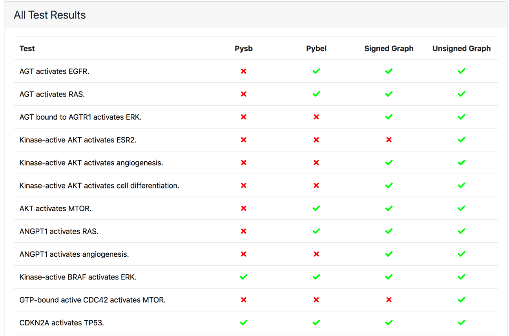
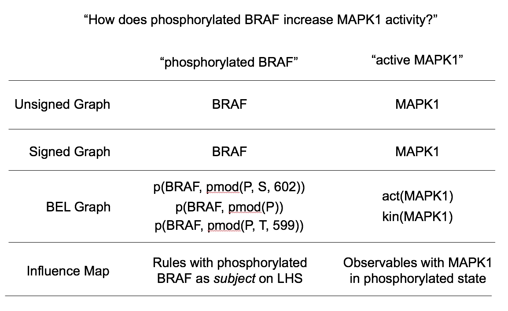
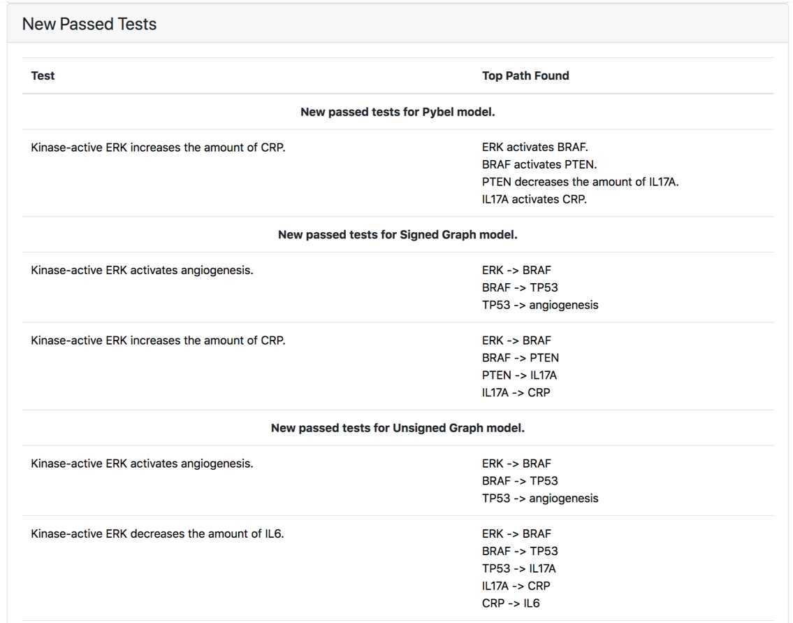
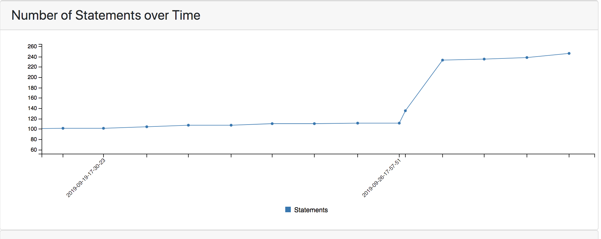
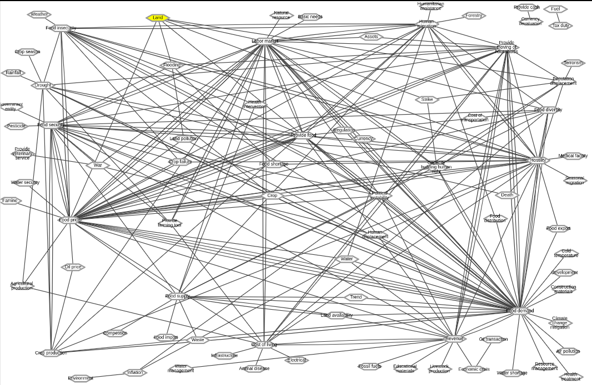

ASKE Month 11 Milestone Report
==============================

Deployment of multiple-resolution model testing and analysis
------------------------------------------------------------

In previous reporting periods we have described our progress towards developing
a capability to check 

assembled at different levels of granularity and specificity. In particular,
we are expanding the range of models assembled from a set of EMMAA Statements
to include:

During this reporting period we have implemented multiple-resolution model
checking for all models hosted in the EMMAA web application. After processing
new literature and assembling the corpus of relevant EMMAA statements,
each knowledge-level model 

* Directed networks
* Signed directed networks
* PyBEL networks (includes nodes with state information)
* PySB models/Kappa influence maps

User-specific query registration and subscription
-------------------------------------------------

We implemented a user registration and login feature in the EMMAA dashboard
which allows registering and subscribing to user-specific queries.
After registering an account and logging in, users can now subscribe to
a query of their interest on the EMMAA Dashboard's Queries page
(https://emmaa.indra.bio/query). Queries submitted by users are stored
in EMMAA's database, and are executed daily with the latest version
of the corresponding models. The results of the new analysis are then
displayed for the user who subscribed to the query on the query page.
This allows users to come back to the EMMAA website daily, and observe how
updates to models result in new analysis results. Later, we are planning
to report any relevant change to the analysis results directly to the user
by sending a notification via email or Slack.

This capability is one important step towards achieving "push science"
in which users are notified about relevant new discoveries if
the inclusion of these discoveries result in meaningful changes in
the context of prior knowledge (i.e., a model) with respect to a
scientific question.

An improved food insecurity model
---------------------------------
This month we migrated the food insecurity model to use the new World Modelers
ontology (https://github.com/WorldModelers/Ontologies), and expanded its
set of search terms. This significantly increased the models' size and the
granularity of concepts over which it represents causal influences:

Below is a snapshot of the network view of the model on NDEx
(https://ndexbio.org/#/network/478a3ed6-b3b7-11e9-8bb4-0ac135e8bacf)
as of 9/27/2019:

