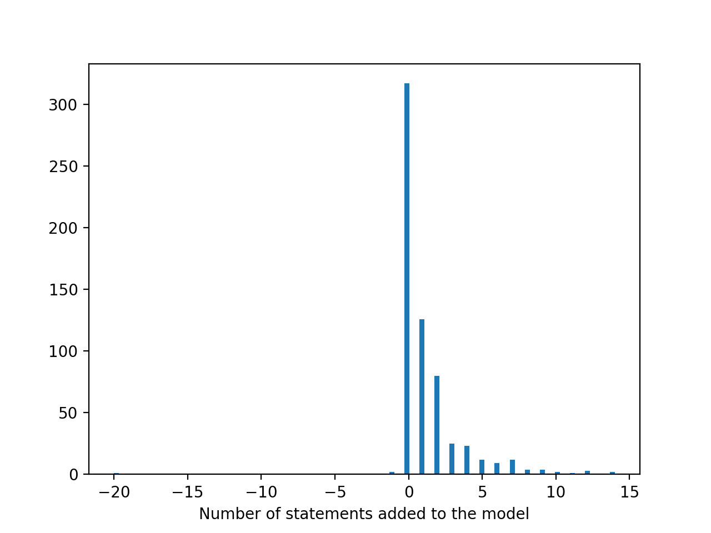
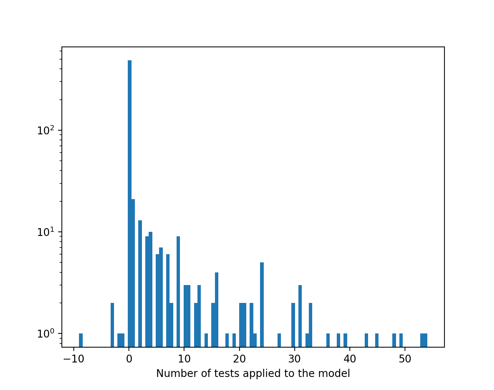
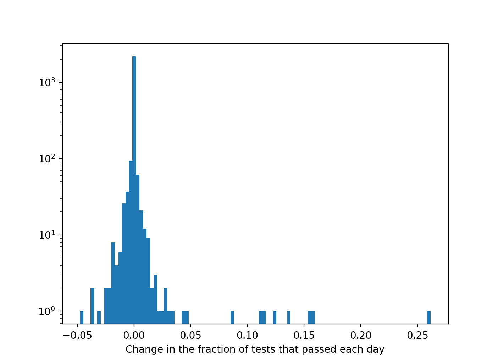

ASKE Month 13 Milestone Report
==============================

Related work for the EMMAA system
---------------------------------

We are not aware of any meta-modeling systems coupling machine-assembled models
to automated analysis, in molecular biology or other fields. To the best of our
knowledge, the EMMAA system is the first of its kind. Despite the fact that
EMMAA is unique as an integrated system, there does exist a body of
pre-existing work related to individual component technologies of the system.

Mathematical and causal modeling has been widely applied in systems biology,
where a multitude of model types (ordinary and partial differential equations,
Boolean and logical models, probabilistic graphical models, etc.) have been
used to represent the behavior of biochemical mechanisms (Aldridge et al.,
2006). However, such models are difficult and time consuming to build, and
require special mathematical and computational expertise. To address this,
EMMAA draws on novel tools allowing the automated assembly of mathematical
models directly from text (INDRA; Gyori et al., 2017).

There also exists a large body of work in text mining in biomedicine (Ananiadou
et al., 2006), motivated by the fact that around 3,200 new publications appear
every day - too much for any human expert to keep up with. However, the output
of these systems have thus far not been combined (EMMAA currently integrates
and aligns output from 4 different text mining systems: REACH
(Valenzuela-Escárcega et al., 2019), Sparser (McDonald et al., 2016),
TRIPS/DRUM (Allen et. al., 2015) and RLIMS-P (Torii et al., 2015)) and made
available for natural language querying by users. Recently, a graphical user
interface was proposed to explore causal relations extracted by a single
reading system (Barbosa et al., 2019). However, the causal networks built using
this system do not make use of the knowledge assembly procedures built into
EMMAA, including correction of systematic reading errors, and assessment of
redundance, relevance, and believability.

Further, several large human-curated knowledge-bases for molecular mechanisms
have been developed (Cerami et al, 2010, Croft et al., 2013), and can be
queried through their respective websites through standard web forms. Finally,
large repositories of experimental and clinical data are routinely used in
biomedicine (Keenan et al., 2018, Tomczak et al., 2015). However, while such
repositories exist, they grow only through manual curation and are often out of
date.

Finally, while the concept of model testing and validation, either static or
dynamic, is not new, this has (to our knowledge) only been applied to specific
models in isolated modeling studies. There exists no framework for the
systematic evaluation of domain models with respect to relevant tests; nor are
there any previous demonstrations of the use of text mining to automatically
grow a body of observations for use in model evaluation.

System performance statistics
-----------------------------

EMMAA currenty manages a total of 11 models. Eight of these models are
fully machine-maintained and represent various diseases (7 models) and
pathways (1 model). Two models are based on expert-curated natural language,
then linked to literature evidence and tested automatically. Finally, one model
represents a set of causal factors affecting food insecurity, i.e., is
outside the domain of molecular biology.

To quantify the performance of the system in terms of extending and testing/
analyzing models, we plotted the distribution of (1) number of new statements
added (2) number of new tests applied and (3) change in the test pass ratio
for each of the machine-maintained biology models each day.

Histogram of the number of new statements added to each model each day. As
we can see, the change in the number of statements is often zero (i.e.,
no new mechanisms were found relevant to the given model), but otherwise
is between 1-15 new statements per day. In some cases, the assembly procedure
removes previously existing mechanisms from the model, thereby making the
number of statements added negative.

Histogram of the number of new applied tests each day. Typically, if new
statements are added to a model, the number of applied tests can increase.
As shown in the histogram, new mechanisms added to a model often result in
dozens of new test being applicable to the model.

Histogram of the change in the fraction of tests that pass (across all
four modeling formalisms, PySB, PyBEL, signed graph, unsigned graph)
each day compared to the previous day. While small fractional changes are
more common, in some cases, model extensions (or changes to model assembly)
resulted in large jumps in test pass ratio of 5-25%.

References
~~~~~~~~~~

Aldridge, B. B., Burke, J. M., Lauffenburger, D. A., & Sorger, P. K. (2006). Physicochemical modelling of cell signalling pathways. Nature cell biology, 8(11), 1195.

Gyori, B. M., Bachman, J. A., Subramanian, K., Muhlich, J. L., Galescu, L., & Sorger, P. K. (2017). From word models to executable models of signaling networks using automated assembly. Molecular systems biology, 13(11).

Ananiadou, S., & McNaught, J. (2005). Text mining for biology and biomedicine (pp. 1-12). London: Artech House.

Valenzuela-Escárcega, M. A., Babur, Ö., Hahn-Powell, G., Bell, D., Hicks, T., Noriega-Atala, E., ... & Morrison, C. T. (2018). Large-scale automated machine reading discovers new cancer-driving mechanisms. Database, 2018.

McDonald, D., Friedman, S., Paullada, A., Bobrow, R., & Burstein, M. (2016, March). Extending biology models with deep NLP over scientific articles. In Workshops at the Thirtieth AAAI Conference on Artificial Intelligence.

Allen, J., de Beaumont, W., Galescu, L., & Teng, C. M. (2015, July). Complex Event Extraction using DRUM. In Proceedings of BioNLP 15 (pp. 1-11).

Torii, M., Arighi, C. N., Li, G., Wang, Q., Wu, C. H., & Vijay-Shanker, K. (2015). RLIMS-P 2.0: a generalizable rule-based information extraction system for literature mining of protein phosphorylation information. IEEE/ACM Transactions on Computational Biology and Bioinformatics (TCBB), 12(1), 17-29.

Barbosa, G. C., Wong, Z., Hahn-Powell, G., Bell, D., Sharp, R., Valenzuela-Escárcega, M. A., & Surdeanu, M. (2019, June). Enabling Search and Collaborative Assembly of Causal Interactions Extracted from Multilingual and Multi-domain Free Text. In Proceedings of the 2019 Conference of the North American Chapter of the Association for Computational Linguistics (Demonstrations) (pp. 12-17).

Cerami, E. G., Gross, B. E., Demir, E., Rodchenkov, I., Babur, Ö., Anwar, N., ... & Sander, C. (2010). Pathway Commons, a web resource for biological pathway data. Nucleic acids research, 39, D685-D690.

Croft, D., Mundo, A. F., Haw, R., Milacic, M., Weiser, J., Wu, G., ... & Jassal, B. (2013). The Reactome pathway knowledgebase. Nucleic acids research, 42(D1), D472-D477.

Keenan, A. B., Jenkins, S. L., Jagodnik, K. M., Koplev, S., He, E., Torre, D., ... & Kuleshov, M. V. (2018). The library of integrated network-based cellular signatures NIH program: system-level cataloging of human cells response to perturbations. Cell systems, 6(1), 13-24.

Tomczak, K., Czerwińska, P., & Wiznerowicz, M. (2015). The Cancer Genome Atlas (TCGA): an immeasurable source of knowledge. Contemporary oncology, 19(1A), A68.

