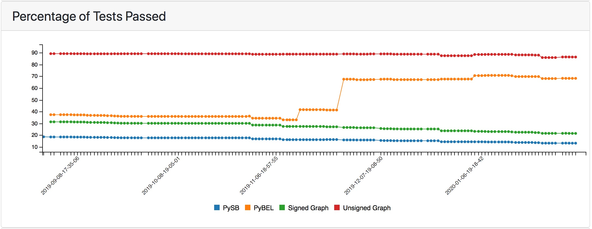
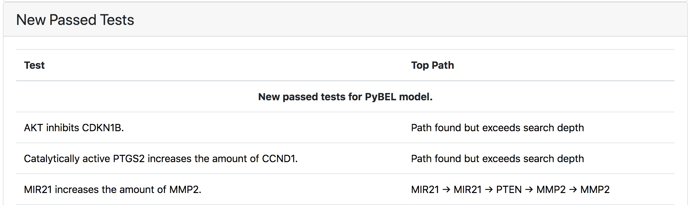

ASKE Month 15 Milestone Report
==============================

EMMAA Knowledge assemblies as alternative test corpora
------------------------------------------------------

During this reporting period we have made two significant updates to our
approach to static analysis of models against observations. First, we have
implemented a prototype capability to generalize EMMMAA knowledge assemblies
for use as either models or as tests. Second, we have implemented the
capability to test a single model against multiple corpora, which involved
changes to both the back-end test execution as well as the user interface for
displaying test results.

In EMMAA, daily machine reading is used to update a set of causal relations
relevant to a specific domain, such as a disease, signaling pathway, or
phenomenon (e.g., food insecurity). Up until this point, these (possibly
noisy) knowledge assemblies have been used to build causal models that are
checked against a set of manually-curated observations. We have now also
implemented the converse procedure, whereby the knowledge assemblies are
treated as sets of *observations*, used to check manually curated models.

A prerequisite for this approach is the ability to run a single model against
alternative test suites, which required significant refactoring of our back-end
procedures for triggering testing and results generation, and new user
interfaces to display multiple test results.  This feature is described in the
documentation for the :ref:`dashboard_models_tests_tab`.

As a proof of concept, we converted the EMMAA Statements used to generate the
Ras Machine 2.0 (`rasmachine`) and Melanoma (`skcm`) models into sets of EMMAA
Tests, and checked the manually-curated Ras Model (`rasmodel`) against each set
independently. The user can now choose between these alternative test corpora
in the EMMAA user interface:

.. figure:: ../_static/images/test_corpus_selection_cropped.png
  :align: center
  :figwidth: 100 %

  *Selecting test results to view among "Large Corpus Tests", "Rasmachine
  Tests" and "Skcm tests".*

Examining the performance of the curated Ras Model against these three
different corpora reveals striking differences. The PySB implementation of the
Ras Model has a passing rate of 55% for the BEL Large Corpus (100/182 tests),
but only 16% (120/730 tests) for the Ras Machine test corpus and 7% (6/86
tests) for the Melanoma test corpus. We inspected a handful of the tests from
the Ras Machine that the Ras Model did not pass. Many of these failed tests
highlighted aspects of the Ras Model that were failing either for minor
technical reasons (e.g., "CCND1 activates CDK4", which failed due to the active
form of CDK4 being defined explicitly in the model); others represented
knowledge gaps that could guide additions to the model (e.g., "RPS6KA1
activates RPTOR"). This latter category represent an opportunity for
*test-driven modeling* as we described in an earlier report, with the
additional feature that here the system is *automatically* providing guidance
for model extension based on ongoing mining of the literature.

In addition, we also found a number of cases where the failure of the Ras Model
to pass a test highlighted errors in the underlying machine reading underlying
the test. For example, the Melanoma Model included the test "PTEN ubiquitinates
PTEN", which was derived from jointly incorrect extractions from three distinct
sentences. As the Ras Model is extended to cover more of the true biology of
the Ras pathway, we anticipate that failed tests will be increasingly likely to
be erroneous. From a larger perspective, we believe that this approach
highlights the prospect of using causal models to determine the *a priori*
plausibility of a newly-reported finding extracted by text mining.

Time machine
------------

When EMMAA performs daily updates, it reports which new statements were newly
added to each model, the new tests that were applied based on the these
statements, and whether these new tests passed or failed. Until this point the
user could only see the change in statements and tests from the most recent
update. This prevented the user from investigating the changes at earlier
points in time, for example at points where there were large changes in the
number of tests passing. During this reporting period we have added a "time
machine" feature to the user interface to allow the user to inspect changes
in the model statements and tests at specific previous timepoints.

For example, the history of the Ras Machine model
shows that on 11/26/2019, there was a dramatic change in the pass ratio of
PyBEL model tests, as shown below:

  *Substantial change in the PyBEL pass ratio for the Ras Machine model on
  November 26, 2019.*

Clicking on the timepoint after the change refreshes the interface to display
which tests were newly passed at this point:

Inspection of these newly passed tests along with the changes in model
statements can help the user understand changes in the causal structure
of the model over time.

This feature is described in the documentation section
:ref:`dashboard_models_load_previous`.

Dynamical model simulation and testing
--------------------------------------

Initially, the EMMAA project focused on a single mode of model analysis:
finding mechanistic paths between a source (e.g., a perturbed protein) and
a readout. This mode of analysis is static in that it relies on
the causal connectivity structure of the model to characterize its behavior.

We have generalized EMMAA model analysis to dynamical properties in which
model simulation is performed. First, EMMAA Statements are assembled into a
PySB model - a rule-based representation from which a reaction network, and
subsequently, a set of coupled ordinary differential equations (ODEs) can be
generated. Given suitable parameters and initial conditions, this set of ODEs
can be solved numerically to reconstruct the temporal profile of observables
of interest.

Our goal was to design a simple specification language that allows a user to
choose an observable, and determine whether it follows a given dynamical
profile of interest. An example could be: "In the RAS model, is
phosphorylated ERK transient?". Here "phosphorylated ERK"
is the observable, and "transient" is the dynamical profile. The user can
choose from the following dynamical profiles:

- always value (low/high): the observable is always at a given level
- sometime value (low/high): at some point in time, the observable reaches the
  given level
- eventual value (low/high): the observable eventually reaches a given level
  and then stays there
- no change: the observable's level never changes
- transient: the observable's level first goes up and then goes back down
- sustained: the observable's level goes up and then stays at a high level

Internally, EMMAA uses a bounded linear-time temporal logic (BLTL) model
checking framework to evaluate these properties. BLTL is defined over discrete
time and so we choose a suitable sampling rate at which the observable's time
course profile is reconstructed. A temporal logic formula is then
constructed around atomic propositions to represent the query. Each
atomic proposition has the form [observable,level] and evaluates to True
if the observable is at the given level at the current time point. Atomic
propositions are then embedded in formulae using standard BLTL operators
including X, F, G and U, combined with standard logical operators (~, ^, v).
For instance,
"is phosphorylated ERK transient?" would be turned into the BLTL property
[pERK,low]^F([pERK,high])^F(G([pERK,low])), which can informally be
interpreted as: "pERK is initially low, after which at some point it reaches
a high level, after which is goes to a low level and remains there."

Given a model simulation, a generic BLTL model checker takes the simulation
output (for the observable) and determines whether it satisfies the given
formula. The result (pass/fail) is then displayed on the dashboard along
with a plot of the actual simulation.

In the future, we plan to account for the parameteric (and potentially the
structural) uncertainty of each model using sampling, and use statistical
model checking techniques with given false positive and false negative
guarantees to produce a pass/fail result.

This feature is described in :ref:`dashboard_dyn_query`.

Towards push science: User notifications of newly-discovered query results
--------------------------------------------------------------------------

The system of user notifications is an important component of the EMMAA
concept. As a first approach, we implemented a registration system for users
so that when a registered user logs in, they can register specific queries
that they are interested in monitoring over time.

Currently, the Query
page allows users to browse the results of their registered queries given
the current state of each model for which the query is registered.
Independently, EMMAA's `answer_queries` module can detect if the result of
a registered query changes due to a model update. Putting these two
capabilities together, we developed a user notification system in EMMAA.
If a specific model update changes the result of a registered user query,
the user receives an email notifying them about the change. Importantly,
the change to model behavior is attributable to the most recent model update
(in which a new discovery from literature was assembled into the model).
This creates a system in which new research results, as soon as they are
published, are integrated into models that are then evaluated with respect
to specific analyses, and their effect on model behavior is assessed and
exposed to users whose research it affects. The email notification system
is currently being tested internally, and will be exposed on the public
interface in the next reporting period.
