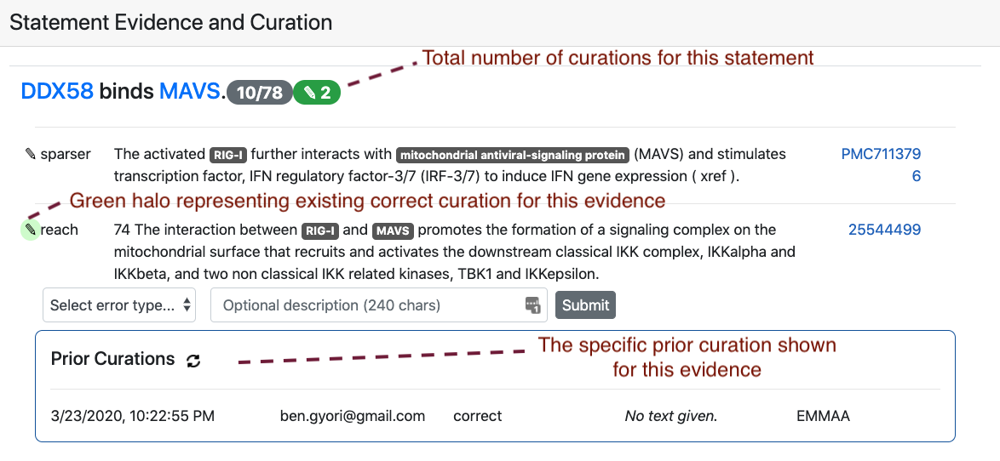

ASKE Month 18 Milestone Report
==============================

Expert curation of models on the EMMAA dashboard
------------------------------------------------
Previously, statements constituting each EMMAA model were linked to an
outside website (the INDRA DB) where they could be curated by users as
correct or incorrect. However, this feature was not convenient for at least
two reasons: the curation required moving to an external website, and
the specific scope and state of each individual EMMAA model was not always
correctly reflected on the more generic INDRA DB site.

Therefore, we implemented several new features in EMMAA that allow curating
model statements (and model tests) directly on the dashboard. Some of the
key places that allow curation include

- The list of most supported statements on the Model tab.
- The list of new added statements on the Model tab.
- The page where all statements in a model can be browsed.
- Each model's Test tab allows curating tests themselves (which in some cases
  are also prone to errors) and also the results of test, i.e., paths of
  mechanisms satisfying the test.
- Results of new queries and registered queries on the Queries page.

Existing curations for all of the above content are also accessible within
the dashboard.

The figure below shows an example of the interface for entering new curations.
as well as the visual annotations used to show existing curations and their
properties for each statement or evidence.

Viewing and ranking all statements in a model
---------------------------------------------
We also recognized the importance of being able to inspect the contents
of the model as a whole, in a view which exposes all the literature evidence
and also enables in-place curation (as opposed to the NDEx network view).
Therefore, we added a "View All Statements" button to each Model page which
allows browsing all statements in the model. To overcome the challenge of
the model potentially containing a very large number of statements,
the page uses an auto-expand feature which loads statements in real time
as the user scrolls further down on the page. Similarly, evidences for
each statement are loaded during runtime, and only when requested by the user.

The default view on the All Statements page ranks statements by the number
of evidence that support them. This allows curators to focus on statements
that are prominently discussed in the subset of literature corresponding
to the scope of the model. However, this ranking doesn't necessarily
correspond to a statement's importance in terms of functionally affecting
a model's behavior. Therefore, we added another option to sort statements by
the number of model tests whose result rely on the statement. In other words,
if a given mechanism is essential for many tests passing, it will be ranked
high on this page. This view is particularly useful if a user intends to
curate the model in a way that they focus on identifying incorrect
statements that have the biggest functional effect on model behavior, without
spending time on statements that do not play an important role in this
sense.

Email notifications
-------------------
The system of user notifications for registered queries is now in place and
available to any registered user. On the Query page, when a query is
registered, the user is also signed up for email notifications. This means
that each time a relevant new result is available for the query, the user
receives an email informing them what the new result is, and linking them
to the page on which the new result and its effect on model behavior
can be inspected.

A representative use case for this is a query about
a drug and an indirect downstream effect that could be explained by many
possible parallel paths of mechanisms (e.g., "how does quercetin inhibit
TMPRSS2?"). Each day, as a model is updated, new mechanisms that were
extracted from the latest literature may provide links between previously
unconnected concepts that can contribute to new results for a query.

The figure below shows an example notification email that an EMMAA user
would receive:

.. figure:: ../_static/images/email_notification.png
  :align: center
  :figwidth: 100 %

A model of Covid-19
-------------------

Before starting the project, we had planned to set up at least one EMMAA model
of a relevant public health-related process. As the Covid-19 crisis emerged, we
set up an EMMAA model (https://emmaa.indra.bio/dashboard/covid19/?tab=model) to
capture the relevant existing literature (by building on the CORD-19 corpus).
The model also self-updates each day with new literature on Covid-19, which is
now appearing at a pace of ~500 papers a day, and accelerating.

We have made a number of enhancements to the underlying reading and assembly
pipelines to:

1. Incorporate full text content from the CORD-19 corpus alongside our other
   sources (PubMed Central, MEDLINE, Elsevier, xDD)
2. Improve grounding of viral proteins, e.g., "SARS-CoV-2 Spike protein"
3. Use GILDA (https://github.com/indralab/gilda) to ground named entities
   identified by the University of Arizona open-domain reading system Eidos
   to extract and integrate high-level causal relations (e.g., viruses
   cause respiratory inf.

In addition, we have added curated tests describing empirically observed
inhibitors of SARS-CoV-2 (e.g., "Imatinib methanesulfonate inhibits severe
acute respiratory syndrome coronavirus 2") to determine whether the model
can identify a mechanistic explanation for the effectiveness of these drugs.

Integration of content from UW xDD system
-----------------------------------------

During this reporting period we have continued to develop our pipeline to
integrate content from the University of Wisconsin xDD platform and have
completed 5 pilot runs. We have created new command-line endpoints to run
machine reading and statement extraction within our Dockerized system. INDRA
Statements extracted from the xDD content are posted to a shared private AWS S3
bucket along with associated document metadata.  In successive pilot runs we
have refined metadata formats and adapted the schema of the INDRA DB to allow
INDRA Statements to be linked to articles in the absence of article content (we
only obtain INDRA Statements from xDD, while xDD retains the articles
themselves). Next steps include:

1) Determining relevance of xDD documents to specific EMMAA models
    by linking documents to specific xDD-indexed terms/keywords
2) Scaling up to larger document runs focusing on Pubmed-indexed documents
for which we do not have full texts available from other sources.

Configurable model assembly pipeline
------------------------------------

Each EMMAA model is defined by a configuration file which determines
what search terms the model is built around, other metadata (name, description
etc.), and other settings specific to the model.
Building on the new Pipeline feature in INDRA, EMMAA models can
now define the assembly pipeline applied to each model in a fully
declarative way, as part of the configuration file. This simplifies the EMMAA
codebase, and makes the instantiation of new models much easier, in a way
that is decoupled from code. This could open up exciting possibilities such
as instantiating EMMAA models on-demand, potentially through a UI.
