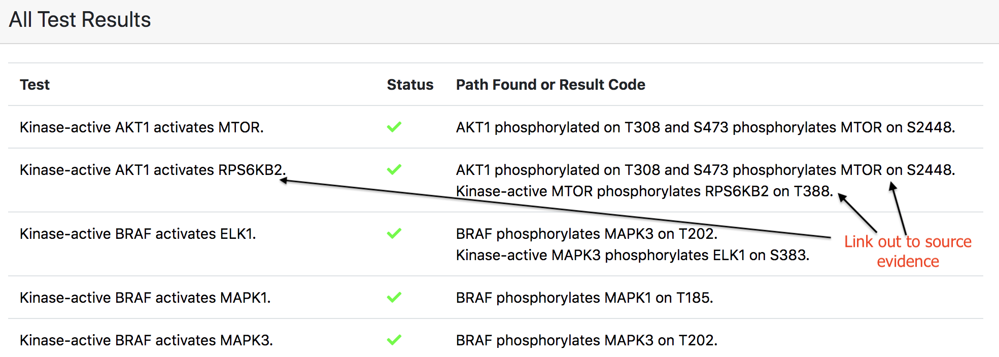
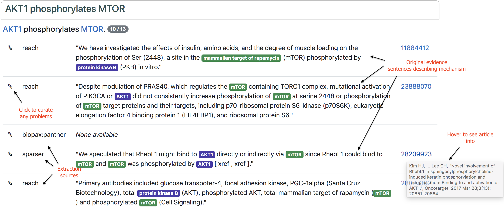

ASKE Month 6 Milestone Report
=============================

Making model analysis and model content fully auditable
-------------------------------------------------------

When browsing the results of model tests, it is often of interest to inspect
the specific provenance of each modeled mechanisms that contributed to the
result. EMMAA models are built automatically from primary knowledge
sources (databases and literature), and model components are annotated such
that given the result, we can link back to the original sources.

Links to browse evidence are available in all of the following contexts:

- New statements added to the model
- Most supported statements in the model
- New tests applicable to the model
- Passed/failed tests and the mechanisms constituting paths by which tests
  passed

Including new information based on relevance
--------------------------------------------

EMMAA models self-update by searching relevant litearture each day and adding
mechanisms described in new publications. However, event publications that are
relevant often contain pieces of information that aren't directly relevant for
the model. We therefore created a relevance filter which can take one of
several policies and determine if a new statement is `relevant` to the given
model or not. The strictest policy is called `prior_all` which only considers
statements in which all participants are prior search terms of interest for the
model as relevant. A less strict policy, `prior_one` requires that at least one
participant of a statement is a prior search term for the model. Currently,
EMMAA models are running with the `prior_one` policy.

Coarse-grained model checking of EMMAA models with directed graphs
------------------------------------------------------------------

To determine whether a model can satisfy a particular test, EMMAA currently
assembles sets of INDRA Statements into mechanistic PySB/Kappa models. The
INDRA ModelChecker is then used to determine whether there is a causal path in
the Kappa influence map linking the subject and object of the test with the
appropriate causal constraints. These constraints include the polarity of the
path, the detailed attributes of the subject and object (for example, a
particular modified form of the object protein), and the type of regulation
(e.g., regulation of activity vs. regulation of amount). Because the assembled
PySB/Kappa models make maximum use of available mechanistic information, this
approach to model checking yields results with high precision, in that the
existence of a path indicates that the strict semantics of the test are
satisfied.

The high precision of this approach comes at the expense of recall and
robustness, in that tests may *not* pass due to subtle aspects of the test or
model statements. For example, if a machine reading system incorrectly extracts
a positive regulation statement linking genes *A* and *B* as a regulation of
amount rather than a regulation of activity, this can lead to the test "A
activates B" failing and yielding no paths.

To help scientists using EMMAA to generate scientific insight, it would be
ideal for models to be verified against tests with *different degrees of causal
constraints.* If a model fails to satisfy a test using the high-precision
approach, the scientist user could also inspect causal paths produced by model
assembly and checking procedures with a more generous interpretation of
causality.

A key advantage of using INDRA as the model assembly engine within EMMAA is
that a single knowledge representation (INDRA Statements) can be used to
assemble multiple types of causal models. In the context of EMMAA, INDRA
can be used to assemble at least four different types of models, listed
in increasing order of causal precision:

* Directed networks
* Signed directed networks
* Boolean networks
* Biological Expression Language (BEL) networks
* PySB model/Kappa influence maps

During this reporting period, we investigated the use of the most
coarse-grained of these representations, directed networks, to check EMMAA
models against tests. Code and results are available in an iPython notebook
accompanying this report available on Github `here
<https://github.com/johnbachman/emmaa/blob/report/notebooks/Graph-based%20model%20checking%20for%20EMMAA.ipynb>`_.
Using the most recent model and test results from the EMMAA `Ras Machine 2.0
<http://emmaa.indra.bio/dashboard/rasmachine>`_, we built a simple directed
graph among agents using `networkx` and checked for paths between pairs of genes
in the applied tests.

We found that, as expected, many more tests passed in the directed graph model
(509 tests, 58.7%) than the detailed PySB/Kappa model (165 tests, 19.0%). All
tests passed by the PySB/Kappa model also passed in the directed graph model,
indicating that the latter is a strict subset of the former.  Roughly half
(52%) of the tests that *failed* in the PySB/Kappa model yielded paths in the
directed graph. Inspection of the discrepancies highlighted some
characteristics of these types of tests (see `iPython notebook
<https://github.com/johnbachman/emmaa/blob/report/notebooks/Graph-based%20model%20checking%20for%20EMMAA.ipynb>`_.)
A key point is that the proportion of tests passed by the directed graph model
represent an *upper bound* of the mechanistic coverage of the model that is
independent of the particular modeling formalism involved. While many of the
paths found in the directed graph do not satisfy the strictest interpretation
of the tests, they are nevertheless useful for a human scientist to better
understand relevant processes contained in the model and to generate
hypotheses.

In the upcoming reporting period we aim to extend this approach further by
using EMMAA to assemble multiple types of models at different levels of causal
resolution. A scientist will then be able to explore a range of explanations
for a given observation depending on the precision-recall tradeoffs of their
use case.

