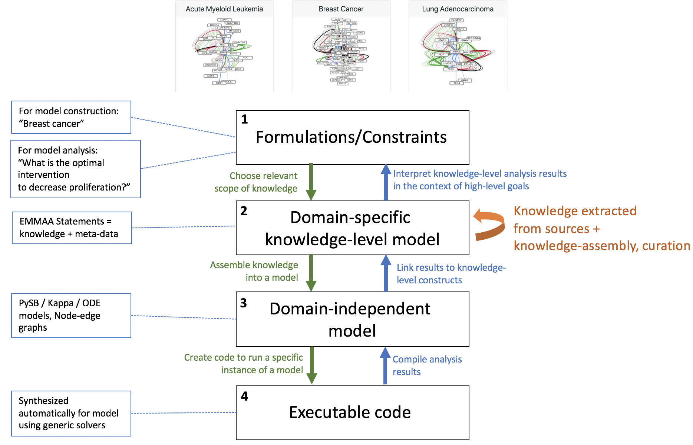

ASKE Month 7 Milestone Report
=============================

Updated conceptual diagram of EMMAA in the ASKE context
-------------------------------------------------------

Use cases for the EMMAA system (and ASKE systems in general)
------------------------------------------------------------

Push Science
~~~~~~~~~~~~

In 2015, Paul Cohen defined "push scholarship" as: "[...]  instead of
pulling results into our heads, we push results into machine-maintained big
mechanisms, where they can be examined by anyone. This could change science
profoundly."

ASKE systems have the potential to go beyond this ambitious goal by:

- actively searching for new discoveries and data,

- autonomously updating a set of models by integrating new discoveries,

- designing model analysis experiments to understand the effect of this new
  knowledge

- reporting the effect of new discoveries on scientific questions
  relevant to the user

In other words, novel, relevant implications of discoveries, as soon as they
appear, are "pushed" to scientists.

Monitoring reproducibility
~~~~~~~~~~~~~~~~~~~~~~~~~~

About 3,600 new publications appear each day on PubMed, in biomedicine alone.
Using automated model extension and analysis, ASKE systems can evaluate newly
reported mechanisms against experimental observations (data) and vice versa.
Reported mechanisms that aren't supported by prior observations, as well as
observations that don't make sense with respect to existing models can be
detected. This technology can help address some aspects of the reproducibility
crisis in a principled way.

Automated scientific discovery
~~~~~~~~~~~~~~~~~~~~~~~~~~~~~~

There is a large body of unexplained observations (i.e., open scientific
questions for which no underlying mechanistic explanation is known) appearing
in the biomedical literature and in data stores An ASKE system that immediately
aggregates and models new knowledge and evaluates its implications with respect
to unexplained observations, is likely to be the first to notice that a
previously unexplained observation can now be explained.  Novel candidate
explanations to observations constructed automatically using ASKE systems can
be experimentally confirmed and published.

Repositioning EMMAA within the ASKE framework of modeling layers
----------------------------------------------------------------

Based on discussions at the ASKE 6-month PI meeting we have been reformulating
how our approach in EMMAA relates to the three proposed modeling representation
levels. One outcome of the meeting was an emerging consensus that the middle
"model" level represents domain-independent model representations that are not
yet executable. Examples discussed included linear regression models,
polynomial functions, ordinary differential equations, etc. Prior to this
discussion we had considered this layer, representing classes of mathematical
models, to be the "bottom"; however, we now recognize that a model at this
level is not yet executable because it must first be coupled to a particular
simulation or inference procedure.

With this in mind, we feel that our approach requires the definition of an
additional layer, sitting between the topmost (level 1,
"formulations/constraints") and the mathematical modeling layer (now level 3).
This layer corresponds to networks of EMMAA/INDRA Statements: representations
of a particular subset of domain *knowledge*. A knowledge network at this layer
may be formulated based on requirements/constraints  specified in level 1
(e.g., "a knowledge model of breast cancer", or "all signaling pathways with a
bowtie architecture"). In turn, this knowledge network can be used to generate
different analytical/mathematical models at level 3 (boolean networks,
rule-based models, analytical/mathematical model ODEs, etc.).

One focus of the discussion during the PI meeting was on the potential for
integration of ASKE modeling frameworks via the domain-independent level 3.
Integration at this level would allow tools for model analysis, simulation,
expansion, etc. to be reused between teams. At this layer domain-specific
considerations may still apply but they will have been converted into syntactic
constraints expressed in the language of the particular modeling formalism. One
example relevant to biology is the formulation of ODE models: while in a
domain-independent sense the class of all ordinary differential equation models
is quite large, biological models typically make use of a highly restricted
subset of mathematical functions. In a "mass-action" reaction model, for
example, the right hand side function consists strictly of a linear combination
of products of the concentration variables. This (semantic) biochemical
constraint could be expressed in the (syntactic) language of mathematical
functions to allow the application of tools for model expansion, simulation,
etc.

Since the PI meeting we have also concluded that important model inference and
transformation procedures can occur at layers other than level 3, and that
these operations can occur *within*, not just across layers. For example, in
INDRA there are a set of related procedures that we collectively refer to as
"pre-assembly": identifying subsumption relationships, inferring and applying
belief scores, identifying statement relationships, etc. Both the information
considered in these operations, and the operations themselves explicitly make
use of domain-specific knowledge, and all take INDRA Statements as input and
produce INDRA Statements as output. These steps are referred to as
"preassembly" to differentiate them from the step of *assembly*, which denotes
the transformation of knowledge level information (level 3) from model-level
information (level 2).

